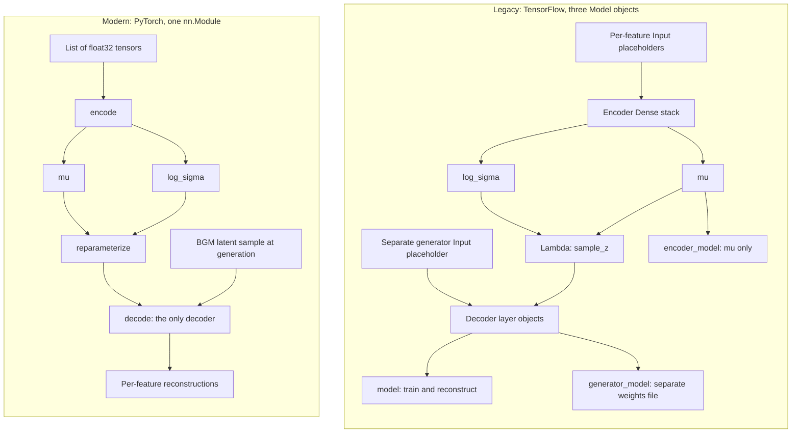
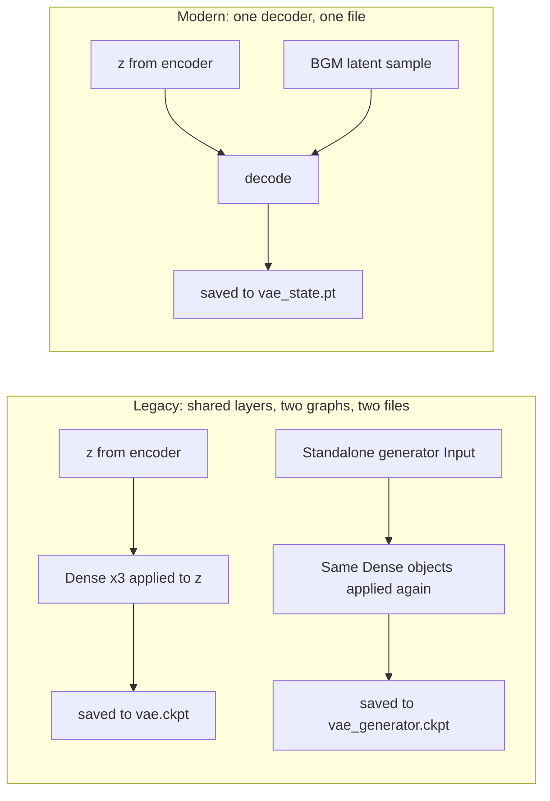
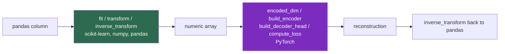
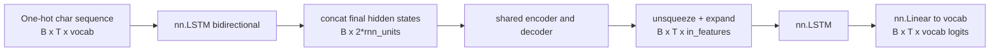
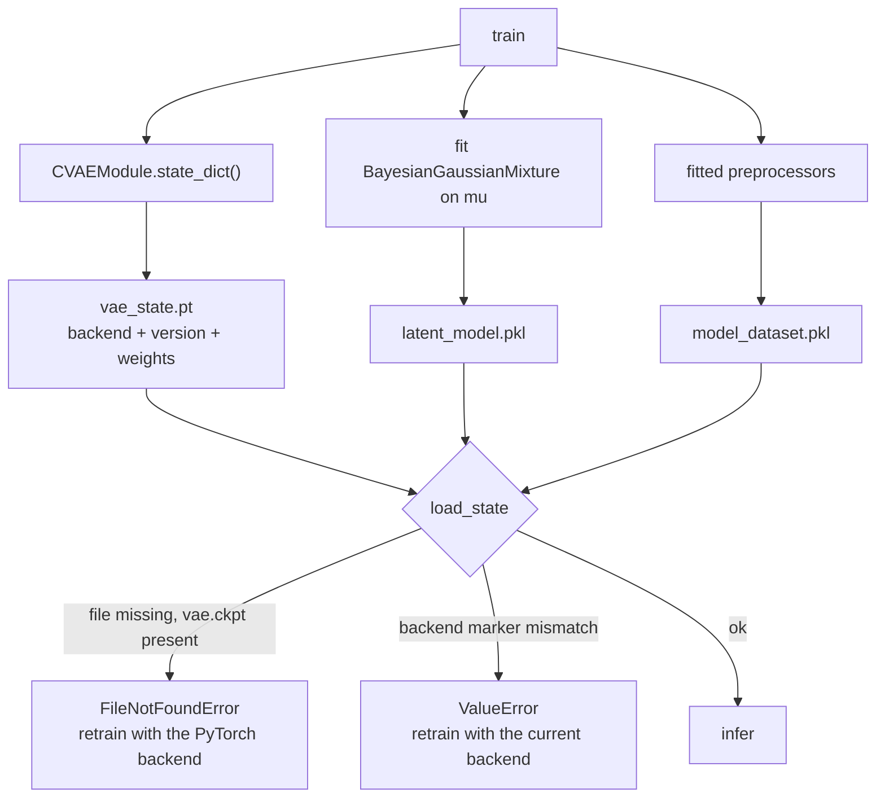
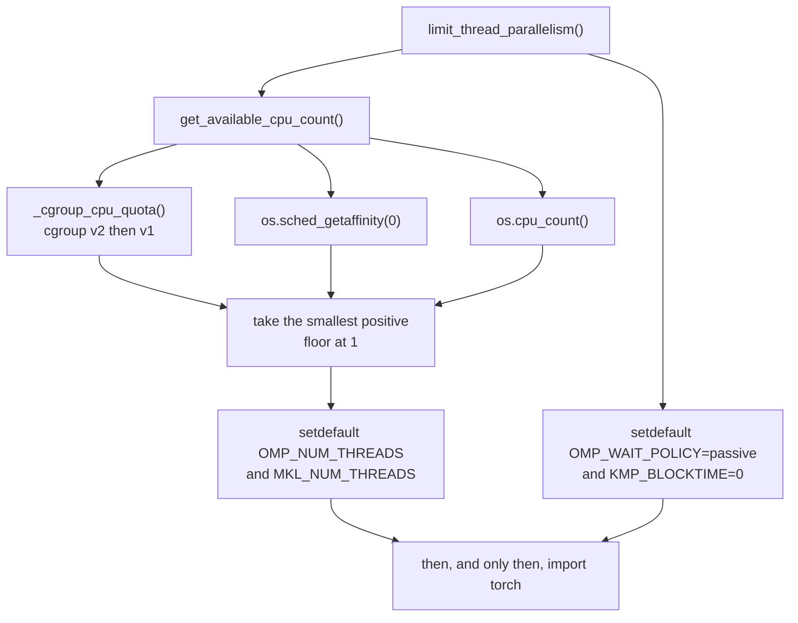

# Syngen: The TensorFlow to PyTorch Migration

**Ticket:** EPMCTDM-7630
**Branch:** `tf-to-pytorch-migration`
**Shipped as:** `1.0.1rc5`
**Status:** Authoritative. Supersedes the documents listed in section 0.5.

---

## Part 0 — Front matter

### 0.1 Purpose

Syngen's synthetic data generator is a Conditional Variational Autoencoder (CVAE). Until
this migration it was built on TensorFlow and Keras. It is now built on PyTorch.

This document is the single reference for that change. It explains what moved, why it
moved, what deliberately did not move, and what is still open. It is written so that a
product manager, a data scientist, and a platform engineer can each read it and get what
they need without reading the other two audiences' sections.

It is also written to be *correct*. Every technical claim below carries a reference to
the code that supports it. Where a claim rests on a one-off experiment rather than on
something the repository enforces, that is stated explicitly rather than smoothed over.

### 0.2 Scope

**In scope:** the complete set of changes between `main` and `tf-to-pytorch-migration` —
38 commits, 63 files, roughly 3,100 inserted lines. That covers two intertwined bodies of
work:

1. The backend swap itself: model, features, data pipeline, training loop, serialization.
2. The EPMCTDM-7630 follow-on work that shipped with it: reproducibility seeding,
   cgroup-aware CPU management, training-loop throughput, and several defect fixes found
   during downstream validation.

These are documented together because they shipped together. Separating them would
misrepresent what a consumer upgrading to `1.0.1rc5` actually receives.

**Out of scope:** the enterprise edition (`tdm_syngen`), which consumes this library as a
versioned package. Section 10.7 states the impact on it; the migration of the enterprise
edition itself is tracked separately.

### 0.3 Who should read what

| If you are | Read | Skip |
| --- | --- | --- |
| A user, product owner, or anyone asking "does this change what I get?" | Parts 1, 2, and 12 | Everything else |
| A data scientist evaluating model behaviour or output quality | Parts 3, 4, 6, 9, 11, 12, and 13.2 | Parts 8 and 10 |
| A developer or DevOps engineer integrating, deploying, or packaging syngen | Parts 2, 5, 7, 8, 10, and 13.3 to 13.4 | Part 4 |
| Planning the next iteration of work | Parts 11, 12, and 13 — especially the priority table in 13.5 | Parts 3 to 7 |
| A reviewer auditing the migration end to end | All of it, then the errata in 14.2 | Nothing |

Part 1 is the only part written entirely without code. Every other part opens with a
plain-English overview paragraph, so you can read the first paragraph of any section and
stop there without being misled.

### 0.4 How to read a Migration Card

Every changed technical component is documented with the same seven-part card, so you can
compare components without re-learning the format:

- **High-Level Overview** — what the component does and why the change matters, in plain
  English. Safe to read in isolation.
- **The Rationale** — the technical reason we changed it.
- **The Legacy Workflow (TensorFlow)** — how it worked before.
- **The Modern Workflow (PyTorch)** — how it works now.
- **Visual Flow** — a Mermaid diagram, where the execution order actually differs.
- **Side-by-Side Code Comparison** — the old and new code, labelled.
- **Developer/DS Takeaways** — speed, memory, syntax traps, and things that will bite you.

Not every card has a diagram. A card without one is a component where the shape of the
computation did not change, only its expression.

### 0.5 Documents this supersedes

The following were written during the migration and have since drifted from the code:

| Document | Status |
| --- | --- |
| `docs/migration/tf_to_pytorch_guide.md` | Superseded. Substantial parts remain accurate; several sections describe a test harness that no longer exists. |
| `docs/migration/tf_to_pytorch_migration_plan.md` | Historical. A pre-implementation contract, useful as a record of intent. |
| `docs/migration/sign_off_records.md` | Historical, with one factual error (section 13.2.2). |
| `docs/migration/pytorch_backend_design.md` | Largely accurate; the data-path description is out of date. |
| `pytorch_migration/FINDINGS.md` | Diagnostic analysis, still valuable. Its headline recommendation was not adopted (section 13.2.1). |

Each specific correction is enumerated in section 13.2. Those documents have not been
edited as part of this one; correcting them is tracked as follow-up work.

### 0.6 Evidence conventions

- A reference like `wrappers.py:534` points at the current code on this branch. Paths are
  relative to `src/syngen/ml/` unless given in full.
- A reference like `main:wrappers.py:455` points at the pre-migration TensorFlow code.
- Code snippets are lightly trimmed for readability — imports and unrelated lines removed
  — but never reworded. Where a snippet is a simplification, it says so.
- **Measured, not enforced:** any performance or quality number produced by a one-off
  experimental run is labelled with this phrase. The repository contains no benchmark
  harness and no statistical quality gate, so these numbers cannot be re-derived from a
  clean checkout. Treat them as evidence for a past decision, not as a guarantee.

---

## Part 1 — Executive overview

*Audience: everyone. No code in this part.*

### 1.1 What changed, in one paragraph

Syngen learns the structure of a real table and then generates a synthetic table that
resembles it statistically without copying any real row. The mathematics of how it does
that is unchanged. What changed is the machine-learning framework underneath: we replaced
TensorFlow and Keras with PyTorch. From the outside, syngen looks the same — the same
commands, the same configuration files, the same outputs. The change is an engineering
one: the code that builds and trains the model is now substantially simpler, honest about
what it actually does, and easier to maintain.

### 1.2 Why we moved off TensorFlow

#### 1.2.1 Ecosystem and maintenance trajectory

PyTorch has become the default framework for research and, increasingly, for production
machine learning. That matters in practical terms: more maintained libraries interoperate
with it, more engineers can read the code without ramp-up, and the components we want to
adopt next are written against it first. Staying on TensorFlow meant paying an
integration tax on everything we wanted to add.

The clearest example is differential privacy. The enterprise edition's roadmap depends on
Opacus, which is PyTorch-only. Part 5 documents a specific design constraint in the new
data pipeline that exists solely to keep that door open.

#### 1.2.2 Dynamic graphs against the workarounds we had accumulated

TensorFlow asks you to describe a computation as a graph, and then runs it. PyTorch simply
runs the code, line by line, as written. The practical difference is debuggability: in
PyTorch you can put a breakpoint in the middle of a model, print a tensor, and see the
actual numbers. In the TensorFlow version you were inspecting placeholders in a graph that
had not run yet.

That difference was not academic. It is the reason the problems described in Part 6 were
found and fixed during this migration rather than shipped for another year.

#### 1.2.3 Dead code the graph model let us keep

Because a TensorFlow graph is assembled before it runs, code that builds a component
which is never connected to anything looks, superficially, like working code. The old
codebase had accumulated exactly that:

- A custom sampling layer that was commented out of the graph entirely.
- A custom loss layer that was constructed on every run, and whose result was discarded
  without ever being used.
- An entire conditional-generation branch that was structurally present but could never
  activate, because the flag controlling it was hard-coded off.

None of this did anything. All of it had to be read, understood, and worked around by
anyone touching the model. In the rewrite it is simply gone — verified as unreachable
before deletion, so nothing functional was lost. Details in section 3.7.

#### 1.2.4 Platform special-casing we deleted

The TensorFlow code carried a branch that detected Apple Silicon at runtime and swapped
in a different, legacy optimiser implementation, because the standard one misbehaved
there. That branch no longer exists. One less platform-specific code path to keep working.

### 1.3 What this means for you

#### 1.3.1 Commands, configuration and outputs are unchanged

This is the most important sentence in the document for most readers: **nothing you type
changes.** The `train` and `infer` commands accept exactly the same options they did
before — verified option-by-option, not assumed. Metadata YAML files are unchanged and
validated by the same schema. The Python SDK is untouched. Reports and generated data
come out in the same formats with the same names.

Part 2 sets out this contract precisely, with the two deliberate exceptions.

#### 1.3.2 Output quality

The migration was held to the standard of matching TensorFlow's output, not improving on
it. To that end, several behaviours of the old framework — including some that are, on
their own merits, questionable — were reproduced exactly rather than corrected, because
correcting them silently would have changed the data our users generate. Sections 3.8,
4.10, and 6.5 document each of these choices and the reasoning behind them.

One area was investigated in depth and deserves an honest summary: for numeric columns
whose values cluster in several distinct groups (geographic coordinates were the test
case), the generated spread can be narrower than the real data's. This behaviour predates
the migration and stems from how the model's numeric output layer is built, not from the
framework change. A hyperparameter change was trialled as a remedy; it improved that one
symptom but made overall model quality worse, so it was rejected and the original setting
kept. Sections 6.4 and 12.1 give the full account.

#### 1.3.3 Speed and resource use

The honest position: the PyTorch training loop was initially slower per epoch than the
TensorFlow one, and a round of optimisation work recovered most but not all of that gap.
Section 6.11 gives the specific measurements along with a clear statement of what they do
and do not establish, since they came from single runs on one machine and no benchmark
harness is committed to the repository.

More consequential than raw speed is a resource-management fix. When several syngen jobs
ran on the same machine, PyTorch's internal thread pools would each try to use every
available CPU core, and the resulting contention pegged all cores at full utilisation
while making very little actual progress. Syngen now detects its real CPU allocation —
including container limits, which the naive method ignores — and sizes its thread pools
accordingly. Part 8 covers this.

#### 1.3.4 The one action required: retrain your models

**Models trained with a previous version of syngen cannot be loaded by this version.**
The saved format for the trained neural network changed, and there is no automatic
conversion.

This is a deliberate decision rather than an oversight. Rather than fail with a confusing
error, the new code detects an old TensorFlow-era model directory and reports explicitly
that the artifact belongs to the previous backend and the table must be retrained.

Retraining is the only remedy. Nothing else in your setup needs to change, and your
configuration files carry over as-is. Section 7.5 covers this in operational detail.

### 1.4 Timeline

Work ran from 2026-05-29 to 2026-07-29.

| Version | Date | What landed |
| --- | --- | --- |
| — | 2026-05-29 | TensorFlow and Keras removed from the runtime; `torch` added |
| `0.13.0` | 2026-07-04 | Backend swap complete |
| `0.13.0rc1` | 2026-07-06 | Learning rate returned to its original value after the alternative was rejected |
| `1.0.1rc1` | 2026-07-10 | Cgroup-aware CPU resource management |
| `1.0.1rc2` | 2026-07-28 | Training-loop throughput work (EPMCTDM-7630) |
| `1.0.1rc4` | 2026-07-28 | Reproducibility and defect fixes from downstream validation |
| `1.0.1rc5` | 2026-07-29 | Final round of carried-over fixes |

Two numbering notes for the release owner: the branch jumps from `0.13.0` to `1.0.1`
without a `1.0.0` ever being released, and `rc3` is skipped. Neither affects behaviour.

### 1.5 Risk summary for downstream consumers

| Risk | Severity | Detail |
| --- | --- | --- |
| Existing trained models stop loading | **High** — action required | Section 7.5 |
| Public API, CLI, SDK, metadata schema | None — verified unchanged | Part 2 |
| Log-level handling is now strictly validated | Low — could surface a previously silent misconfiguration | Section 2.6 |
| Container images carry unused GPU libraries | Low — image size only | Section 8.7 |
| No automated statistical quality gate exists | **Medium** — affects confidence in future changes, not this one | Part 11 |

---

## Part 2 — The contract that did not change

*Audience: developers, DevOps, and anyone integrating syngen. Read this before Part 1 if
your first question is "will this break my integration?"*

**Overview.** A backend migration is only safe if the boundary around it holds. This part
records what was verified to be unchanged, and how. Two things did change on the public
surface, and both are stated here rather than buried.

### 2.1 CLI entry points and flags

Unchanged, and verified by comparing the complete set of declared options between the two
branches rather than by inspection: both `train` and `infer` expose an identical option
set.

The console scripts are declared in `pyproject.toml:72-75`:

```toml
[project.scripts]
train = "syngen.train:cli_launch_train"
infer = "syngen.infer:cli_launch_infer"
syngen = "syngen:main"
```

These point at the click-wrapped `cli_launch_*` functions. The plain `launch_train` and
`launch_infer` remain the entry points for Python and SDK callers. That distinction
matters: an earlier defect had the console scripts pointing at the plain functions, so
invoking `train` from a shell produced an unhelpful `AttributeError` because no argument
parsing had occurred. This was a pre-existing bug, fixed independently on both branches.

### 2.2 Python SDK

Unchanged. `src/syngen/sdk.py` has a zero-line diff against `main`. The `Syngen` class,
its methods, and their signatures are exactly as they were.

### 2.3 Metadata YAML and validation schema

Unchanged. `src/syngen/ml/validation_schema/` has a zero-line diff against `main`. Every
metadata file that validated before validates now, with identical semantics. No schema
field was added, removed, renamed, or had its type or constraints altered.

This was a hard requirement: metadata schema changes propagate directly to `tdm_syngen`
and to every user's committed configuration.

### 2.4 Preprocessing

Unchanged, and this is worth understanding because it explains why the migration was
tractable at all.

Syngen's feature handling has two distinct layers. The first turns a pandas column into a
numeric array: scaling, one-hot encoding, date-to-timestamp conversion, null handling.
This layer is built on scikit-learn, numpy, and pandas — it never touched TensorFlow. The
second layer is the neural network that consumes those arrays.

Only the second layer moved. `StandardScaler`, `MinMaxScaler`, `QuantileTransformer`, and
`OneHotEncoder` are the same objects, fitted the same way, producing the same arrays. This
is why the migration is a backend swap rather than a rewrite, and why the statistical
character of the output is dominated by code that did not change. Part 4 draws the
boundary precisely.

### 2.5 MLflow metrics, `losses.csv`, and reports

Unchanged. The loss-bookkeeping functions — `_gather_losses_info`, `_update_losses_info`,
`_get_grouped_losses`, and the routine that writes the CSV — are untouched by the diff.
Only the training step that *produces* the numbers changed; everything that records and
formats them is the original code.

MLflow still receives the same three per-epoch metrics — `loss`, `saved_weights_loss`, and
`kl_loss` (`wrappers.py:509-511`) — and `losses.csv` still carries the same per-feature
rows plus the `total_loss` and `kl_loss` summary entries (`wrappers.py:421`). Existing
dashboards and downstream parsers continue to work.

One caveat for anyone comparing runs across the migration boundary: the metric *names* are
stable, but the loss *values* are not directly comparable between backends, because the
two frameworks reduce per-sample losses to a scalar differently. A higher or lower number
after the migration does not by itself indicate a better or worse model. Section 6.8
explains the mechanism.

### 2.6 Deliberate change one: log-level validation

The `--log_level` option previously accepted six values. It now accepts seven — `SUCCESS`
was missing, despite the underlying logging library supporting it. The single source of
truth is `utils.py:648`:

```python
SUPPORTED_LOG_LEVELS = ("TRACE", "DEBUG", "INFO", "SUCCESS", "WARNING", "ERROR", "CRITICAL")
```

Both CLIs derive their accepted values from this tuple (`train.py:200`, `infer.py:169`)
rather than repeating a literal list, and a unit test guards against drift between the
tuple and the logging library's own level registry.

The behavioural change is in `setup_log_process`, which now validates the level and raises
`ValueError` on an unsupported one (`utils.py:687-691`). Previously an invalid level was
passed through silently. This is a widening of what is accepted plus a fail-fast on what
was already invalid, so no previously working call breaks — but an SDK caller that had
been passing a bad level and not noticing will now get an error. That is the intended
outcome.

### 2.7 Deliberate change two: trained model artifacts

The saved format of the trained network changed and is not backward compatible. This is
the one genuine break in the migration, called out in section 1.3.4 and documented
operationally in section 7.5.

---

## Part 3 — Core architecture

*Audience: data scientists primarily; section 3.1 is readable by anyone.*

**Overview.** The model is a conditional variational autoencoder: an encoder compresses a
row into a small latent vector, a decoder reconstructs the row from it, and generation
works by sampling new latent vectors and decoding them. That description was true before
the migration and is true now. What changed is that the TensorFlow implementation built
*three* separate model objects out of one set of layers, while the PyTorch implementation
builds one module that serves every purpose.

### 3.1 The shape of the change

The clearest way to see the migration is to compare what gets constructed.



The right-hand side has one decoder. The left-hand side has one *set of decoder layers*
used to build two different graphs, whose weights were then saved to two different files.
Section 3.4 explains why that distinction mattered.

### 3.2 Migration Card: The CVAE container

**High-Level Overview.** `CVAE` is the class that owns the model, builds it, trains
against it, and generates from it. It still exists and still has that job. What changed is
that it no longer *is* the neural network — it now holds one, cleanly separated.

**The Rationale.** In Keras, a model is assembled by calling layer objects on tensors and
capturing the result. The consequence is that the model, its intermediate tensors, and the
bookkeeping about them all end up as attributes of whatever class did the assembling. The
old `CVAE` carried fifteen such attributes: `inputs`, `encoders`, `feature_decoders`,
`feature_losses`, `loss_models`, `cond_inputs`, `global_decoder`, `generator`, and more.
Most were intermediate graph handles that existed only because the graph had to be built
before it could run.

PyTorch has no separate build step, so none of that state is needed. The module holds
layers; the container holds the module.

**The Legacy Workflow.** `build_model` walked the features, collected `Input` placeholders
and encoder tensors, concatenated them, built encoder and decoder, then constructed three
`Model` objects over the resulting graph and attached losses to one of them.

**The Modern Workflow.** `CVAEModule.__init__` constructs layers and stores them. Nothing
is executed. `CVAE` keeps four attributes where there were fifteen (`model.py:148-151`),
and gained two that describe the artifact rather than the graph: `BACKEND = "pytorch"` and
`ARTIFACT_VERSION = 1` (`model.py:139-140`), used by the loader in Part 7.

**Visual Flow.** See section 3.1.

**Side-by-Side Code Comparison**

```python
# === legacy_syngen_tensorflow.py ===
# model.py:41-54 - graph-assembly state on the container
self.model = None
self.latent_model = None
self.metrics = {}
self.cond_features = {}
self.is_cond = False
self.inputs = list()
self.encoders = list()
self.feature_decoders = list()
self.feature_losses = dict()
self.feature_types = dict()
self.loss_models = dict()
self.cond_inputs = list()
self.global_decoder = None
self.generator = None
```

```python
# === modern_syngen_pytorch.py ===
# model.py:148-151 - only what survives a build
self.model = None              # CVAEModule (nn.Module)
self.latent_model = None       # BayesianGaussianMixture
self.feature_types = dict()
self.feature_order = list()
```

**Developer/DS Takeaways.** `CVAE.fit()` no longer exists. It called `model.fit()` and was
never on the wrapper's execution path — the wrapper always ran its own loop — so removing
it deleted a second, misleading way to train that nobody used. Training now has exactly
one entry point (Part 6). If you are reading old notebooks that call `cvae.fit(...)`, they
were not exercising the code path that produced your models.

### 3.3 Migration Card: The encoder stack

**High-Level Overview.** The encoder compresses a row into two small vectors describing a
distribution: a centre and a spread. Its structure is unchanged — three identical blocks
followed by two output layers.

**The Rationale.** No architectural change was wanted here. The goal was a faithful
translation, including the parts of Keras's default behaviour that a naive PyTorch
rewrite would silently alter. Section 3.8 lists those.

**The Legacy Workflow.** Three repetitions of `Dense`, `BatchNormalization`,
`leaky_relu`, `Dropout`, written out longhand three times, then two `Dense` layers
producing `mu` and `log_sigma`.

**The Modern Workflow.** The same three blocks, built by a helper so the repetition
appears once, then `mu_layer` and `log_sigma_layer`.

**Visual Flow.** Not applicable — the computation is identical in shape.

**Side-by-Side Code Comparison**

```python
# === legacy_syngen_tensorflow.py ===
# model.py:133-152 - one of three identical blocks, written out three times
def __build_encoder(self, input):
    h0 = Dense(self.intermediate_dim, name="Encoder_0")(input)
    h0 = BatchNormalization(name="First_encoder_BN")(h0)
    h0 = Activation(tf.nn.leaky_relu)(h0)
    h0 = Dropout(0.2)(h0)
    # ... h1 and h2 repeat the above verbatim ...
    mu = Dense(self.latent_dim, name="mu")(h2)
    log_sigma = Dense(self.latent_dim, name="log_sigma")(h2)
    return mu, log_sigma
```

```python
# === modern_syngen_pytorch.py ===
# model.py:87-94, 59-64
@staticmethod
def _encoder_block(in_features: int, out_features: int) -> nn.Module:
    return nn.Sequential(
        nn.Linear(in_features, out_features),
        nn.BatchNorm1d(out_features, eps=BN_EPS, momentum=BN_MOMENTUM),
        nn.LeakyReLU(ENCODER_LEAKY_SLOPE),
        nn.Dropout(DROPOUT),
    )

self.enc_block0 = self._encoder_block(total_encoded, intermediate_dim)
self.enc_block1 = self._encoder_block(intermediate_dim, intermediate_dim)
self.enc_block2 = self._encoder_block(intermediate_dim, intermediate_dim)
self.mu_layer = nn.Linear(intermediate_dim, latent_dim)
self.log_sigma_layer = nn.Linear(intermediate_dim, latent_dim)
```

**Developer/DS Takeaways.** The named layers are gone. Keras layer names such as
`"Encoder_0"` and `"First_encoder_BN"` were how you addressed weights in a TensorFlow
checkpoint; PyTorch uses attribute paths instead, so a saved parameter is now
`enc_block0.0.weight`. If you have tooling that inspects checkpoints by layer name, it
needs rewriting against the new key structure.

Note also that the BatchNorm and Dropout layers in these blocks are, in practice, inert —
not because of anything in this card, but because of how the training loop invokes the
model. That is section 6.5, and it is worth reading before drawing conclusions about this
architecture.

### 3.4 Migration Card: The decoder, and collapsing the duplicate generator

**High-Level Overview.** This is the most consequential structural change in Part 3. The
old code effectively maintained two copies of the decoder — one used during training, one
used to generate data — and saved them to separate files. The new code has one.

**The Rationale.** In the TensorFlow version, the decoder `Dense` objects were created
once and then *called twice*: once on the latent vector coming from the encoder, and once
on a separate standalone `Input` placeholder. Calling the same layer object on two
different tensors is Keras's layer-sharing idiom, and it does mean the two graphs share
weights in memory during a run.

The problem is what happened at the boundaries. The two graphs became two `Model` objects,
`self.model` and `self.generator_model`, whose weights were saved to two separate
checkpoint files. Any divergence between them — a save that captured one but not the
other, a load that restored one but not the other, an ordering bug in either path —
produces a generator that is not the decoder you trained, and the failure mode is silent:
you get plausible-looking synthetic data from a model that is subtly not the one your loss
curve described.

This was a live hypothesis during the investigation into distribution collapse. Rather
than verify the two paths stayed in sync, the migration removed the possibility. One
decoder module, one set of weights, one file. The class docstring records this as
"collapse hypothesis #2 handled by construction" (`model.py:36-45`).

**The Legacy Workflow.** Build three `Dense` layers; apply them to `input_z` with dropout
between, storing the result as `global_decoder`; apply the same three layers to
`generator_input` without dropout, storing the result as `generator`. Then build a `Model`
around each.

**The Modern Workflow.** One `decode` method. Reconstruction calls it with the
reparameterised latent; generation calls it with a sample drawn from the fitted mixture.
Same module, same weights, no second file.

**Visual Flow**



**Side-by-Side Code Comparison**

```python
# === legacy_syngen_tensorflow.py ===
# model.py:154-176 - same layer objects, two separate graphs
def __build_decoder(self, input_z, generator_input):
    decoder_h0 = Dense(self.intermediate_dim, activation=LeakyReLU(), name="Decoder_0")
    decoder_h1 = Dense(self.intermediate_dim, activation=LeakyReLU(), name="Decoder_1")
    decoder_h2 = Dense(self.intermediate_dim, activation=LeakyReLU(), name="Decoder_2")

    # path 1: training / reconstruction, with dropout
    h_decoded0 = Dropout(0.2)(decoder_h0(input_z))
    h_decoded1 = Dropout(0.2)(decoder_h1(h_decoded0))
    self.global_decoder = Dropout(0.2)(decoder_h2(h_decoded1))

    # path 2: generation, no dropout, becomes a separate Model
    generator0 = decoder_h0(generator_input)
    generator1 = decoder_h1(generator0)
    self.generator = decoder_h2(generator1)
```

```python
# === modern_syngen_pytorch.py ===
# model.py:96-115 - one decoder, both callers
@staticmethod
def _decoder_block(in_features: int, out_features: int) -> nn.Module:
    return nn.Sequential(
        nn.Linear(in_features, out_features),
        nn.LeakyReLU(DECODER_LEAKY_SLOPE),
        nn.Dropout(DROPOUT),
    )

def decode(self, latent):
    d = self.dec_block2(self.dec_block1(self.dec_block0(latent)))
    return [head(d) for head in self.feature_heads]
```

**Developer/DS Takeaways.** Note the asymmetry in the legacy snippet: the training path
applies `Dropout` and the generator path does not. Under Keras semantics dropout is
disabled at inference anyway, so the two were equivalent in effect — but they were not
equivalent in *code*, and that difference had to be reasoned about every time someone read
the function. The PyTorch version has one path, and dropout is handled by the module's
mode rather than by which graph you happen to be in.

Operationally: `vae_generator.ckpt` no longer exists. If you have deployment scripts,
backup jobs, or artifact validators that expect it, they need updating. See Part 7.

### 3.5 Migration Card: Reparameterisation and the per-batch noise decision

**High-Level Overview.** To make the autoencoder generative, training adds random noise to
the latent vector. How that noise is drawn turns out to matter a great deal, and the
choice here is deliberately not the textbook one.

**The Rationale.** The standard formulation draws independent noise for every row in the
batch. The TensorFlow code did not: it drew a single noise vector of length `latent_dim`
and relied on broadcasting to apply the same vector to every row.

The initial port used per-row noise, on the reasonable assumption that the TF behaviour
was an oversight. Generated output was visibly over-dispersed — an age column spanning
roughly 2 to 117 where the TensorFlow baseline produced roughly 33 to 79. The mechanism:
more latent noise during training teaches the decoder to expect a wider input
distribution, so it learns a wider output spread. The change was reverted (commit
`5d458eaf`) and the TF behaviour reproduced exactly.

**The Legacy Workflow.** `sample_z` drew `shape=(self.latent_dim,)` and broadcast it.

**The Modern Workflow.** `reparameterize` draws `mu.shape[-1]` values and broadcasts them,
which is the same thing.

**Visual Flow.** Not applicable.

**Side-by-Side Code Comparison**

```python
# === legacy_syngen_tensorflow.py ===
# model.py:56-59
def sample_z(self, args):
    mu, log_sigma = args
    eps = tf.random.normal(shape=(self.latent_dim,), mean=0.0, stddev=1.0)
    return mu + tf.exp(log_sigma / 2) * eps
```

```python
# === modern_syngen_pytorch.py ===
# custom_layers.py:22-34
def reparameterize(mu: torch.Tensor, log_sigma: torch.Tensor) -> torch.Tensor:
    eps = torch.randn(mu.shape[-1], dtype=mu.dtype, device=mu.device)
    return mu + torch.exp(log_sigma / 2.0) * eps
```

**Developer/DS Takeaways.** Read `mu.shape[-1]`, not `mu.shape`. The absence of a batch
dimension is the entire point, and it is easy to "fix" by accident during a refactor. The
docstring at `custom_layers.py:25-31` exists to stop exactly that, and it records the
observed symptom so a future reader knows what breaking it looks like.

Two further notes. First, the deleted `SampleLayer` used the correct per-row form — but it
was commented out of the graph, so the broadcasting version was always the live path.
Second, this decision is coupled to the KL term being disabled; with no KL pressure
constraining the latent scale, per-row noise adds variance the model was never trained to
absorb. Section 13.2.4 argues these two should be revisited together, not separately.

### 3.6 Migration Card: Weight initialisation

**High-Level Overview.** The values a network starts with, before any training, influence
where it ends up — especially when training is short. Syngen defaults to ten epochs, which
is short. So the migration matched Keras's starting values deliberately rather than
accepting PyTorch's.

**The Rationale.** Keras `Dense` layers initialise weights with Glorot uniform and biases
to zero. PyTorch `nn.Linear` uses Kaiming uniform with a non-zero bias. These are both
reasonable defaults and they are not the same distribution. At ten epochs the result is,
as the code comment puts it, init-dominated — so leaving PyTorch's defaults in place would
have shifted the output distribution for reasons unrelated to the framework's merits.

**The Legacy Workflow.** Implicit. Keras defaults, never stated in syngen's code.

**The Modern Workflow.** Explicit, applied to every `nn.Linear` in the module after
construction.

**Visual Flow.** Not applicable.

**Side-by-Side Code Comparison**

```python
# === legacy_syngen_tensorflow.py ===
# Implicit: Keras Dense defaults to
#   kernel_initializer="glorot_uniform", bias_initializer="zeros"
Dense(self.intermediate_dim, name="Encoder_0")
```

```python
# === modern_syngen_pytorch.py ===
# model.py:75-85 - PyTorch's default is Kaiming uniform with non-zero bias,
# so this must be stated explicitly to match.
self.apply(self._init_linear)

@staticmethod
def _init_linear(module):
    if isinstance(module, nn.Linear):
        nn.init.xavier_uniform_(module.weight)
        if module.bias is not None:
            nn.init.zeros_(module.bias)
```

("Xavier" and "Glorot" are the same initialisation; the two frameworks name it after
different halves of the author's name.)

**Developer/DS Takeaways.** `self.apply` walks the whole module tree, so any `nn.Linear`
added later is covered automatically. `nn.BatchNorm1d` is left alone, which is correct —
PyTorch and Keras both initialise batch-norm weight to one and bias to zero.

#### 3.6.1 Known gap: LSTM layers are not matched

`self.apply(self._init_linear)` only touches `nn.Linear`. The `nn.LSTM` layers inside the
text encoder and decoder keep PyTorch's defaults, which differ from Keras's recurrent
initialisation in two ways: Keras uses an orthogonal initialiser for the recurrent weights
and sets the forget-gate bias to one.

So text and email columns are the one feature type where the port is not
initialisation-matched. Whether this was a conscious scope decision or an oversight is an
open question (section 13.2.5). It is easy to correct and would change generated text, so
it needs quality evidence before anyone acts on it.

### 3.7 Migration Card: Deleted dead code

**High-Level Overview.** Three substantial pieces of the old model did nothing at all.
Each was verified unreachable before removal.

**The Rationale.** Code that builds a graph component and never connects it is
indistinguishable, at a glance, from code that works. All three of these read as
functionality.

**The Legacy Workflow, component by component:**

- **`SampleLayer`** — a custom Keras layer implementing reparameterisation with a capacity
  term. Commented out of `build_model` (`main:model.py:79-81`); the live path was a
  `Lambda` wrapping `sample_z`.
- **`FeatureLossLayer`** — a custom loss layer, constructed once per feature by a helper
  whose body called the constructor and returned nothing (`main:model.py:62-65`). The
  return value was discarded at the call site. Losses actually reached the model through
  `add_loss`.
- **The conditional branch** — `is_cond` was initialised to `False` and `cond_features` to
  an empty dict, and nothing ever set either. Two branches of `build_model` and a branch
  of `__build_decoder` were therefore unreachable.

**The Modern Workflow.** None of it exists. `custom_layers.py` now contains only what is
used: `reparameterize`, `TextEncoder`, `TextDecoder`.

**Visual Flow.** Not applicable.

**Side-by-Side Code Comparison**

```python
# === legacy_syngen_tensorflow.py ===
# model.py:61-65 - constructs a layer, returns None, caller ignores it anyway
@staticmethod
@slugify_parameters(exclude_params=("feature",))
def _create_feature_loss_layer(feature, name):
    FeatureLossLayer(feature, name=name)

# model.py:79-81 - the sampling layer, commented out
# embed_layer = SampleLayer(gamma=2,
#                          capacity=30,
#                          name='sampling_layer')([self.mu, self.log_sigma])
z = Lambda(self.sample_z)([self.mu, self.log_sigma])
```

```python
# === modern_syngen_pytorch.py ===
# custom_layers.py - the module docstring records why these are absent,
# so the deletion is auditable rather than looking like an omission.
"""PyTorch building blocks for the CVAE.

These replace the former Keras helper layers. Note that in the TF graph
``FeatureLossLayer`` was instantiated but never connected to any tensor
... and ``SampleLayer`` was commented out ...
So the only behavior worth porting is the per-feature reconstruction loss and
the reparameterization, which now live on the features and the model module.
"""
```

**Developer/DS Takeaways.** Conditional generation is not a feature that was removed — it
is a feature that was never reachable. If it is wanted, it is new work, not a restoration.
Anyone reading the old code and assuming syngen supported conditioning was reading dead
branches.

### 3.8 Deliberately preserved Keras defaults

A faithful port has to reproduce the framework's defaults, not just its explicit code.
Where syngen relied on a Keras default that differs from PyTorch's, the PyTorch value is
now written out as a named constant with the reason attached (`model.py:18-27`).

| Constant | Value | Why this value |
| --- | --- | --- |
| `ENCODER_LEAKY_SLOPE` | 0.2 | The encoder used `tf.nn.leaky_relu`, whose default slope is 0.2 |
| `DECODER_LEAKY_SLOPE` | 0.3 | The decoder used the Keras `LeakyReLU()` layer, whose default is 0.3 |
| `BN_MOMENTUM` | 0.01 | Keras batch-norm momentum is 0.99; PyTorch defines momentum as the complement |
| `BN_EPS` | 1e-3 | Keras default; PyTorch's is 1e-5 |
| `DROPOUT` | 0.2 | Explicit in the old code |

The first two are worth pausing on. The encoder and decoder use *different* activation
slopes — 0.2 against 0.3 — not by design, but because the original author used two
different ways of writing "leaky ReLU" and each carried a different default. This is
almost certainly unintentional. It was preserved anyway, because normalising it would
change every model's behaviour, and the migration's job was to match, not to improve.
Now that it is a named constant with a comment, it is at least a visible decision rather
than an accident hidden in two different call styles.

### 3.9 The latent sampler

Generation does not run the encoder. After training, a `BayesianGaussianMixture` is fitted
to the encoded means of the training data (`model.py:176-179`), and generation samples
from that mixture and decodes the result.

This is unchanged by the migration — it is scikit-learn code that never touched
TensorFlow. It is described here because it is essential to understanding the model: the
quality of generated data depends on the mixture's fit as much as on the network, and the
mixture is fitted to `mu` only, ignoring `log_sigma` entirely.

Two properties are worth carrying forward. The fit uses ten random restarts, which is a
significant fixed cost (section 13.3.3). And it is constructed without an explicit random
state, so its reproducibility depends on the global numpy stream reaching it in a
consistent order (section 13.4.4).

### 3.10 Open item: the latent dimension clamp

`VanillaVAEWrapper` computes a clamped latent dimension and then does not use it:

```python
# wrappers.py:758-766 (abridged)
self.latent_dim = min(latent_dim, int(len(self.dataset.columns) / 2))
...
self.vae = CVAE(
    self.dataset,
    batch_size=self.batch_size,
    latent_dim=latent_dim,          # the unclamped argument, not self.latent_dim
    ...
)
```

The clamp has no effect on the model. Separately, the mixture component count is clamped
again inside `CVAE` against the column count (`model.py:147`), so on a narrow table the
effective value is smaller than the configuration suggests.

Both behaviours are identical to `main` and were preserved deliberately: "fixing" either
changes model capacity for every existing user. Which value was intended is an open
question (section 13.2.6).

---

## Part 4 — The feature layer

*Audience: data scientists, and any developer adding a new column type.*

**Overview.** Syngen handles each column according to its type — numbers, categories,
dates, free text — and each type needs its own way of being turned into numbers, its own
output layer, and its own loss. This part documents how that per-type machinery was
ported. The headline is that only half of it moved: the preprocessing half was already
framework-neutral and was not touched.

### 4.1 The feature contract

Every feature class implements a contract that the model calls into. That contract was
rewritten, because the TensorFlow one was expressed in terms of graph tensors and the
PyTorch one is expressed in terms of modules.

The old contract had five members, all returning tensors, most of them lazily-evaluated
properties: `input`, `encoder`, `__decoder_layer`, `create_decoder`, and `loss`. Because
they were lazy, accessing `feature.loss` for the first time would *build* the loss
sub-graph as a side effect, and the order in which the model touched these properties
determined the order in which the graph was assembled.

The new contract has four members with explicit types and no hidden construction:

| Member | Returns | Purpose |
| --- | --- | --- |
| `encoded_dim` | `int` | Width this feature contributes to the concatenated encoder input |
| `build_encoder()` | `nn.Module` | Per-feature encoder piece; identity for everything except text |
| `build_decoder_head(in_features)` | `nn.Module` | Maps shared decoder output to this feature's reconstruction |
| `compute_loss(target, output)` | scalar tensor | Per-feature reconstruction loss |

**Side-by-Side Code Comparison**

```python
# === legacy_syngen_tensorflow.py ===
# features.py:77-105 - lazily-built graph tensors; touching one has side effects
def input(self) -> tf.Tensor:
    """Define a feature-specific input for the NN"""

def encoder(self) -> tf.Tensor:
    """Define a feature-specific encoder for the NN"""

def __decoder_layer(self) -> tf.Tensor:
    """Define an elementary layer for decoder to use in create_decoder() method"""

def create_decoder(self, encoder_output: tf.Tensor):
    """Create a feature-specific decoder combining given decoder layers and encoder outputs"""

def loss(self) -> tf.Tensor:
    """Define a feature-specific loss taking into account the data types"""
```

```python
# === modern_syngen_pytorch.py ===
# features.py:148-166 - modules and values, constructed when asked
@property
def encoded_dim(self) -> int:
    """Width this feature contributes to the concatenated encoder input."""
    return self.input_dimension

def build_encoder(self) -> nn.Module:
    """Per-feature encoder piece. Identity for tabular features; the shared
    encoder does the heavy lifting."""
    return nn.Identity()

def build_decoder_head(self, in_features: int) -> nn.Module:
    """Map the shared decoder output to this feature's reconstruction."""
    raise NotImplementedError

def compute_loss(self, target: torch.Tensor, output: torch.Tensor) -> torch.Tensor:
    """Per-feature reconstruction loss (scalar)."""
    raise NotImplementedError
```

Two differences matter beyond syntax. The base class now raises `NotImplementedError`
instead of silently returning `None`, so an incompletely implemented feature type fails
immediately and audibly. And the `lazy` decorator is gone from the module entirely — there
is no longer any construction-by-side-effect, so the order in which the model touches
features no longer affects what gets built.

### 4.2 Where the boundary sits

This is the single most useful thing to understand about the feature layer, and it
explains why a framework migration did not become a rewrite.

Each feature class does two unrelated jobs:



The green half — scaling, one-hot encoding, timestamp conversion, null handling, the
vocabulary — never touched TensorFlow. It is scikit-learn and numpy, and it is byte-for-byte
the same code after the migration. The purple half is what moved.

This matters when reasoning about output quality: the statistical character of syngen's
output is shaped heavily by the green half, which did not change. When a generated
distribution looks wrong, the scaler choice is at least as likely a cause as the network.

### 4.3 Migration Card: Binary features

**High-Level Overview.** Two-valued columns. Mapped to 0 and 1, predicted with a sigmoid,
scored with binary cross-entropy. Unchanged in substance.

**The Rationale.** Nothing to reconsider; a direct translation.

**The Legacy Workflow.** A single `Dense` with sigmoid activation, and
`losses.binary_crossentropy`.

**The Modern Workflow.** `nn.Linear` followed by `nn.Sigmoid`, and
`F.binary_cross_entropy`.

**Visual Flow.** Not applicable.

**Side-by-Side Code Comparison**

```python
# === legacy_syngen_tensorflow.py ===
# features.py:142,150
def __decoder_layer(self):
    return Dense(self.input_dimension, activation="sigmoid", name="%s_sigmoid" % self.name)

def loss(self) -> tf.Tensor:
    return self.weight * tf.keras.losses.binary_crossentropy(self.input, self.decoder)
```

```python
# === modern_syngen_pytorch.py ===
# features.py:214-220
def build_decoder_head(self, in_features: int) -> nn.Module:
    # Keras: single Dense(input_dimension, sigmoid), no hidden layer.
    return nn.Sequential(nn.Linear(in_features, self.input_dimension), nn.Sigmoid())

def compute_loss(self, target: torch.Tensor, output: torch.Tensor) -> torch.Tensor:
    return self.weight * F.binary_cross_entropy(output, target)
```

**Developer/DS Takeaways.** Binary is the only feature type that uses `self.weight`, the
constant 1.0 from the base class. The others use `self.loss_weight` (section 4.11). The
inconsistency is inherited, not introduced.

Note also that this head applies sigmoid and then uses `F.binary_cross_entropy` on the
resulting probabilities, rather than the numerically safer
`binary_cross_entropy_with_logits`. That is deliberate — it mirrors what Keras did — but it
is worth knowing if you ever see instability here.

### 4.4 Migration Card: Continuous and numeric features

**High-Level Overview.** Numeric columns are scaled, then predicted by a small network
ending in a single unconstrained value, scored with mean squared error.

**The Rationale.** A direct translation. The scaler-selection logic, which is where most
of the interesting behaviour lives, was untouched apart from making one sampling step
reproducible (Part 9).

**The Legacy Workflow.** A `Dense(60, relu)` followed by `Dense(input_dimension, linear)`,
with MSE scaled by a randomised weight.

**The Modern Workflow.** The same two layers via a shared head builder, with MSE scaled by
a weight resolved at construction.

**Visual Flow.** Not applicable.

**Side-by-Side Code Comparison**

```python
# === legacy_syngen_tensorflow.py ===
# features.py:301-303, 322-329
decoder_layers.append(
    Dense(self.input_dimension, activation="linear", name="%s_linear" % self.name)
)

def loss(self) -> tf.Tensor:
    low = self.weight_randomizer[0]
    high = self.weight_randomizer[1]
    random_weight = K.random_uniform_variable(shape=(1,), low=low, high=high)
    return random_weight * tf.keras.losses.MSE(self.input, self.decoder)
```

```python
# === modern_syngen_pytorch.py ===
# features.py:350-354
def build_decoder_head(self, in_features: int) -> nn.Module:
    return _numeric_decoder_head(self.decoder_layers, in_features, self.input_dimension)

def compute_loss(self, target: torch.Tensor, output: torch.Tensor) -> torch.Tensor:
    return self.loss_weight * F.mse_loss(output, target)
```

**Developer/DS Takeaways.** The shared builder `_numeric_decoder_head`
(`features.py:169-188`) is used by the continuous, categorical, and date heads. It also
quietly fixed a dead branch: the Keras version accepted either integers or layer classes
in `decoder_layers`, but the layer-class branch appended the *class* rather than an
instance and could never have worked. The new builder ignores non-integer entries and says
so in its docstring.

This head is the origin of the narrowed-spread behaviour discussed in section 13.2.1. MSE
against a single output value is minimised by predicting the conditional mean, which
collapses multimodal columns toward the middle. It behaved this way under TensorFlow too.

### 4.5 Migration Card: Categorical features

**High-Level Overview.** Columns with a small number of distinct values, one-hot encoded,
predicted with a softmax, scored with cross-entropy. Substance unchanged — but the
implementation deliberately avoids the idiomatic PyTorch approach.

**The Rationale.** PyTorch's `F.cross_entropy` expects raw scores and applies log-softmax
internally, which is more numerically stable and is what you would write from scratch.
Using it here would have changed the numbers. Keras applied softmax in the layer, then
computed cross-entropy on the resulting probabilities, clipping them away from zero and
one by a small epsilon first.

Those two routes are mathematically equivalent and numerically different. The migration
chose to match Keras, epsilon included.

**The Legacy Workflow.** `Dense(60, relu)`, then `Dense(n_categories, softmax)`, then
`categorical_crossentropy` on the probabilities.

**The Modern Workflow.** The same two layers with `nn.Softmax`, then an explicit clamp and
a hand-written cross-entropy.

**Visual Flow.** Not applicable.

**Side-by-Side Code Comparison**

```python
# === legacy_syngen_tensorflow.py ===
# Dense(60, relu) -> Dense(n_cat, softmax); Keras clips internally by epsilon
decoder_layers.append(
    Dense(self.input_dimension, activation="softmax", name="%s_softmax" % self.name)
)
return random_weight * tf.keras.losses.categorical_crossentropy(self.input, self.decoder)
```

```python
# === modern_syngen_pytorch.py ===
# features.py:425-435 - deliberately NOT F.cross_entropy on logits
def build_decoder_head(self, in_features: int) -> nn.Module:
    return _numeric_decoder_head(
        self.decoder_layers, in_features, self.input_dimension,
        final_activation=nn.Softmax(dim=-1),
    )

def compute_loss(self, target: torch.Tensor, output: torch.Tensor) -> torch.Tensor:
    # categorical_crossentropy on softmax probabilities (output already softmaxed)
    output = output.clamp(_CE_EPS, 1.0 - _CE_EPS)
    return self.loss_weight * -(target * torch.log(output)).sum(dim=-1).mean()
```

**Developer/DS Takeaways.** This is the clearest example of a trap in the whole migration.
A reviewer who knows PyTorch will read this and want to replace it with `F.cross_entropy`
on logits. That refactor is *correct in isolation* and would change generated categorical
distributions. `_CE_EPS = 1e-7` (`features.py:35`) exists specifically to mirror Keras's
epsilon; the comment on the line is what stops the "improvement".

### 4.6 Migration Card: Date features

**High-Level Overview.** Dates become timestamps, are scaled like numbers, and use the
same numeric head. One real change: an explicit cast to 32-bit floats.

**The Rationale.** The Keras input placeholder for dates declared `dtype="float64"`,
because timestamps are large integers where single-precision loses resolution. PyTorch has
no placeholder to carry that declaration, and the model runs in float32 throughout, so the
cast has to happen at the point where the data is produced.

**The Legacy Workflow.** `Input(..., dtype="float64")`, with the final `Dense` declaring
`dtype="float32"` to convert back.

**The Modern Workflow.** `transform` casts explicitly.

**Visual Flow.** Not applicable.

**Side-by-Side Code Comparison**

```python
# === legacy_syngen_tensorflow.py ===
# The dtype declaration lived on the graph placeholder
self.index_input = Input(shape=(self.input_dimension,), dtype="float64",
                         name="input_%s" % self.name)
```

```python
# === modern_syngen_pytorch.py ===
# features.py:649 - the cast moves to the data, since there is no placeholder
def transform(self, data: pd.DataFrame) -> List:
    return self.scaler.transform(self.data).astype("float32")
```

**Developer/DS Takeaways.** Because scaling happens before the cast, precision is
preserved where it matters — the scaled values are small, so float32 is ample. The cast
would be a genuine problem only if applied to raw timestamps.

Note the pre-existing quirk visible in that snippet: `transform` ignores its `data`
argument and transforms `self.data`, cached at fit time. Inherited from `main` and
deliberately preserved (section 4.10.2).

### 4.7 Migration Card: Text and email features

**High-Level Overview.** Free-text columns are handled character by character: a
bidirectional recurrent network reads the string, and a second recurrent network writes
one back out. This is the most involved feature type and the one with the most moving
parts to port.

**The Rationale.** Keras bundles a great deal into single layer names — `Bidirectional`,
`RepeatVector`, `TimeDistributed`. PyTorch has no direct equivalent for two of those three,
so the port had to express them explicitly. The result is more code that is easier to
follow, because the tensor shapes are visible.

**The Legacy Workflow.** `Bidirectional(LSTM(return_sequences=False))` to encode, then
`RepeatVector` to broadcast the decoder output across time, `LSTM(return_sequences=True)`,
and `TimeDistributed(Dense(vocab_size))`.

**The Modern Workflow.** `TextEncoder` and `TextDecoder` in `custom_layers.py`.
`Bidirectional` becomes concatenating the two final hidden states; `RepeatVector` becomes
`unsqueeze` and `expand`; `TimeDistributed(Dense)` becomes a plain `nn.Linear`, since
PyTorch linear layers already apply across all leading dimensions.

**Visual Flow**



**Side-by-Side Code Comparison**

```python
# === legacy_syngen_tensorflow.py ===
# features.py:610-625
def encoder(self) -> tf.Tensor:
    rnn_encoder_layer = Bidirectional(self.rnn_unit(self.rnn_units, return_sequences=False))
    return rnn_encoder_layer(self.input)

def __decoder_layer(self) -> List[tf.Tensor]:
    decoder_layers = list()
    decoder_layers.append(RepeatVector(self.text_max_len))
    decoder_layers.append(self.rnn_unit(self.rnn_units, return_sequences=True))
    decoder_layers.append(TimeDistributed(Dense(self.vocab_size, activation="linear")))
    return decoder_layers
```

```python
# === modern_syngen_pytorch.py ===
# custom_layers.py:57-80
class TextEncoder(nn.Module):
    def forward(self, x: torch.Tensor) -> torch.Tensor:      # x: (B, T, vocab)
        _, (h_n, _) = self.lstm(x)
        # h_n: (2, B, rnn_units) for a 1-layer bidirectional LSTM
        return torch.cat([h_n[-2], h_n[-1]], dim=-1)

class TextDecoder(nn.Module):
    def forward(self, x: torch.Tensor) -> torch.Tensor:      # x: (B, in_features)
        x = x.unsqueeze(1).expand(-1, self.text_max_len, -1)  # RepeatVector
        seq, _ = self.lstm(x)                                 # (B, T, rnn_units)
        return self.linear(seq)                               # (B, T, vocab) logits
```

**Developer/DS Takeaways.** Text is the one feature whose `build_encoder` returns something
other than identity, and therefore the one whose `encoded_dim` is not simply the input
width — it is `2 * rnn_units`, because the bidirectional encoder concatenates two
directions (`features.py:544-546`). Get that wrong and the shared encoder's input width is
wrong for every feature.

The text loss keeps logits rather than probabilities, and applies `log_softmax` inside the
loss — the opposite of the categorical choice in section 4.5, and correct in both cases,
because Keras also did it differently in the two places:

```python
# features.py:554-557
def compute_loss(self, target: torch.Tensor, output: torch.Tensor) -> torch.Tensor:
    log_probs = F.log_softmax(output, dim=-1)
    return self.weight * -(target * log_probs).sum(dim=-1).mean()
```

`EmailFeature` subclasses the text feature and is otherwise unchanged; it inherits all of
the above for free.

The LSTM initialisation gap from section 3.6.1 applies specifically to these two modules.

### 4.8 Migration Card: Tokenisation

**High-Level Overview.** Turning strings into integer sequences was done by a Keras
utility. That utility was the last remaining reason for parts of the codebase to import
TensorFlow, so it was reimplemented.

**The Rationale.** `keras.preprocessing.text.Tokenizer` is a pure-Python vocabulary
builder with no tensor computation in it — it was pulling a very large dependency into a
module that only needed a dictionary of character counts. It was also imported by the
long-text handler, meaning inference had a TensorFlow dependency for string splitting.

**The Legacy Workflow.** `Tokenizer(lower=False, char_level=True)` from Keras, plus
`keras.preprocessing.sequence.pad_sequences`, plus `K.one_hot` on cast tensors.

**The Modern Workflow.** `CharTokenizer` (`features.py:38`) with the same constructor
signature, so it is a drop-in replacement, plus numpy implementations of `pad_sequences`
(`features.py:79`) and `_one_hot` (`features.py:91`).

**Visual Flow.** Not applicable.

**Side-by-Side Code Comparison**

```python
# === legacy_syngen_tensorflow.py ===
# handlers.py - inference imported TensorFlow to split strings
from tensorflow.keras.preprocessing.text import Tokenizer
tokenizer = Tokenizer(lower=False, char_level=True)
```

```python
# === modern_syngen_pytorch.py ===
# handlers.py:28,126 - same signature, no framework dependency
from syngen.ml.vae.models.features import CharTokenizer
tokenizer = CharTokenizer(lower=False, char_level=True)
```

**Developer/DS Takeaways.** The signature match is deliberate, so the change at the call
site is the import line only. The vocabulary indexing convention is preserved exactly,
including the quirk in section 4.10.1 — which is entirely a consequence of how this
tokenizer numbers its vocabulary.

### 4.9 Migration Card: Sampling utilities

**High-Level Overview.** When generating text, the model produces a score for every
possible next character, and a sampling strategy picks one. Those strategies were written
with TensorFlow operations and are now numpy.

**The Rationale.** These functions operate on a single batch of already-computed scores,
outside any gradient computation, and the old implementation ended by calling `.numpy()`
anyway. Running them as framework operations bought nothing.

**The Legacy Workflow.** `_top_p_filtering` converted its numpy input into a TensorFlow
tensor, sorted with `tf.sort` and `tf.argsort`, and scattered with
`tf.tensor_scatter_nd_update`. `_top_k_filtering` used `tf.math.top_k`. The softmax in
`_process_batch` was `tf.nn.softmax(...).numpy()`.

**The Modern Workflow.** `np.argsort`, `np.take_along_axis`, `np.put_along_axis`
(`features.py:479-505`), and an inline max-shifted softmax in `_process_batch`.

**Visual Flow.** Not applicable.

**Side-by-Side Code Comparison**

```python
# === legacy_syngen_tensorflow.py ===
# features.py:512-521, 570 - numpy in, tensor round-trip, numpy out
@staticmethod
def _top_p_filtering(logits: np.ndarray, top_p: float = 0.9):
    # Convert logits to TensorFlow tensor
    logits = tf.convert_to_tensor(logits, dtype=tf.float32)
    sorted_logits = tf.sort(logits, direction="DESCENDING", axis=-1)
    sorted_indices = tf.argsort(logits, direction="DESCENDING", axis=-1)
    cumulative_probs = tf.cumsum(sorted_logits, axis=-1)
    ...

def _process_batch(self, batch: np.ndarray) -> List[str]:
    probs = tf.nn.softmax(batch, axis=-1).numpy().astype(float)
```

```python
# === modern_syngen_pytorch.py ===
# features.py:507-513 - max-shifted softmax, no framework round-trip
def _process_batch(self, batch: np.ndarray) -> List[str]:
    # softmax over the vocab axis
    batch = np.asarray(batch, dtype=np.float64)
    shifted = batch - batch.max(axis=-1, keepdims=True)
    exp = np.exp(shifted)
    probs = exp / exp.sum(axis=-1, keepdims=True)
```

**Developer/DS Takeaways.** Subtracting the maximum before exponentiating prevents overflow
and does not change the result — it is what `tf.nn.softmax` did internally, so this is a
faithful translation rather than an added safeguard.

Worth noting what the legacy code was actually doing: it took a numpy array, converted it
to a tensor, ran a handful of sort operations, and converted back. The framework was doing
no gradient tracking and no acceleration here — it was an expensive way to call `argsort`.
The one behavioural subtlety is that `tf.cumsum` was applied to the sorted values directly
rather than to normalised probabilities, and the numpy version reproduces that as-is.

### 4.10 Behaviours preserved on purpose

Two quirks in the old code were reproduced deliberately. Both look like bugs. Both are
documented in the source so nobody "fixes" them without understanding the consequence.

#### 4.10.1 The all-zero row for the least frequent character

The tokenizer numbers vocabulary entries from 1 upward, reserving 0 for padding. One-hot
encoding uses a depth equal to the vocabulary size. Those two conventions do not quite fit:
the highest index equals the depth, which is out of range for a zero-based array, so the
least frequent character in the corpus encodes as a row of all zeros rather than as a
one-hot row.

`tf.one_hot` returns zeros for out-of-range indices silently, so the old code had this
behaviour without anyone deciding on it. A from-scratch numpy implementation would
naturally raise an `IndexError` instead. `_one_hot` reproduces the TensorFlow behaviour
explicitly (`features.py:91-105`), with a docstring explaining why.

The practical effect is small — one rare character is indistinguishable from padding — but
it affects the vocabulary the model sees, and changing it would change generated text.

#### 4.10.2 `DateFeature.transform` ignores its argument

`transform(data)` does not use `data`; it transforms `self.data`, cached during `fit`.
Present on `main`, preserved here. It works because of how the caller happens to invoke it,
and fixing it in isolation risks changing behaviour in a path nobody has mapped.

### 4.11 Per-feature reference

| Feature | Encoder | Decoder head | Loss | Weight attribute |
| --- | --- | --- | --- | --- |
| Binary | identity | `Linear` then `Sigmoid` | binary cross-entropy | `weight` |
| Continuous | identity | `Linear(60)` + `ReLU` then `Linear(dim)` | mean squared error | `loss_weight` |
| Categorical | identity | `Linear(60)` + `ReLU` then `Linear(n_cat)` + `Softmax` | cross-entropy on clamped probabilities | `loss_weight` |
| Date | identity | `Linear(60)` + `ReLU` then `Linear(dim)` | mean squared error | `loss_weight` |
| Text / email | `TextEncoder` bidirectional LSTM | `TextDecoder` LSTM then `Linear` | softmax cross-entropy on logits | `weight` |

On the weight column: numeric, categorical, and date features resolve a per-feature loss
weight at construction via `_sample_loss_weight` (`features.py:673-680`), which draws from
a configurable range. Binary and text use the base-class constant `self.weight = 1.0` and
have no randomiser. Since the range defaults to `(1, 1)`, every weight is 1.0 in practice
and the distinction is inert — but it is real if anyone configures a range, and the
inconsistency is inherited rather than introduced. Section 13.2.8 discusses whether
weighting should be doing real work here.

UUID columns do not appear in this table because they are not a feature type. They are
generated outside the model entirely, from their regex pattern, and bypass the network.

---

## Part 5 — Data ingestion

*Audience: developers and DevOps primarily; data scientists should read 5.3 and 5.7.*

**Overview.** Before the model can train, the transformed columns have to be sliced into
batches and handed over one at a time. TensorFlow had a dedicated subsystem for this,
`tf.data`. PyTorch has `DataLoader`. The migration moved from one to the other — but the
`DataLoader` here is configured in a way that will look wrong to anyone who has used one
before, and this part explains why each of those choices is deliberate.

### 5.1 Migration Card: The batching pipeline

**High-Level Overview.** Turn a list of per-feature arrays into a stream of batches, each
a tuple of per-feature tensors, in a fixed order, dropping the final incomplete batch.

**The Rationale.** `tf.data` builds a pipeline description that the framework then
executes. `DataLoader` is an ordinary Python iterable over an ordinary Python object. The
contract that had to be preserved across the change: same order, same batch size, same
tuple structure, same handling of the trailing partial batch, and no shuffling.

**The Legacy Workflow.** Build one `tf.data.Dataset` per feature with
`from_tensor_slices`, attach a sharding option to each, `zip` them into a single dataset
of tuples, and batch with `drop_remainder=True`.

**The Modern Workflow.** Wrap the tensors in a small `Dataset` class, drive batching with
an explicit `BatchSampler`, and collate with a named function.

**Visual Flow**


**Side-by-Side Code Comparison**

```python
# === legacy_syngen_tensorflow.py ===
# wrappers.py:459-475
def _create_batched_dataset(self, df: pd.DataFrame):
    transformed_data = self.dataset.transform(df)
    self._validate_transformed_data(transformed_data)

    feature_datasets = []
    options = tf.data.Options()
    options.experimental_distribute.auto_shard_policy = AutoShardPolicy.DATA
    for inp in transformed_data:
        dataset = tf.data.Dataset.from_tensor_slices(inp).with_options(options)
        feature_datasets.append(dataset)

    dataset = tf.data.Dataset.zip(tuple(feature_datasets)).with_options(options)
    return dataset.batch(self.batch_size, drop_remainder=True)
```

```python
# === modern_syngen_pytorch.py ===
# wrappers.py:571-591
def _create_batched_dataset(self, df: pd.DataFrame):
    # Validate the raw (numpy) transformed arrays for NaN/inf before
    # converting to tensors, then tensorize for the PyTorch training loop.
    raw_transformed = self.dataset.transform(df)
    self._validate_transformed_data(raw_transformed)
    transformed_data = _to_tensors(raw_transformed)

    dataset = _FeatureTuples(transformed_data)
    batch_sampler = BatchSampler(
        SequentialSampler(dataset), batch_size=self.batch_size, drop_last=True
    )
    return TorchDataLoader(
        dataset,
        sampler=batch_sampler,
        batch_size=None,
        collate_fn=collate_feature_batch,
    )
```

**Developer/DS Takeaways.** The new version is longer, and that is the honest trade. What
`tf.data` expressed in two method calls now takes a class, a sampler, and a collate
function. In exchange, every step is ordinary Python you can step through in a debugger,
and the three subtleties in section 5.2 are visible in the code rather than buried in
framework behaviour.

### 5.2 Why the loader looks wrong

Three choices here will each trip an experienced reviewer. All three are deliberate and
carry comments in the source.

#### 5.2.1 A `BatchSampler` in the `sampler` slot, with `batch_size=None`

The idiomatic way to batch is `DataLoader(dataset, batch_size=32)`. This code instead
constructs a `BatchSampler` explicitly, passes it as `sampler`, and sets `batch_size=None`.

That combination switches off PyTorch's automatic batching. The consequence is what the
code is after: with automatic batching on, the loader asks the dataset for one row at a
time and stacks the results, costing `batch_size × features` individual index operations
plus one stack per feature, for every batch. With it off, the whole list of indices is
handed to `__getitem__` at once, and each feature tensor is fancy-indexed a single time.

The measured effect: roughly 3.4 million index operations eliminated over a 15-epoch run
on a mid-sized table (**measured, not enforced**). This was one of the EPMCTDM-7630
throughput changes.

```python
# wrappers.py:74-81 - the two shapes __getitem__ must handle
def __getitem__(self, idx):
    # With automatic batching off, the fetcher hands over the whole index list at
    # once, so fancy-index a complete batch in one op per feature.
    if isinstance(idx, list):
        index = torch.as_tensor(idx)
        return tuple(tensor[index] for tensor in self.tensors)
    return tuple(tensor[idx] for tensor in self.tensors)
```

#### 5.2.2 `__len__` returns rows, not batches

`_FeatureTuples.__len__` returns the row count. Because `drop_last=True`, this means
`len(loader) == rows // batch_size`, which is the batch count — the two stay consistent.

This looks like an accident waiting to happen and is instead a load-bearing contract.
Differential privacy libraries, Opacus in particular, derive a sampling rate from the
relationship between dataset length and batch size. A `__len__` that returned the batch
count would not raise an error; it would silently change that computed rate, and a wrong
sampling rate means a wrong privacy guarantee — a failure that is invisible until someone
audits the mathematics.

Two unit tests lock this down, named for what they protect:
`test_batched_dataset_reports_row_length_for_opacus` and
`test_loader_len_supports_sampling_rate_contract`. The docstring says plainly: "do not
'simplify' either one" (`wrappers.py:562-566`).

This is the concrete example of the roadmap argument in section 1.2.1 — PyTorch was chosen
partly for Opacus, and the data pipeline already carries the shape that decision requires.

#### 5.2.3 A named collate function and a module-level dataset class

`collate_feature_batch` is a module-level function, not a lambda, and `_FeatureTuples` is a
module-level class, not one defined inside the method that uses it.

Both are required for the loader to be picklable, which is what `num_workers > 0` needs
under the `spawn` process-start method — the default on Windows and macOS. A
function-local class cannot be sent to a worker process. The comment notes the trap:
fixing only one of the two leaves the loader unpicklable, so it looks like the fix did not
work (`wrappers.py:100-107`).

Worker processes are not currently used (section 13.3.1), so this is groundwork rather
than active functionality — but it is cheap groundwork, and `test_loader_is_picklable_for_worker_processes`
keeps it from rotting.

The collate function also has to handle two different input shapes, because which one
arrives depends on whether automatic batching is on. Syngen's own loader has it off, so an
already-batched tuple arrives and passes straight through. A consumer that installs its
own `batch_sampler` — again, Opacus — turns automatic batching back on, and then a list of
per-row tuples arrives and must be re-collated:

```python
# wrappers.py:105-108
if isinstance(batch, tuple) and batch and torch.is_tensor(batch[0]):
    return batch
return tuple(default_collate(batch))
```

Returning a `tuple` in both cases preserves the contract inherited from `tf.data.zip`: a
batch is a tuple of per-feature tensors in transform order.

### 5.3 Ordering guarantees

Batches are produced in dataset order, with no shuffling, by `SequentialSampler`.

Worth stating explicitly because it is unusual: shuffling training data between epochs is
standard practice, and its absence here is not an oversight of the migration —
`tf.data`'s `batch()` did not shuffle either, and no `shuffle` call was ever in the
pipeline. The behaviour is preserved exactly.

Feature order within each batch is equally fixed, and is the order of
`Dataset.transform`. The training step zips batch entries against `vae.feature_order`
positionally (`wrappers.py:635`), so a reordering anywhere in this chain would pair each
feature's target with a different feature's reconstruction — computing real losses on
mismatched pairs, converging to something, and producing nonsense. This was tracked during
the migration as a distribution-collapse hypothesis and is locked by three tests, including
`test_batched_dataset_preserves_feature_order_and_shape` and
`test_collate_preserves_feature_order_across_arrangements`.

### 5.4 Validation runs before tensorisation

The guardrail that refuses to train on data containing NaN or infinity is unchanged, but
its position in the sequence matters: it runs on the raw numpy arrays, before conversion
to tensors (`wrappers.py:576-578`).

That ordering keeps `_find_non_finite_features` working on numpy, so its error message can
name the offending columns. The message calls out the common cause — date columns from
Parquet or Delta sources that failed to convert — and contains no data values, per the
project's logging rules.

### 5.5 What was dropped

**The sharding option.** Each `tf.data.Dataset` carried
`experimental_distribute.auto_shard_policy = AutoShardPolicy.DATA`, which governs how data
is split across workers in TensorFlow's distribution strategies. Syngen never used a
distribution strategy, so this configured a mechanism that was never engaged. There is no
PyTorch equivalent because there is nothing to be equivalent to.

**Batched inference.** The TF code called `predict(batch_size=self.batch_size)`, which
chunked the forward pass. The PyTorch generation path does not chunk — see section 5.7.

### 5.6 Cost model

For readers deciding whether to change any of this, the per-batch cost:

| Step | Legacy `tf.data` | Modern `DataLoader` |
| --- | --- | --- |
| Row gathering | Framework-internal | One fancy-index per feature |
| Stacking | Framework-internal | None — indexing produces the batch |
| Tuple assembly | `zip` at graph build | `collate_feature_batch`, pass-through |
| Partial final batch | `drop_remainder=True` | `drop_last=True` |
| Shuffling | None | None |
| Parallel workers | Not used | Not used, but supported |

### 5.7 Inference is not batched

Training batches. Generation does not: the entire table goes through the model in one
forward pass under `no_grad` (`model.py:182-186`, and the same pattern in `sample`,
`less_likely_sample`, and `fit_sampler`).

This is simpler, and it removes the TF version's chunking. The trade is that peak memory
during inference now scales with table size rather than being bounded by batch size. At
current scales this is fine, and no test establishes where the ceiling is. Section 13.3.4
records it as an open question, and it is the item most likely to surface first as
customer data grows.

---

## Part 6 — Training and optimisation

*Audience: data scientists primarily. Developers should read 6.2 and 6.11.*

**Overview.** This is where the two frameworks differ most visibly, and where the
migration made its most consequential decision. TensorFlow computes gradients by recording
operations on a tape; PyTorch accumulates them on the tensors themselves. Translating
between those two models is mechanical. What was not mechanical was discovering that the
old training loop had been running the model in inference mode all along — and deciding to
keep doing so.

### 6.1 One training step, side by side


The structural difference: on the left, losses are *retrieved* from the model, because
they were attached to the graph when it was built. On the right, they are *computed*,
because there is no graph to attach them to.

### 6.2 Migration Card: The training step

**High-Level Overview.** One batch in, one weight update out. Same arithmetic, expressed
in a way you can read top to bottom.

**The Rationale.** The TensorFlow version needed a workaround that is worth recording,
because it is a good illustration of the friction the migration removed. `tf.function`
compiles a Python function into a graph for speed, and is normally applied as a decorator.
It could not be used as a decorator here: it needs a weakref-keyed descriptor cache, and
the wrapper class is not hashable. The workaround was to wrap the bound method by hand on
first call and cache the result on the instance — a hasattr check inside the hot path.

PyTorch has no compilation step, so the workaround has no counterpart. Both
`_train_step_graph_impl` and the caching logic were deleted.

**The Legacy Workflow.** Enter a `GradientTape` context, call the model, read losses off
`model.losses`, and hand loss plus tape to `optimizer.minimize`.

**The Modern Workflow.** Zero the gradients, call the model, compute the losses, call
`backward`, call `step`.

**Visual Flow.** See section 6.1.

**Side-by-Side Code Comparison**

```python
# === legacy_syngen_tensorflow.py ===
# wrappers.py:514-536
def _train_step_graph_impl(self, batch: Tuple[tf.Tensor]):
    with tf.GradientTape() as tape:
        self.model(batch)

        # Compute reconstruction loss
        loss = sum(self.model.losses)
        kl_loss = self.model.losses[-1]
        feature_losses = self.model.losses[:-1]

    self.optimizer.minimize(
        loss=loss,
        var_list=self.model.trainable_weights,
        tape=tape
    )
    self.loss_metric(loss)
    return loss, kl_loss, feature_losses

def _train_step(self, batch: Tuple[tf.Tensor]):
    # `self` (VanillaVAEWrapper) isn't hashable, so `@tf.function` can't be used
    # as a class-level method decorator (it needs a weakref-keyed descriptor
    # cache). Wrap the bound method once instead, cached on the instance.
    if not hasattr(self, "_train_step_graph"):
        self._train_step_graph = tf.function(self._train_step_graph_impl)
    ...
```

```python
# === modern_syngen_pytorch.py ===
# wrappers.py:628-649
def _train_step(self, batch: Tuple[torch.Tensor, ...]):
    self.optimizer.zero_grad()
    recons, mu, log_sigma = self.model(batch)

    feature_losses = {}
    recon_total = torch.zeros((), dtype=recons[0].dtype)
    for name, recon, target in zip(self.vae.feature_order, recons, batch):
        feature_loss = self.dataset.features[name].compute_loss(target, recon)
        feature_losses[name] = feature_loss
        recon_total = recon_total + feature_loss

    kl_loss = kl_divergence(mu, log_sigma)
    # KL weight 0: reported under `kl_loss` but excluded from the optimized
    # total — mirrors the TF graph, which registers `add_loss(kl_loss * 0)`
    loss = recon_total + 0.0 * kl_loss

    loss.backward()
    self.optimizer.step()

    feature_losses = {name: float(value.detach()) for name, value in feature_losses.items()}
    return float(loss.detach()), float(kl_loss.detach()), feature_losses
```

**Developer/DS Takeaways.** Note the positional `zip` against `vae.feature_order` — this
is the consumer of the ordering contract from section 5.3.

`zero_grad()` first is not optional. PyTorch *accumulates* gradients rather than replacing
them, so omitting it does not raise an error; it silently trains on the sum of every batch
seen so far. This is the single most common PyTorch mistake and it has no TensorFlow
equivalent, since the tape is fresh per context.

The `.detach()` calls before converting to floats keep the returned values from holding
references to the computation graph, which would otherwise prevent it being freed.

One line to flag for anyone attempting GPU support: `torch.zeros((), dtype=...)` has no
`device` argument, so the accumulator is always created on the CPU. On a GPU run this
raises a device-mismatch error on the first addition. Concrete evidence that the GPU path
has never been exercised (section 8.8.2).

### 6.3 Migration Card: The optimiser

**High-Level Overview.** Adam, before and after, with the same learning rate. Two changes:
a platform workaround disappeared, and a performance flag was added.

**The Rationale.** The Apple Silicon branch existed because the standard Keras Adam
misbehaved there and a legacy implementation had to be substituted at runtime. PyTorch has
no such problem, so the branch is gone.

The added flag is the interesting one. PyTorch's Adam can update all parameters in a
handful of fused operations rather than looping over them individually, but it only
enables that automatically for CUDA parameters. On a CPU install it silently takes the
slow path: a Python loop issuing roughly six elementwise operations per parameter tensor,
every step. Setting `foreach=True` forces the fast path. The arithmetic is identical —
losses stay bit-identical — and it recovered about 18% of training wall-clock
(**measured, not enforced**).

**The Legacy Workflow.** Detect the processor; branch to a legacy optimiser on ARM.

**The Modern Workflow.** One line, no branching, with an explicit performance flag.

**Visual Flow.** Not applicable.

**Side-by-Side Code Comparison**

```python
# === legacy_syngen_tensorflow.py ===
# wrappers.py:443-450
@staticmethod
def _create_optimizer(learning_rate):
    import platform
    if platform.processor() == 'arm':
        logger.info('Mac ARM processor is detected. Legacy Adam optimizer has been created.')
        return tf.keras.optimizers.legacy.Adam(learning_rate=learning_rate)
    else:
        return tf.keras.optimizers.Adam(learning_rate=learning_rate)
```

```python
# === modern_syngen_pytorch.py ===
# wrappers.py:527-535
@staticmethod
def _create_optimizer(model, learning_rate):
    # ``foreach=True`` batches the per-parameter update into a handful of
    # ``_foreach_*`` calls. Left at the default, torch only enables it for CUDA
    # params, so a CPU install silently takes ``_single_tensor_adam``: a Python
    # loop issuing ~6 elementwise ops per parameter tensor, every step.
    # The arithmetic is unchanged - losses stay bit-identical (EPMCTDM-7630).
    return torch.optim.Adam(model.parameters(), lr=learning_rate, foreach=True)
```

**Developer/DS Takeaways.** The signature gained a `model` parameter, because PyTorch
optimisers are constructed against the parameters they will update, while Keras optimisers
are told at `minimize` time. `test_create_optimizer_enables_foreach` locks the flag, since
it is exactly the kind of thing a future cleanup would drop as redundant.

### 6.4 The learning rate

#### 6.4.1 The formula is identical to TensorFlow

```python
# wrappers.py:538 - byte-identical to main:wrappers.py:452
learning_rate = 1e-04 * np.sqrt(self.batch_size / BATCH_SIZE_DEFAULT)
```

The rate scales with the square root of the batch-size ratio against a default of 32, so
larger batches get a proportionally larger step. Unchanged by the migration.

#### 6.4.2 The `5e-4` experiment, and why it was rejected

The final state is `1e-4`, but the branch history shows it at `5e-4` for a period, and
anyone reading the commits — or the prior migration documents — will encounter the change
presented as a fix. The full account:

During the investigation into narrowed numeric spread (section 13.2.1), raising the
learning rate five-fold was trialled. On the metric it targeted it worked well: retained
spread on the two geographic columns went from roughly 51% and 40% of the source to
roughly 99% and 93%, with a lower final loss (**measured, not enforced** — single runs).

It was adopted, then reverted in commit `702330a2`. **The reason, which that commit
message does not record: the higher learning rate did not produce better results overall.
Model quality got worse on the wider evaluation, so the original value was restored.** The
improvement was real but narrow, and it did not survive as a net gain.

Two things follow. First, `1e-4` is a deliberate setting that matches TensorFlow, not a
stalled revert or an oversight. Second, `pytorch_migration/FINDINGS.md` states that the
`5e-4` change "has been committed on the `tf-to-pytorch-migration` branch". **That is
incorrect on both counts** — it is not in the code, and it was rejected rather than
pending. Section 14.2.1 records the correction.

The episode is also the strongest available argument for the verification gap in Part 11:
the change was caught only because someone looked past the metric it was designed to move.
A statistical quality gate would have caught it automatically.

### 6.5 Migration Card: Training in `eval()` mode

**High-Level Overview.** The most consequential decision in the migration, and the least
obvious. The model is put into evaluation mode *before training starts* and left there. If
you read only one card in this document, read this one.

**The Rationale.** PyTorch modules have two modes. In training mode, `Dropout` randomly
zeroes activations and `BatchNorm` normalises using the current batch's statistics while
updating running averages. In evaluation mode, `Dropout` does nothing and `BatchNorm`
applies a fixed transform using its stored running averages.

Keras makes the same distinction, through a `training` argument on the model call. The old
training loop called `self.model(batch)` inside the gradient tape **without passing
`training=True`**. So the forward pass ran in inference mode: dropout disabled, batch-norm
using its moving statistics — which, because they are only updated when `training=True`,
were never updated at all and stayed at their initialised values of mean 0 and variance 1.

This was verified empirically against the TensorFlow code rather than inferred from the
documentation. The moving averages were confirmed still at their initial values after 50
training steps.

That left a choice. Write the *correct* PyTorch loop, with `model.train()` and live
dropout and batch statistics — and produce a model that behaves differently from every
model syngen has ever shipped. Or reproduce what TensorFlow actually did.

The migration reproduced it. The acceptance criterion was matching the baseline, and this
is the difference that would have moved output the most. Training with live batch
statistics was tried and measured worse.

**The Legacy Workflow.** `self.model(batch)` with no `training` argument, inside the tape.

**The Modern Workflow.** `self.model.eval()` once, before the epoch loop.

**Visual Flow.** Not applicable.

**Side-by-Side Code Comparison**

```python
# === legacy_syngen_tensorflow.py ===
# wrappers.py:515-516 - the absence of `training=True` is the whole behaviour
with tf.GradientTape() as tape:
    self.model(batch)
```

```python
# === modern_syngen_pytorch.py ===
# wrappers.py:452-459
# The TF training loop called ``model(batch)`` inside GradientTape WITHOUT
# ``training=True``, so the forward ran in *inference* mode: Dropout off and
# BatchNorm as a fixed affine (moving stats frozen at init 0/1 — verified
# empirically against the TF code). We replicate that by training in
# ``eval()`` mode, which also keeps the train / fit_sampler / generation
# encodings identical (the real defense against latent drift, collapse
# hypothesis #3). Gradients still flow through the BN affine and all weights.
self.model.eval()
```

**Developer/DS Takeaways.** Consequences, stated plainly:

- **All four `Dropout(0.2)` layers do nothing.** No regularisation is applied during
  training, in either backend, ever.
- **BatchNorm is a fixed affine transform.** It normalises by constants of 0 and 1 rather
  than by data statistics. Its learnable scale and shift are still trained — gradients
  flow — but the normalisation itself is inert.
- **Every `DROPOUT` and `BN_*` constant in section 3.8 is therefore decorative** at
  training time. They are preserved for fidelity of structure, not because they act.
- **The encoder behaves identically during training, sampler fitting, and generation.**
  This is the deliberate upside: there is no train-versus-inference discrepancy that could
  let the latent space drift between the space the sampler was fitted to and the space the
  decoder expects.

The trap: `self.model.eval()` is one line, far from the step function, and looks like
boilerplate a tidy-up would move or delete. Deleting it would not raise an error. It would
quietly activate dropout and batch statistics and change every model syngen produces. No
test currently guards it — an honest gap, recorded in Part 11.

What this model does when trained properly is an open question, not a settled one
(section 13.2.3).

### 6.6 Migration Card: Loss assembly

**High-Level Overview.** How the per-feature losses are gathered into one number to
optimise.

**The Rationale.** In Keras, losses can be attached to a model at build time with
`add_loss`, then collected at run time from `model.losses`. This made the loss list an
implicit, positional structure: the training step knew that the last entry was the KL term
and everything before it was per-feature, purely by construction order. The PyTorch
version computes each loss by name.

**The Legacy Workflow.** `add_loss` at build; slice `model.losses` by position at run.

**The Modern Workflow.** Loop over features by name, call `compute_loss`, accumulate.

**Visual Flow.** See section 6.1.

**Side-by-Side Code Comparison**

```python
# === legacy_syngen_tensorflow.py ===
# model.py:126-129 (build time) and wrappers.py:519-522 (run time)
self.model = Model(self.inputs, self.feature_decoders)
losses = list(self.feature_losses.values())
self.model.add_loss(losses)
self.model.add_loss(kl_loss * 0)
...
loss = sum(self.model.losses)
kl_loss = self.model.losses[-1]        # last by construction order
feature_losses = self.model.losses[:-1]
```

```python
# === modern_syngen_pytorch.py ===
# wrappers.py:632-643 - named, not positional
for name, recon, target in zip(self.vae.feature_order, recons, batch):
    feature_loss = self.dataset.features[name].compute_loss(target, recon)
    feature_losses[name] = feature_loss
    recon_total = recon_total + feature_loss

kl_loss = kl_divergence(mu, log_sigma)
loss = recon_total + 0.0 * kl_loss
```

**Developer/DS Takeaways.** The positional slicing in the legacy version was fragile in a
way that is easy to miss: adding any `add_loss` call anywhere would have shifted `[-1]`
and silently mislabelled the KL term as a feature loss. The new version cannot have that
class of bug, because losses are keyed by feature name.

### 6.7 The KL term is multiplied by zero

Visible in both snippets above, and worth isolating because it changes what the model
fundamentally is.

`add_loss(kl_loss * 0)` in TensorFlow. `recon_total + 0.0 * kl_loss` in PyTorch. The KL
divergence is computed, reported to MLflow and `losses.csv` under `kl_loss`, and
contributes nothing to the gradient.

**A variational autoencoder is defined by the KL term.** It is what pulls the latent
distribution toward a known prior and makes the latent space samplable. With it at zero,
this trains as a plain autoencoder. Generation works anyway, because the sampler does not
assume a prior — a Bayesian Gaussian Mixture is fitted to whatever shape the latent space
happens to take (section 3.9).

The migration preserved this exactly and added `test_train_step_excludes_kl_from_optimized_loss`
to lock it, so nobody "fixes" it accidentally. Whether it should be fixed *deliberately* is
section 13.2.2, and it is coupled to the noise question in section 13.2.4.

### 6.8 Loss values are not comparable across the migration

Both backends compute the same losses over the same data, but they reduce them to a scalar
differently. Keras loss functions such as `MSE` reduce only the last axis, producing a
per-sample vector; summing those vectors gave a vector that Keras reduced implicitly at
the end. The PyTorch implementations reduce to a scalar inside each `compute_loss` — for
example `F.mse_loss` defaults to `reduction='mean'`.

The practical consequence for anyone comparing runs across the boundary: **a different
loss number does not indicate a different model quality.** Loss curves are comparable
within a backend and not across one. This is why the migration was validated on properties
of the generated data rather than on loss values.

### 6.9 Early stopping and best-weight checkpointing

Unchanged in logic, changed only in how weights are written and read.

Training stops when the mean loss fails to improve by at least `es_min_delta = 0.005` for
`es_patience = 10` consecutive epochs, at which point the best weights seen are restored.

| | Legacy | Modern |
| --- | --- | --- |
| Save best | `self.model.save_weights(pth / "vae_best_weights_tmp.ckpt")` | `torch.save(self.model.state_dict(), best_weights_path)` |
| Restore | `self.model.load_weights(...)` | `self.model.load_state_dict(torch.load(best_weights_path, weights_only=True))` |
| Temp file | `vae_best_weights_tmp.ckpt` | `vae_best_weights_tmp.pt` |

Two small additions: the state directory is now created if missing
(`pth.mkdir(parents=True, exist_ok=True)`, `wrappers.py:447`), and the reload passes
`weights_only=True`, which restricts unpickling to tensor data and is the safe default for
loading a file the process itself just wrote.

One property to note, since it is easy to misread the code: **early stopping watches
training loss.** There is no validation split, in either backend. The criterion measures
fit, not generalisation (section 13.2.7).

### 6.10 What was deliberately not added

A PyTorch rewrite is an opportunity to add the things a modern training loop usually has.
None were added, because each would change output:

| Not added | Status in both backends |
| --- | --- |
| Learning-rate scheduler | Absent — the rate is constant for the whole run |
| Gradient clipping | Absent |
| Weight decay | Absent — Adam's default of 0 |
| Validation split | Absent |
| Mixed precision | Absent — float32 throughout |

Each is a reasonable idea and each is out of scope for a migration whose acceptance
criterion was parity.

### 6.11 Throughput: what was done and what it proves

The initial PyTorch port was slower per epoch than TensorFlow. EPMCTDM-7630 addressed
this, and the changes are documented in their own sections:

| Change | Where | Effect |
| --- | --- | --- |
| `foreach=True` on Adam | 6.3 | ~18% of train wall-clock |
| Batch-level fancy indexing | 5.2.1 | ~3.4M index operations removed over a 15-epoch run |
| `OMP_WAIT_POLICY=passive` | Part 8 | Prevents cross-container CPU saturation; costs some single-job throughput |

Net effect measured at roughly 1.21× on the training loop and 1.12× end to end, against an
initial gap of about 2.51× slower per epoch than TensorFlow.

**What these numbers do and do not establish.** They are single runs on one machine.
**Measured, not enforced** — the repository contains no benchmark harness, so none of them
can be reproduced from a clean checkout, and none is guarded against regression. They are
sufficient evidence that the changes helped and are the right shape. They are not a
performance specification, and they should not be quoted to a customer as one.

Two candidates were measured and rejected: worker processes (about 1.4× slower, section
13.3.1) and `torch.compile` (about 1.08× faster against 23 seconds of warmup, section
13.3.2).

Not addressed: the mixture-model fit, which is a large fixed cost unrelated to the backend
(section 13.3.3).

---

## Part 7 — Serialization and state

*Audience: developers and DevOps. Section 7.5 is the operational one; read it if you
maintain deployments or backups.*

**Overview.** Training produces files on disk that inference later reads. Those files
changed. This is the one place where the migration is not transparent to existing users:
a model trained before the migration cannot be loaded after it, by design, and the only
remedy is retraining.

### 7.1 Artifact inventory

What a trained table's state directory contains, before and after:

| File | Legacy | Modern | Notes |
| --- | --- | --- | --- |
| `vae.ckpt` (plus `.index` and data shards) | Present | **Gone** | TensorFlow checkpoint format, multiple files per checkpoint |
| `vae_generator.ckpt` (plus shards) | Present | **Gone** | The separate generator graph from section 3.4 |
| `vae_state.pt` | — | **New** | Single file: backend marker, version, and weights |
| `latent_model.pkl` | Present | Present, unchanged | Pickled mixture model; never touched TensorFlow |
| `model_dataset.pkl` | Present | Present, unchanged | Fitted preprocessors |
| `vae_best_weights_tmp.ckpt` | Present during training | — | Replaced by the `.pt` form |
| `vae_best_weights_tmp.pt` | — | Present during training | Early-stopping scratch file |

Two files became one. That is a direct consequence of collapsing the duplicate decoder
(section 3.4) — with a single decoder there is only one set of weights to save.

### 7.2 Migration Card: Saving model state

**High-Level Overview.** Write the trained network to disk. Now a single file that
identifies itself.

**The Rationale.** The TensorFlow version wrote two checkpoints and recorded nothing about
what produced them. If you were handed a state directory, nothing in it told you which
backend, which format version, or whether the two checkpoints were consistent with each
other.

The PyTorch version writes one file containing a dictionary with three keys: a backend
marker, an artifact version number, and the weights. The two metadata keys cost nothing
and make the loader able to give a precise diagnosis instead of a stack trace.

**The Legacy Workflow.** Two `save_weights` calls to two paths, plus the pickle.

**The Modern Workflow.** One `torch.save` of a self-describing dictionary, plus the same
pickle.

**Visual Flow.** See section 7.4.

**Side-by-Side Code Comparison**

```python
# === legacy_syngen_tensorflow.py ===
# model.py:292-303
def save_state(self, path: str):
    pth = Path(path)

    if self.model is not None:
        self.model.save_weights(str(pth / "vae.ckpt"))

    if self.generator_model is not None:
        self.generator_model.save_weights(str(pth / "vae_generator.ckpt"))

    if self.latent_model is not None:
        with open(str(pth / "latent_model.pkl"), "wb") as f:
            f.write(pickle.dumps(self.latent_model))
```

```python
# === modern_syngen_pytorch.py ===
# model.py:288-301
def save_state(self, path: str):
    pth = Path(path)
    pth.mkdir(parents=True, exist_ok=True)

    if self.model is not None:
        torch.save(
            {
                "backend": self.BACKEND,
                "version": self.ARTIFACT_VERSION,
                "state_dict": self.model.state_dict(),
            },
            str(pth / "vae_state.pt"),
        )

    if self.latent_model is not None:
        with open(str(pth / "latent_model.pkl"), "wb") as f:
            f.write(pickle.dumps(self.latent_model))
```

**Developer/DS Takeaways.** `state_dict()` returns an ordered mapping from parameter path
to tensor — for example `enc_block0.0.weight`. Those paths derive from attribute names, so
**renaming an attribute in `CVAEModule` breaks loading of every previously saved model**.
That is the PyTorch equivalent of the Keras layer-name coupling mentioned in section 3.3,
and it is the reason `ARTIFACT_VERSION` exists: a future rename can bump the version and
the loader can migrate or refuse knowingly.

The `mkdir(parents=True, exist_ok=True)` is new. The legacy version assumed the directory
existed.

### 7.3 Migration Card: Loading model state

**High-Level Overview.** Read the network back. Strict, and explicit about failure.

**The Rationale.** The failure mode being designed against: a user upgrades syngen, runs
inference against a model trained on the previous version, and gets an error from deep
inside a framework about a missing file or an unexpected tensor shape. That error is true
but useless — it does not say *retrain*.

So loading checks three things in order: the file exists; if it does not, whether a
TensorFlow-era checkpoint is sitting there instead; and whether the backend marker matches.
Each failure gets its own message naming the remedy.

**The Legacy Workflow.** Two `load_weights` calls. No verification of anything.

**The Modern Workflow.** Existence check with legacy detection, backend check, then load.

**Visual Flow.** See section 7.4.

**Side-by-Side Code Comparison**

```python
# === legacy_syngen_tensorflow.py ===
# model.py:305-311
def load_state(self, path: str):
    pth = Path(path)
    self.model.load_weights(str(pth / "vae.ckpt"))
    self.generator_model.load_weights(str(pth / "vae_generator.ckpt"))

    with open(str(pth / "latent_model.pkl"), "rb") as f:
        self.latent_model = pickle.loads(f.read())
```

```python
# === modern_syngen_pytorch.py ===
# model.py:306-329
def load_state(self, path: str):
    pth = Path(path)
    state_file = pth / "vae_state.pt"
    if not state_file.exists():
        legacy = any((pth / name).exists() for name in
                     ("vae.ckpt", "vae.ckpt.index", "vae_generator.ckpt.index"))
        hint = (
            " A TensorFlow-era checkpoint (vae.ckpt) is present; the PyTorch "
            "backend cannot load it. Retrain with the PyTorch backend."
        ) if legacy else ""
        raise FileNotFoundError(f"Missing PyTorch VAE state at '{state_file}'.{hint}")

    checkpoint = torch.load(str(state_file), map_location="cpu", weights_only=False)
    backend = checkpoint.get("backend")
    if backend != self.BACKEND:
        raise ValueError(
            f"Incompatible model artifact: backend {backend!r}, "
            f"expected {self.BACKEND!r}. Retrain with the current backend."
        )
    self.model.load_state_dict(checkpoint["state_dict"])

    with open(str(pth / "latent_model.pkl"), "rb") as f:
        self.latent_model = pickle.loads(f.read())
```

**Developer/DS Takeaways.** `map_location="cpu"` pins loading to the CPU regardless of
where the tensors were saved, which is correct today and would need revisiting alongside
any GPU work.

Note `weights_only=False` here, against `weights_only=True` for the early-stopping reload
in section 6.9. The difference is deliberate: `weights_only=True` restricts unpickling to
plain tensor data, which is the safe choice, but this file is a dictionary containing
strings and an integer alongside the weights, so the restricted loader cannot read it. The
early-stopping file is a bare `state_dict` and can use the safe mode.

This is worth flagging for a security review, since `weights_only=False` will execute
pickled code. The mitigating context is that the file is one syngen itself wrote into a
directory it controls — but "a model artifact directory is a trust boundary" is a
reasonable position, and if artifacts are ever accepted from outside, this line is where
that assumption is made.

### 7.4 The artifact lifecycle



### 7.5 Operational guidance: upgrading with existing models

**What happens.** Inference against a state directory produced by a pre-migration syngen
fails immediately with a message telling you to retrain. It does not produce degraded
output, and it does not silently succeed.

**What to do.** Retrain each table. Configuration files, metadata YAML, and command
invocations all carry over unchanged — only the trained artifacts must be regenerated.

**What to check in your infrastructure.** The file list changed, so anything enumerating
artifacts by name needs review:

- Deployment or packaging scripts that copy `vae.ckpt` and `vae_generator.ckpt` explicitly.
- Backup and retention jobs matching on `*.ckpt`.
- Artifact validators asserting a specific file set.
- Storage estimates — one file instead of the several a TensorFlow checkpoint spread
  across.

**What is not affected.** `latent_model.pkl` and `model_dataset.pkl` keep their names and
formats. Only the neural-network weights changed representation.

**Old files are not cleaned up.** The migration neither deletes nor converts TensorFlow-era
checkpoints. They remain on disk, inert, until removed. Retraining writes `vae_state.pt`
alongside them rather than replacing them, so a directory can hold both — which is exactly
the state the legacy detection in section 7.3 is written to recognise.

### 7.6 Known bug: the helpful hint is discarded

The careful diagnostic in `CVAE.load_state` does not reach the user in the normal path.

`VAEWrapper.load_state` wraps the call, catches `FileNotFoundError`, and raises a new one
with a fixed message:

```python
# wrappers.py:705-712
def load_state(self, path: str):
    try:
        self.vae.load_state(path)

    except FileNotFoundError:
        raise FileNotFoundError("Missing file with VAE state")

    logger.info(f"Loaded VAE state from {path}")
```

So a user with a TensorFlow-era model directory sees `Missing file with VAE state` rather
than the message explaining that a TF checkpoint is present and the table must be
retrained.

**This wrapper code is unchanged from `main`** — it is not a regression introduced by the
migration. What changed is its cost. Previously the inner exception carried nothing worth
preserving, so discarding it lost nothing. Now it carries precisely the guidance this
migration needs to deliver, and the wrapper throws it away.

The `ValueError` for a backend mismatch is not caught, so that message does reach the user.
The fix is small — re-raise with the original message chained, or catch more narrowly — and
it matters because section 7.5's entire user-facing story depends on this diagnostic
arriving.

### 7.7 Artifact hashes are not a same-model check

Do not compare checksums of a state directory to decide whether two models are identical.

`model_dataset.pkl` contains Python sets, whose iteration order varies with the process
hash seed, so it does not serialise byte-identically across runs even when the model is
numerically identical. Section 13.4.6 covers this.

The consequence for CI and deployment tooling: hash comparison on the artifact directory
will report spurious changes. Compare generated output under a fixed seed instead, which is
what the determinism test does (section 9.5).

---

## Part 8 — Hardware alignment

*Audience: DevOps and platform engineers. Section 8.1 matters to everyone; section 8.8 is
forward-looking and describes work not yet done.*

**Overview.** This part must open by contradicting an expectation. A framework migration
is often motivated by hardware — better GPU support, a new accelerator. That is not what
happened here, and the document would be misleading if it implied otherwise.

### 8.1 Syngen is CPU-only, before and after

**There is no GPU support in syngen, and the migration did not add any.**

This is not an inference from absence. A search across the entire package for every
relevant symbol — `torch.device`, `.cuda()`, `.to(device)`, `torch.cuda.is_available()`,
`torch.backends.mps` — returns no device-selection code at all. The only occurrence of the
word `device` in the model code is this, which inherits whatever device its input is
already on:

```python
# custom_layers.py:33
eps = torch.randn(mu.shape[-1], dtype=mu.dtype, device=mu.device)
```

Every tensor is created on the default CPU device (`model.py:30-33`), the module is never
moved, and loading pins to CPU explicitly. Training and inference run on the CPU by
construction.

Anyone reading this part hoping for CUDA configuration guidance should skip to section 8.8,
which describes what such support would require. Everything between here and there is
about making CPU execution behave correctly, which is where the migration's real
hardware-related work went.

### 8.2 What we gave up

Two hardware-related capabilities disappeared, both smaller than they sound:

**The Apple Silicon optimiser branch.** Removed with the optimiser rewrite (section 6.3).
It selected a legacy Adam implementation on ARM Macs to work around a Keras bug. Not a
performance feature — a correctness workaround for a problem PyTorch does not have.

**`tensorflow-metal`.** The README's macOS installation instructions still tell users to
install this package, describing it as leveraging the GPU capabilities of M1 and M2 chips
(`README.md:703-706`). That instruction is now actively wrong: it installs a TensorFlow
accelerator plugin for a package that no longer uses TensorFlow. It will not error — it
will simply do nothing, at the cost of a large download and a confusing dependency.

Note that this only ever accelerated TensorFlow operations. Since syngen's model is small
and the surrounding preprocessing is scikit-learn, the practical benefit was likely modest
even when it worked. But the instruction must go, and README mentions PyTorch nowhere at
all. Section 13.2 of the follow-up work tracks it; it is user-facing and worth fixing
before the release is announced.

### 8.3 Migration Card: CPU thread budgeting

**High-Level Overview.** The real hardware work of this migration. PyTorch's numerical
libraries assume they own the machine. In a container, they are wrong about that, and the
consequences were severe enough to warrant a dedicated fix.

**The Rationale.** PyTorch delegates numerical work to OpenMP and MKL, which size their
thread pools from the host's CPU topology. Two problems follow in a containerised
deployment:

1. **They ignore the container's CPU quota.** A container limited to 4 CPUs on a 128-core
   host still creates 128 threads, because the host topology is what the libraries can
   see. Run several such containers and each spawns 128 threads for 4 CPUs' worth of work.
2. **Idle threads busy-wait by default.** OpenMP's default is to spin while waiting for
   the next work item, on the assumption that spinning beats sleeping when the next item
   is imminent. That assumption holds when the process owns the machine. When many
   containers share it, every spinning thread consumes a core doing nothing.

Together these produced the observed failure: concurrent syngen jobs pegging every CPU at
100% while making very little forward progress. All the capacity went to contention and
spinning.

**The Legacy Workflow.** None. TensorFlow has its own threading configuration and syngen
did not set it, but the failure mode was not observed in practice at the same severity.

**The Modern Workflow.** Three functions in `utils.py`, called before torch is imported.

**Visual Flow**



**Side-by-Side Code Comparison**

```python
# === legacy_syngen_tensorflow.py ===
# No equivalent. Thread pools were left at framework defaults.
# handlers.py used the host core count directly for parallel inference:
cpu_count = max(1, mp.cpu_count() - 1)
```

```python
# === modern_syngen_pytorch.py ===
# utils.py:636-641
cpu_count = get_available_cpu_count()
os.environ.setdefault("OMP_NUM_THREADS", str(cpu_count))
os.environ.setdefault("MKL_NUM_THREADS", str(cpu_count))
os.environ.setdefault("OMP_WAIT_POLICY", "passive")
os.environ.setdefault("KMP_BLOCKTIME", "0")
return cpu_count
```

**Developer/DS Takeaways.** Note what is *not* used: `torch.set_num_threads()` is never
called. Everything is done through environment variables, for the reason in section 8.3.3.

#### 8.3.1 Detecting the real CPU budget

`get_available_cpu_count()` (`utils.py:598`) takes the smallest positive value among three
signals, with a floor of 1:

| Signal | Detects |
| --- | --- |
| `_cgroup_cpu_quota()` | The container's `--cpus=N` limit |
| `os.sched_getaffinity(0)` | CPU pinning, for example under `taskset` |
| `os.cpu_count()` | The host topology — the fallback |

Taking the minimum is right because each signal describes a different constraint and all
of them apply simultaneously. The affinity call is wrapped in `except (AttributeError,
OSError)` because it does not exist on Windows or macOS.

#### 8.3.2 Reading the cgroup quota

`_cgroup_cpu_quota()` (`utils.py:569`) tries cgroup v2 first, then v1:

- **v2:** `/sys/fs/cgroup/cpu.max` holds a quota and a period, with the literal `max`
  meaning unlimited.
- **v1:** `cpu.cfs_quota_us` and `cpu.cfs_period_us` as separate files, with a negative
  quota meaning unlimited.

In both cases the budget is `ceil(quota / period)` — `docker run --cpus=2.5` gives a
quota-to-period ratio of 2.5, rounded up to 3. Both paths return `None` on `OSError` or
`ValueError`, so a non-Linux host or an unreadable cgroup filesystem degrades to the other
signals rather than failing.

Eight unit tests cover this, including both cgroup versions, the unlimited case, and total
absence.

#### 8.3.3 The ordering constraint

**This is the part most likely to be broken by an innocent refactor.**

OpenMP and MKL read their configuration once, when they are first initialised — which
happens when torch is imported. Setting `OMP_NUM_THREADS` after that point has no effect
whatsoever, silently.

So `limit_thread_parallelism()` must run *before* the first torch import. Both CLI entry
points enforce this by placing the call between two import blocks:

```python
# train.py:8-21 (infer.py:8-21 is identical in structure)
from syngen.ml.utils import (
    setup_log_process,
    get_reports,
    fetch_env_variables,
    limit_thread_parallelism,
    SUPPORTED_LOG_LEVELS
)

# Bound native (OpenMP/MKL) thread pools and disable their busy-wait spinning
# before ``torch`` is imported (via ``Worker`` below), so that many concurrent
# syngen processes do not over-subscribe the CPUs. Honours pre-set env vars.
limit_thread_parallelism()

from syngen.ml.worker import Worker
```

Executable code between imports is unusual and will look like a style violation. It is
load-bearing: `Worker` is what transitively imports torch. Moving that call up with the
other imports, or moving the `Worker` import above it, disables the fix without any
error appearing.

#### 8.3.4 Operator overrides always win

Every variable is set with `setdefault`, never assignment. If an operator has exported
`OMP_NUM_THREADS` — in a Kubernetes manifest, a shell profile, a job scheduler — syngen
leaves it alone.

This is the right default for a library: it means the automatic behaviour is a sensible
floor rather than a policy that fights the platform. `test_limit_thread_parallelism_respects_preset`
locks it.

### 8.4 Container configuration

The Dockerfile sets the two wait-policy variables at image level (`Dockerfile:26-31`):

```dockerfile
# Make OpenMP/MKL idle threads sleep instead of busy-waiting. Without this,
# PyTorch's native thread pools spin on every core, so several containers
# running concurrently peg all CPUs at 100% with no forward progress. Thread
# *counts* are bounded at runtime (cgroup-aware) by limit_thread_parallelism().
ENV OMP_WAIT_POLICY=passive
ENV KMP_BLOCKTIME=0
```

The division of responsibility is deliberate and worth understanding. The **policy**
variables are static and correct for every container, so they belong in the image. The
**count** variable is not — it depends on the quota this particular container was started
with, which the image cannot know. That is computed at runtime.

Setting these at image level also covers any entry path that bypasses the Python helper,
including the gap in section 8.6.

One unrelated change in the same file: `pip uninstall -y pip` was appended to the install
chain (`Dockerfile:22`), reducing attack surface by removing the package installer from the
runtime image. Unrelated to torch, but it will break any downstream image that tries to
`pip install` on top of this one.

### 8.5 Parallel inference

Inference can process batches across several worker processes. The worker count now comes
from the same cgroup-aware source (`handlers.py:328`):

```python
cpu_count = max(1, get_available_cpu_count() - 1)
```

Previously `mp.cpu_count()`, which reports host topology and ignores the container quota —
so a 4-CPU container would have started dozens of worker processes. Reserving one CPU is
pre-existing behaviour, retained.

### 8.6 Gap: the SDK does not budget threads

`limit_thread_parallelism()` is called at import time by `train.py` and `infer.py`. It is
not called by `src/syngen/sdk.py` or the `syngen` console script.

A caller using the `Syngen` SDK class in their own process therefore gets unbounded OpenMP
thread pools — the exact condition section 8.3 exists to prevent. Container-level
environment variables in the Dockerfile cover the deployed case for wait policy, but not
thread count, and not for SDK use outside a syngen container.

The fix is not simply calling the function from inside the SDK, because of the ordering
constraint in section 8.3.3: by the time SDK code runs, torch may already be imported. It
needs to move to a location guaranteed to execute first. Recorded as an open question
(section 13.3.6).

### 8.7 Gap: the image carries unused GPU libraries

The Dockerfile installs `torch>=2.2` from the default package index with no CPU-specific
index configured (`Dockerfile:19`). On Linux x86-64, the default torch wheel bundles the
NVIDIA CUDA runtime — cuBLAS, cuDNN, and related libraries.

Since syngen is CPU-only (section 8.1), **none of that is ever loaded.** It is downloaded
on every image build and shipped in every layer.

The conventional remedy is to install from PyTorch's CPU index
(`--index-url https://download.pytorch.org/whl/cpu`) or pin a `+cpu` build. This would
reduce image size substantially and speed up builds and CI, which also installs plainly.

Two honest caveats. First, this is a change to installation behaviour and therefore falls
under the dependency-change approval rule — it is a recommendation, not something to apply
unilaterally. Second, **the image was not built or measured as part of writing this
document.** The absence of a CPU index is verified; the size impact is inferred from how
the wheels are packaged, not observed here. Measure before quoting a number.

### 8.8 What a GPU port would require

*Forward-looking. None of this describes current behaviour.*

Included because "add GPU support" is the obvious next question, and the answer is more
tractable than it might appear — the blockers are few and small, but they are real and
they are not merely a matter of calling `.to("cuda")`.

#### 8.8.1 A device abstraction

There is no concept of a device anywhere in the codebase. One would need introducing:
resolved once from configuration or auto-detection, threaded through model construction,
tensor creation, and loading. This is the bulk of the work, and it is ordinary work.

The natural boundaries already exist. `_to_tensors` (`model.py:30-33`) is the single place
input tensors are created, and `CVAEModule` is the single place the model is constructed.

#### 8.8.2 Concrete blockers in today's code

Small, specific, and each would fail on the first GPU run:

| Location | Problem |
| --- | --- |
| `wrappers.py:633` | `torch.zeros((), dtype=...)` with no `device` — the loss accumulator is always CPU, so the first addition raises a device mismatch |
| `model.py:33` | `_to_tensors` creates CPU tensors unconditionally |
| `model.py:318` | `torch.load(..., map_location="cpu")` pins loading to CPU |
| `model.py:174` and similar | `.cpu().numpy()` calls, harmless today, correct on GPU, worth auditing |
| `wrappers.py:534` | `foreach=True` was forced *because* CPU; on CUDA it is the default and the reasoning in the comment no longer applies |

The first entry is the informative one. It is proof the GPU path has never been run — not
even once, not even accidentally.

#### 8.8.3 Determinism implications

Part 9's reproducibility guarantee is a CPU guarantee. On GPU it would need revisiting:

- `torch.cuda.manual_seed_all` would have to join `_seed_everything`.
- `torch.use_deterministic_algorithms(True)` moves from optional to necessary — several
  CUDA kernels are nondeterministic by default (section 13.4.3).
- cuDNN benchmarking selects algorithms by timing, which varies run to run.
- GPU floating-point reduction order differs from CPU, so results would not match CPU runs
  even with everything seeded. Cross-device bit-reproducibility is not achievable; only
  same-device reproducibility is.

This compounds the thread-count question in section 13.4.1: the reproducibility contract
would need to name the device as well as the seed.

#### 8.8.4 Packaging implications

Today's single CPU-only distribution would become a choice. The options — a CUDA wheel by
default, an optional extra, or separate images — each trade image size against usability,
and the decision affects `pyproject.toml`, the Dockerfile, and CI. Section 8.7 becomes a
decision to make deliberately rather than a gap to close.

Worth stating for planning: for a model of this size, most of syngen's wall-clock is not
in the neural network. The mixture fit (section 13.3.3), preprocessing, and report
generation are all scikit-learn and pandas, and none of them moves to a GPU. A GPU port
would accelerate the training loop and leave the rest untouched — so the end-to-end gain
would be considerably smaller than the training-loop gain. That should be measured on a
representative table before the work is committed to.

---

## Part 9 — Reproducibility and determinism

*Audience: data scientists and developers. Section 9.6 states the limits of the guarantee
and should be read by anyone who intends to rely on it.*

**Overview.** Syngen now guarantees that the same seed produces the same synthetic data,
end to end, and a committed test enforces it. That guarantee did not exist before. Getting
there meant finding a class of bug that had nothing to do with the framework change — and
this part is as much about that class of bug as about the migration.

### 9.1 Why a backend swap forced a reproducibility audit

Validating the migration meant comparing output before and after. That comparison is only
meaningful if each side is stable on its own: if two runs of the *same* code produce
different data, a difference between two *different* implementations tells you nothing.

The audit found that syngen was not stable on its own, in either backend, for reasons
unrelated to the model's random number generator. Fixing those was a prerequisite for
evaluating the migration at all — and it produced the more durable outcome, because
reproducibility is a property users care about independently.

### 9.2 Migration Card: The training seed

**High-Level Overview.** Seed Python, numpy, and torch once, at the start of training.

**The Rationale.** Three independent random number generators are in play. Python's
`random` is used by preprocessing and reporting; numpy's global stream is used by
scikit-learn and by syngen's own array code; torch's generator drives weight
initialisation and the reparameterisation noise. Seeding one is not enough.

The scoping decision matters more than the seeding. Inference already had its own seeding
mechanism — a user-supplied `random_seed` that the inference handler applies to numpy —
and a training seed applied unconditionally at construction would have overwritten it,
silently making the user's inference seed ineffective. So the call is guarded to the train
path only.

**The Legacy Workflow.** No seeding of any kind on the training path.

**The Modern Workflow.** One helper, called once, guarded by process type.

**Visual Flow.** Not applicable.

**Side-by-Side Code Comparison**

```python
# === legacy_syngen_tensorflow.py ===
# No equivalent. Training was not seeded.
```

```python
# === modern_syngen_pytorch.py ===
# wrappers.py:44-51
# Fixed training seed for reproducible CPU runs (Phase E). Applied only on the
# train path so it never overrides the infer-time numpy seed that
# VaeInferHandler sets from `random_seed`.
_TRAIN_SEED = 42


def _seed_everything(seed: int):
    """Seed Python / numpy / torch for deterministic CPU training."""
    random.seed(seed)
    np.random.seed(seed)
    torch.manual_seed(seed)

# wrappers.py:741-744 - guarded, and placed before dataset fitting and model init
if process == "train":
    _seed_everything(_TRAIN_SEED)
```

**Developer/DS Takeaways.** Placement is as load-bearing as the guard. The call sits
*before* `super().__init__`, because that is what fits the dataset and constructs the
model — both of which consume randomness. Moving it after would leave the fitting
decisions in section 9.3 unseeded, which is precisely the bug this part is about.

The training seed is a fixed constant, not user-configurable. It exists for
reproducibility, not for letting users explore different initialisations.

### 9.3 The real finding: unseeded fitting decisions

Seeding the model was the easy part. The interesting bugs were elsewhere, and they share a
shape worth naming, because it generalises beyond syngen.

**The pattern:** a random draw that does not generate data but *decides how data will be
processed*. Such a draw happens during fitting, often before any model-level seeding is in
scope, and its effect is not a slightly different number — it is a different code path.
Two runs then differ structurally, and no amount of seeding the model afterwards recovers
the difference.

Four instances were found and fixed.

#### 9.3.1 Scaler selection

Each numeric column gets a scaler chosen by testing whether it is normally distributed.
The test runs on a 500-row subsample and compares its p-value against a hard 0.05
threshold (`features.py:277-296`):

```python
normality = shapiro(
    data.sample(n=min(len(data), 500), random_state=NORMALITY_SAMPLE_SEED)
).pvalue

if normality >= 0.05:
    return StandardScaler()
```

Before the seed, the subsample differed between runs. For a column whose true p-value sits
near 0.05, that is a coin flip between `StandardScaler` and something else — a *different
transform*, therefore different model inputs, therefore a different model. At a fixed
seed. This is the cleanest example of the pattern: the randomness is in a decision, not in
a value.

#### 9.3.2 Tied-mode imputation

Missing values in some columns are filled with the most frequent value. Pandas `mode()`
returns *every* most-frequent value, so a tie leaves a genuine choice, previously resolved
by an unseeded `sample(1)` (`dataset.py:1258-1266`):

```python
# `mode()` returns *every* most-frequent value, so a tie leaves a real
# choice here. Unseeded, two identical runs impute different values.
fillna_value = (
    self.df[feature]
    .dropna()
    .mode()
    .sample(1, random_state=FITTING_SAMPLE_SEED)
    .values[0]
)
```

Ties are common in categorical data with small cardinality, so this fired more often than
it might appear.

#### 9.3.3 Row-limit subsetting

When a table is configured with `row_limit`, training uses a random subset
(`processors.py:167`). Unseeded, every run trained on different rows — which made any
table with `row_limit` set irreproducible no matter what else was fixed.

This one carries a **behaviour change worth stating plainly**: with `ROW_SUBSET_SEED = 0`,
a table with `row_limit` now always trains on the *same* subset. Previously each run drew
fresh rows, which gave a form of sampling variety across runs. That variety is gone,
traded deliberately for reproducibility. If you rely on repeated runs seeing different
slices of a large table, this changes your workflow.

#### 9.3.4 Report sampling

Accuracy reports choose which column pairs to plot and which categories to display by
sampling. Unseeded, the same data produced a visually different report every run — not a
correctness problem, but it made reports impossible to compare and eroded trust in them.
Now seeded via `METRIC_SAMPLE_SEED = 10`, chosen to match the `random_state=10` already
used by the estimators in the same module so all report randomness shares one seed.

### 9.4 The shared-state defect in the validator

Found during the same audit, unrelated to randomness, and worth including because it has
the same character: invisible until two operations run in one process.

`Validator.errors` was a bare class attribute rather than a dataclass field:

```python
# === before (also present on main) ===
errors = defaultdict(defaultdict)
```

```python
# === after (config/validation.py:43) ===
errors: Dict = field(default_factory=lambda: defaultdict(defaultdict))
```

A bare class attribute is created once when the class is defined and **shared by every
instance in the process**, and it was never cleared. Validation errors from one run leaked
into the next, so a second validation could fail on a table it had already passed.

The CLI never hit this, because each invocation is a fresh process. The SDK does: calling
`train()` and then `infer()` in one process shares a single `Validator` class. The code
comment states it was confirmed present on `main` too, so it is a pre-existing defect
fixed here rather than a migration regression. Two tests lock the fix, including
`test_failed_validation_does_not_poison_a_later_valid_one`.

Minor code-quality note for a future tidy-up: that comment cites internal analysis reports
that are not committed to the repository, so the reference is a dead end for anyone reading
it. The ticket number alone would serve.

### 9.5 The determinism test

`src/tests/integration/test_determinism.py` enforces the guarantee end to end. Its design
is worth understanding, because a weaker version of this test would pass while proving very
little.

**What it does.** Runs a full train-then-infer cycle twice, in two separate subprocesses,
and asserts the two generated CSV files are identical with `pd.testing.assert_frame_equal`.

**The design choices that give it teeth:**

- **Separate subprocesses with different `PYTHONHASHSEED`** (`"0"` and `"12345"`). This is
  the key move. Running twice in one process would share warmed-up RNG state and identical
  hash ordering, hiding exactly the bugs being tested for. Different hash seeds mean any
  dependence on set or dict iteration order shows up as a failure.
- **A fixture engineered to fire all three fitting bugs at once.** A `borderline` column of
  normal values plus one large outlier, to sit near the normality threshold; a `tied_cat`
  column with three exactly-tied values, to force the mode tie; and `row_limit` below the
  row count, to trigger subset sampling. Without this, the test would pass on data that
  never exercises the bugs.
- **`OMP_NUM_THREADS=4`** pinned — see section 9.6.
- **One epoch, 300 rows.** Fast enough for CI.

Registered under a `determinism` marker in `src/tests/pytest.ini` so it can be selected or
excluded.

### 9.6 The limits of the guarantee

A guarantee whose boundary is undocumented invites people to rely on it where it does not
hold. Stated precisely:

**What is guaranteed and tested.** Same seed, same machine, same thread count, same
package version: byte-identical generated output, independent of process hash seed.

**What is not tested, and should not be assumed:**

- **Across thread counts.** The test pins `OMP_NUM_THREADS=4`, while
  `limit_thread_parallelism()` sets it at runtime from the detected CPU budget. Parallel
  floating-point reduction is order-dependent, so a differently-sized container may produce
  different output from the same seed. This is the most important gap and the cheapest to
  close — section 13.4.1 sets out the experiment.
- **Across machines or CPU architectures.** Different instruction sets take different code
  paths in the numerical libraries.
- **Across torch versions.** Kernel implementations change between releases.
- **At realistic scale, or on other table shapes.** The fixture is 300 rows and three
  columns.

**What is deliberately not pinned.** `torch.use_deterministic_algorithms(True)` is not set
(section 13.4.3), and the mixture model has no explicit `random_state` (section 13.4.4).
Both currently work out, for reasons that are properties of the present code rather than
enforced invariants.

**One trap.** Inference seeds numpy but never torch. That is safe today only because the
generation path uses no torch randomness at all — it samples from the mixture and runs the
decoder, never touching `reparameterize`. Any refactor that routes generation through the
model's forward method would introduce unseeded noise, and it would fail by producing
irreproducible output rather than by raising. Section 13.4.5 recommends closing it
pre-emptively, since the fix is one line and a no-op today.

---

## Part 10 — Dependencies, packaging and release

*Audience: DevOps, release engineers, and anyone maintaining a downstream dependency.*

**Overview.** The dependency change is smaller than the migration's scope suggests: two
packages out, one in. This part records exactly what moved, what did not, and three items
the release owner should decide on before tagging.

### 10.1 Root distribution

The complete dependency delta in `pyproject.toml`:

```diff
-    "keras==2.15.*",
...
-    "tensorflow==2.15.*",
+    "setuptools==78.1.*",
+    "torch>=2.2",
```

**Removed:** `keras==2.15.*` and `tensorflow==2.15.*`. No other TensorFlow-family packages
were ever declared.

**Added:** `torch>=2.2` (`pyproject.toml:57`).

Three observations for the release owner:

**`torch>=2.2` has no upper bound.** Every other pinned dependency in the file constrains a
range — `numpy==1.26.*`, `scipy==1.14.*`, `scikit_learn==1.5.*`. Torch is the only major
dependency free to move to any future major version, including one with breaking changes.
Given that section 9.6 notes results may vary across torch versions, an upper bound would
also stabilise the reproducibility story.

**`setuptools==78.1.*` is a merge artifact, not a migration change.** `main` deliberately
removed this runtime pin; this branch consolidated its build configuration before that
landed and kept it, and it survived the merge. There is no commit message stating intent,
and nothing in the torch migration requires it. Recommend confirming whether it should be
dropped to match `main`.

**`lazy==1.4` is now orphaned.** The `lazy` decorator was used twenty times in
`features.py` to build graph tensors on first access. That pattern disappeared with the
feature-contract rewrite (section 4.1). A search of the whole package finds **zero**
remaining usages, yet the pin remains. A safe removal, and one the migration should have
made.

**Transitive pins were not relaxed.** `numpy==1.26.*` is unchanged, even though the
constraint originally reflected TensorFlow's requirements and torch 2.2+ supports numpy 2.
No `protobuf` pin exists anywhere in the repository. Loosening `numpy` is a possible
follow-up, not a defect.

### 10.2 Databricks distribution

The `databricks/` variant received the same treatment:

```diff
-    "keras==2.15.*",
...
-    "tensorflow==2.15.*",
+    "setuptools==68.*",
+    "torch>=2.2",
```

Its platform-specific downgrades — `numpy==1.23.*`, `scipy==1.11.*`, `seaborn==0.12.*` —
are untouched, and `databricks/databricks.dockerfile` has no diff.

**Two governance notes.** The migration plan explicitly scoped `databricks/` out, stating
it was not a migration target. It was migrated anyway, in a commit whose message describes
it as a testing update. And `docs/migration/sign_off_records.md` states that the databricks
variant intentionally retains TensorFlow and Keras — **which is factually wrong against
this branch** (section 14.2.2).

Neither is a technical problem: leaving the databricks variant on TensorFlow while the
package it wraps is PyTorch would have been the worse outcome. But the scope exclusion and
the sign-off record both need an explicit correction, because right now the written record
contradicts the code.

### 10.3 Python version support

Unchanged. Root: `requires-python = ">3.9,<3.12"` with classifiers for 3.10 and 3.11.
Databricks: `>3.10,<3.12`.

A pre-existing inconsistency, not introduced here: `>3.9` admits Python 3.9.1 and later,
while the classifiers and `CLAUDE.md` both state 3.10 and 3.11. Worth aligning at some
point; it is not a migration matter.

### 10.4 Container image

The Dockerfile diff is nine lines and contains no change to the base image
(`python:3.11-slim-trixie`) or the install mechanism (`pip install --no-cache-dir .`).

| Change | Purpose |
| --- | --- |
| `ENV OMP_WAIT_POLICY=passive` and `ENV KMP_BLOCKTIME=0` | Stop idle OpenMP threads busy-waiting (section 8.4) |
| `pip uninstall -y pip` appended to the install chain | Attack-surface reduction; unrelated to torch |

The `pip uninstall` deserves a note in release communications: it makes the image immutable
with respect to package installation, so any downstream image doing `pip install` on top of
it will break.

`TF_CPP_MIN_LOG_LEVEL` was never set in the Dockerfile — it lived in Python, in `train.py`
and `strategies.py`, and was removed there. `strategies.py`'s entire contribution to this
migration is the deletion of that line and its now-unused `import os`.

Not addressed: the image installs torch from the default index and therefore carries CUDA
libraries that are never loaded (section 8.7). This is the largest available improvement to
image size and build time, and it is a dependency change requiring approval.

### 10.5 Version history

`src/syngen/VERSION` moves from `0.12.14` to `1.0.1rc5`. The version is dynamic, read from
that file at build time (`pyproject.toml:80-81`), so the file is the single source of truth.

| Version | Date |
| --- | --- |
| `0.13.0` | 2026-07-04 |
| `0.13.0rc1` | 2026-07-06 |
| `1.0.1rc1` | 2026-07-10 |
| `1.0.1rc2` | 2026-07-28 |
| `1.0.1rc4` | 2026-07-28 |
| `1.0.1rc5` | 2026-07-29 |

Two anomalies, neither affecting behaviour but both worth a deliberate decision:

- **No `1.0.0` was ever released.** The branch jumps `0.13.0` to `1.0.1`.
- **`rc3` was skipped**, going `rc2` to `rc4`.

Meanwhile `main` moved independently from `0.12.7` to `0.12.14`, reconciled by the merge in
June.

A semantic-versioning observation: this release breaks model-artifact compatibility
(section 7.5). A major-version bump is the correct signal for that, so `1.0.x` is
defensible — but arriving there without a `1.0.0` makes the release history harder to read
than it needs to be.

### 10.6 Checklist for the release owner

Items this document surfaces that want a decision before tagging:

| # | Item | Section | Suggested action |
| --- | --- | --- | --- |
| 1 | `README.md` still instructs macOS users to install `tensorflow-metal` | 8.2 | **Fix before announcing.** User-facing and actively wrong |
| 2 | `setuptools==78.1.*` re-pinned as a merge artifact | 10.1 | Confirm intent; likely drop to match `main` |
| 3 | `lazy==1.4` is unused | 10.1 | Remove |
| 4 | `torch>=2.2` has no upper bound | 10.1 | Consider bounding, for reproducibility as much as safety |
| 5 | Databricks scope exclusion contradicted by the change | 10.2 | Record a decision; correct the sign-off record |
| 6 | Version skips `1.0.0` and `rc3` | 10.5 | Cosmetic; decide whether to renumber before general release |
| 7 | Image carries unused CUDA libraries | 8.7 | Measure, then decide; needs dependency approval |

Items 1 and 5 are documentation correctness. Items 2, 3, and 4 are one-line changes. Item 7
is the only one requiring measurement.

### 10.7 Impact on `tdm_syngen`

The enterprise edition consumes this library as a versioned package, so every public-surface
change propagates.

**No action required:**

- CLI flags, SDK surface, and metadata schema are unchanged and verified (Part 2).
- MLflow metric names and `losses.csv` structure are unchanged (section 2.5).

**Action required:**

- **Model artifacts must be regenerated.** Any pre-migration model held by the enterprise
  edition or its customers stops loading (section 7.5). This is the one hard break, and it
  needs its own communication plan.

**Worth reviewing:**

- **Log-level validation is now strict** (section 2.6). An enterprise caller passing an
  unsupported level previously got silence and now gets a `ValueError`. Accepted values
  widened, so no valid call breaks — but a latent misconfiguration will surface.
- **The `foreach=True` optimiser flag and the DataLoader configuration** are load-bearing
  for the differential-privacy roadmap (section 5.2.2). Any enterprise code wrapping or
  replacing the training loop should preserve the `__len__` contract.
- **Loss values are not comparable across the boundary** (section 6.8). Enterprise
  dashboards that alert on absolute loss thresholds need recalibrating.

---

## Part 11 — Verification posture

*Audience: reviewers, and anyone about to change the generative path. This is the part
that says what we can and cannot demonstrate.*

**Overview.** A migration document that only lists what was verified is marketing. This
part lists what is verified *and enforced by committed code*, what was verified once and
cannot be re-checked, and what is not covered at all. The gap between the first and third
categories is the honest state of the project's safety net, and it is wider than the
migration's sign-off records imply.

### 11.1 What the test suite covers today

**Measured now, on this branch: 1,412 tests collected, 1,412 passed, in roughly 40
seconds.** That includes the one determinism test. A suite this fast is worth stating,
because it means there is no cost argument against running it on every change.

The migration added targeted tests that lock in specific decisions. Their value is less in
coverage percentage than in what they *prevent*: each one guards a choice that a
well-intentioned refactor would otherwise undo silently.

| Area | Tests lock in | Section |
| --- | --- | --- |
| Training step | KL excluded from the optimised loss; step returns plain floats; weights actually update | 6.7 |
| Data loader | `__len__` is the row count, for the DP sampling-rate contract | 5.2.2 |
| Data loader | Feature order preserved across batching and collation; every row covered in order | 5.3 |
| Data loader | Collate handles both automatic-batching arrangements; loader is picklable for worker processes | 5.2.3 |
| Optimiser | `foreach=True` is set | 6.3 |
| CPU budgeting | cgroup v1 and v2 parsing, affinity fallback, minimum of one, `setdefault` semantics | 8.3 |
| Log levels | All seven accepted; unsupported rejected; CLI, SDK, and internal list stay aligned with loguru | 2.6 |
| Determinism | Scaler selection, tied-mode imputation, and `row_limit` sampling are each reproducible | 9.3 |
| Determinism | Full train-then-infer cycle is byte-identical under a fixed seed | 9.5 |
| Validation | `Validator` instances do not share error state; a failed validation does not poison a later one | 9.4 |
| Training data | Non-finite values are rejected before training starts | 5.4 |

The naming convention is deliberate and worth preserving: several tests are named for the
contract rather than the mechanism —
`test_batched_dataset_reports_row_length_for_opacus`,
`test_loader_len_supports_sampling_rate_contract`,
`test_train_step_excludes_kl_from_optimized_loss`. A developer who breaks one of these
learns *why* it existed from the failure message alone.

### 11.2 The parity harness, in the past tense

The prior migration documents describe an extensive statistical safety net at
`src/tests/integration/parity/`. **It no longer exists.** It was removed in commit
`f35b990f` on 2026-06-02, deleting 32 files and 10,335 lines.

It is described here because every other migration document still cites it as live
evidence, and a reader encountering those references needs to know they point at nothing.

**What it contained:** a statistics module computing distributional profiles; seven
fixture datasets with generator scripts, covering numeric, categorical, datetime, text and
email, primary and foreign keys, a multi-table relation chain, and a mixed-complexity
table; captured TensorFlow baselines for each; a runner; and a test module that compared a
PyTorch run against the baseline within calibrated tolerances.

**What it established at the time:** the sign-off records report all seven fixtures
passing with zero discrepancies, against tolerance bands calibrated to TensorFlow's own
run-to-run variance.

**Why this document does not restate those results as guarantees:** the fixtures, the
baselines, and the code that computed the comparisons are all deleted. The numbers cannot
be reproduced, re-checked, or regression-tested. They were real evidence for the decision
taken at the time, and they are not a claim that can be made about the code today. Any
tolerance figure, coverage percentage, or "zero discrepancies" statement sourced from
those documents should be read as historical.

**Why it was removed** is not recorded in the commit message, and I have not established
it. Plausible reasons — CI runtime, repository size, maintenance burden — are speculation
and are not asserted here. See section 14.2.3.

### 11.3 The gaps, stated plainly

**There is no statistical quality gate.** Nothing in the repository checks that generated
data resembles source data. Not distribution shape, not value ranges, not category
coverage, not correlation structure. A change that degrades output quality by any amount
will pass the entire test suite.

This is the most consequential gap in the project, and it is worth being precise about why:
the migration's own history demonstrates the failure mode. The `5e-4` learning rate
improved the metric it was aimed at and degraded overall quality (section 6.4.2). It was
caught by a human who looked beyond the target metric. Nothing automated would have caught
it.

**Specific invariants with no test:**

| Invariant | Consequence if broken | Section |
| --- | --- | --- |
| Training runs in `eval()` mode | Dropout and batch statistics silently activate; every model changes | 6.5 |
| Learning rate formula | Silent change to all training | 6.4.1 |
| One noise sample per batch | Over-dispersed output, as observed during the migration | 3.5 |
| `vae_state.pt` backend marker rejection | The retraining diagnostic stops working | 7.3 |
| Keras-matching constants and initialisation | Output distribution shifts | 3.6, 3.8 |

Each of these is a decision the migration made deliberately, documented at length in this
file, and enforced by nothing but a code comment.

**No performance regression harness.** Every number in section 6.11 is from a single
manual run. A change that halves throughput passes CI.

**Determinism is tested narrowly.** One fixture, 300 rows, one epoch, one thread count
(section 9.6).

**Some verification was one-off.** The prior guide records manual checks — Avro and Excel
sources, a four-table relation chain, parallel inference, a clean-room install. These were
real, and no committed test reproduces any of them.

### 11.4 How to verify a change to the generative path today

Given the above, the practical procedure for anyone touching the model, features, data
pipeline, or training loop:

1. **Run the suite.** `pytest src/tests` — 40 seconds, and it will catch contract breaks.
2. **Read the relevant Migration Card in this document first.** Several of the changes you
   might make are deliberate decisions with recorded reasoning. Sections 6.5, 4.5, and 3.5
   are the three most likely to be "fixed" by accident.
3. **Generate data before and after, with a fixed seed, and compare distributions
   yourself.** There is no tooling for this. Compare per-column ranges, means, standard
   deviations, and category frequencies against the source table, on more than one dataset
   shape.
4. **Do not use loss values as evidence** of quality — they are not comparable across
   backends (section 6.8), and within a backend a lower reconstruction loss does not imply
   better synthetic data.
5. **Do not use artifact checksums** to decide whether two models are the same
   (section 7.7).

Steps 3 and 4 are doing by hand what a quality gate should do automatically.

### 11.5 Recommended next investment

Rebuild a statistical gate. It does not need to be the deleted harness, and it does not
need to be large: a handful of fixtures spanning the feature types, a per-column
distributional comparison, and tolerances calibrated against the *same* backend's
run-to-run variance rather than an absolute threshold.

The argument for prioritising it above every other item in Part 13: it is the dependency
for all of them. Sections 13.2.1 through 13.2.5 each propose a change to the generative
path, and none can be evaluated without it. Building the gate first converts a set of
untestable proposals into a work queue.

---

## Part 12 — Known limitations

*Audience: everyone. This is the "what you are getting" section.*

**Overview.** The decisions here are closed. Each was made deliberately, for a stated
reason, and each has a consequence a user or developer might otherwise be surprised by.
Part 13 covers what remains open; this part covers what was settled.

### 12.1 Accepted: the learning rate stays at 1e-4

**The decision.** The learning rate remains `1e-04 * sqrt(batch_size / 32)`, identical to
TensorFlow.

**Why it is here.** Raising it five-fold was trialled during the investigation into
narrowed numeric spread, adopted, and then reverted.

#### 12.1.1 What the experiment showed in isolation

On the metric it targeted, it worked. Retained spread on the two geographic test columns
went from roughly 51% and 40% of the source distribution to roughly 99% and 93%, with a
lower final training loss (**measured, not enforced** — single runs).

#### 12.1.2 Why it was rejected

Overall model quality got worse. The improvement was real but narrow, and on the broader
evaluation the higher learning rate was a net regression, so the original value was
restored.

This is the substance of the decision and it is recorded nowhere in the commit history —
`702330a2` changes the value and bumps the version with no rationale. Anyone reading the
commits alone, or reading `pytorch_migration/FINDINGS.md`, would reasonably conclude the
fix was applied and is live. It is neither (section 14.2.1).

#### 12.1.3 What remains

The underlying behaviour — narrowed spread on multimodal numeric columns — is real and
predates the migration. The learning rate was never the right lever for it. Diagnostic work
localised the cause to the decoder: an MSE-trained point estimate is minimised by predicting
the conditional mean, which collapses multimodal distributions toward the middle.

So this is now a modelling question, not a hyperparameter one, and it is tracked as such in
section 13.2.1. Reframing it that way is the durable outcome of the episode.

### 12.2 Open: the README documents a TensorFlow-only install step

`README.md:703-706` instructs macOS ARM users to `pip install tensorflow-metal`. That
package accelerates TensorFlow operations, and syngen no longer performs any. The
instruction is inert at best and misleading at worst, and PyTorch is mentioned nowhere in
the README.

Listed among the limitations because it is user-facing and unresolved. It is the one item
in this part that is a straightforward defect rather than a considered trade-off, and
section 10.6 flags it as fix-before-announcing.

### 12.3 Accepted: conditional generation was not ported

The `is_cond` branch does not exist in the PyTorch code.

Precisely: this is not a capability that was removed. On `main` the flag was initialised to
`False` and never set, and the feature dictionary it depended on was never populated, so
the branches were unreachable (section 3.7). Syngen has never supported conditional
generation in a released version.

If it is wanted, it is new work. Anyone who read the old code and concluded the capability
existed was reading dead branches.

### 12.4 Accepted: dropout and batch normalisation are inert during training

The model trains in `eval()` mode, reproducing what the TensorFlow loop did by omitting
`training=True` (section 6.5).

Consequences: four `Dropout(0.2)` layers apply no regularisation; `BatchNorm` normalises by
constants of 0 and 1 rather than by data statistics, though its learnable scale and shift
are still trained. The architecture therefore contains regularisation and normalisation
machinery that has never been active in any released version, under either backend.

The upside is deliberate: the encoder behaves identically during training, sampler fitting,
and generation, so there is no train-versus-inference discrepancy that could let the latent
space drift.

Accepted because the migration's criterion was matching TensorFlow, and changing it was
measured worse at hyperparameters tuned for the inert configuration. Whether it should
change, with retuning, is section 13.2.3.

### 12.5 Accepted: `model_dataset.pkl` is not byte-stable

The fitted-preprocessor artifact does not serialise identically across runs even when the
model is numerically identical, because it contains Python sets whose iteration order
varies with the process hash seed.

Deliberately not fixed. The practical consequence is the one in section 7.7: **artifact
checksums are not a same-model check**, and CI or deployment logic comparing hashes across
the artifact directory will report spurious changes. Compare generated output under a fixed
seed instead.

### 12.6 Accepted: preserved quirks

Several behaviours that look like defects were reproduced on purpose, because correcting
them would silently change output for existing users. Collected here so they are findable:

| Behaviour | Section |
| --- | --- |
| Encoder and decoder use different LeakyReLU slopes, 0.2 and 0.3 | 3.8 |
| One noise sample per batch rather than per row | 3.5 |
| The KL term is multiplied by zero | 6.7 |
| The latent-dimension clamp is computed and not applied | 3.10 |
| The least frequent character encodes as an all-zero row | 4.10.1 |
| `DateFeature.transform` ignores its argument | 4.10.2 |
| Categorical loss uses softmax-then-cross-entropy rather than logits | 4.5 |
| Early stopping watches training loss, with no validation split | 6.9 |
| Text LSTM layers are not initialisation-matched to Keras | 3.6.1 |

Every one of these is now a named constant, a documented comment, or both. That is the real
change: they were previously implicit in framework defaults and call styles, and they are
now visible decisions that a reader can find and question.

### 12.7 Deferred to the owner

Items surfaced by this work that are decisions rather than defects, each with its section:

| Item | Section |
| --- | --- |
| `setuptools==78.1.*` re-pinned as a merge artifact | 10.1 |
| `lazy==1.4` retained but unused | 10.1 |
| `torch>=2.2` has no upper bound | 10.1 |
| Databricks migrated despite an explicit scope exclusion | 10.2 |
| Version history skips `1.0.0` and `rc3` | 10.5 |
| Container image carries unused CUDA libraries | 8.7 |
| The TF-checkpoint diagnostic is discarded by the wrapper | 7.6 |
| The SDK path does not budget threads | 8.6 |

---

---

## Part 13 — Open Questions

*Audience: data scientists (13.2), developers and DevOps (13.3, 13.4), and anyone
planning the next iteration. Section 13.5 is a one-page summary for planning.*

### 13.1 What this part is, and what it is not

Everything in Parts 3 through 12 describes decisions that were made and closed. This part
is the opposite: it is the list of things we chose *not* to do, could not settle, or did
not have the evidence to settle, written down so that the next person does not have to
rediscover them.

It has three kinds of entry:

- **Quality opportunities (13.2)** — changes that could plausibly improve generated data,
  each with the mechanism and the reason it was out of scope.
- **Speed opportunities (13.3)** — the same, for training and inference throughput.
- **Uncontrolled variability (13.4)** — places where the same inputs may not produce the
  same outputs, and where our determinism guarantee stops.

Two rules apply throughout. First, **none of these are defects introduced by the
migration.** Most predate it; the migration made them visible. Second, the migration's
acceptance criterion was to *match* TensorFlow's behaviour, not to improve on it. Nearly
every item below was deliberately deferred for that reason, and acting on any of them is
a behaviour change requiring its own quality evidence.

### 13.2 Data quality: where the headroom is

#### 13.2.1 The numeric output layer is a point estimate

**The single highest-value item in this part.**

Every numeric and date column is predicted by a small head ending in one unconstrained
value, trained with mean squared error (`features.py:351`, `features.py:354`). MSE is
minimised by predicting the conditional *mean*. For a column whose values cluster in
several distinct groups — geographic coordinates being the case we studied — the mean
sits between the clusters, and the model's output is pulled toward the middle. The
generated spread is narrower than the real spread.

This is a property of the loss and the head, not of the framework. It behaved this way
under TensorFlow and behaves this way now. Diagnostic work on the branch isolated the
loss of spread to the decoder specifically, ruling out the latent sampler, the KL term,
and the sampling procedure as causes.

**Options, roughly in order of effort:**

- A **quantile head** — predict several quantiles with pinball loss and sample among them.
  Directly models spread instead of collapsing it.
- A **mixture density head** — predict a small Gaussian mixture per column. Best fit for
  the multimodal case, most implementation risk.
- **Discretise and treat as categorical** — reuses the existing categorical path, which
  does not have this failure mode. Costs numeric precision.

**Open question:** all three change generated numeric distributions for every user. None
can be evaluated without the statistical quality gate that section 13.3 of Part 11 says
we do not have. **Build the gate first.**

#### 13.2.2 The KL term is multiplied by zero

The KL divergence is computed, logged, and then excluded from the optimised loss by
multiplying it by zero (`wrappers.py:643`). The TensorFlow code did the same thing via
`add_loss(kl_loss * 0)`. The migration faithfully preserved it, and a unit test now locks
it in.

The consequence deserves plain statement: **the model is not trained as a variational
autoencoder.** With no KL pressure, nothing regularises the latent space toward a known
prior. It trains as an ordinary autoencoder, and the generative capability comes entirely
from fitting a Bayesian Gaussian Mixture to the encoded means afterwards
(`model.py:177`). That design works — the mixture learns whatever shape the latent space
happens to take — but it is a different architecture from the one the class name implies.

**Open questions:** Was the zero weight a deliberate design choice or an experiment that
was never revisited? Would a non-zero weight, or KL annealing over epochs, improve latent
structure enough to help section 13.2.1? Note the interaction: a well-regularised latent
space might make the mixture step cheaper or unnecessary, which would also address
section 13.3.3.

#### 13.2.3 Dropout and BatchNorm are inert during training

The model trains with `self.model.eval()` set (`wrappers.py:459`). This is correct as a
fidelity decision — the TensorFlow loop called the model without `training=True`, so it
had the same behaviour, and section 6.5 documents why matching it mattered. But the
downstream effect is that four `Dropout(0.2)` layers do nothing at all, and every
BatchNorm layer acts as a fixed affine transform over statistics that are never updated
from their initial values.

So the architecture contains regularisation and normalisation machinery that has never
been active, in either backend.

**Open question:** what does this model actually do when trained properly, with dropout
and batch statistics live? One attempt was measured during the migration and produced
worse results, but that was a single run at hyperparameters tuned for the inert
configuration. A fair evaluation means retuning learning rate and epochs together with
the mode switch, which is a study, not a patch.

#### 13.2.4 One noise sample per batch, not per row

The reparameterisation step draws a single noise vector and broadcasts it across the
entire batch (`custom_layers.py:33`) rather than drawing one per row. This matches
TensorFlow exactly, and switching to per-row noise was tried and reverted during the
migration because it produced visibly over-dispersed output.

Still, per-row noise is the textbook formulation, and the fact that adopting it degraded
output is a symptom worth understanding rather than a question that is closed. It most
likely interacts with section 13.2.2: with no KL term constraining the latent scale,
per-row noise injects variance the model was never trained to absorb.

**Open question:** does per-row noise become correct once the KL term is non-zero? These
two items should be investigated together, not separately.

#### 13.2.5 Text layers do not match Keras initialisation

The migration deliberately reproduced Keras's initialisation for linear layers — Xavier
uniform weights and zero biases (`model.py:75-85`) — because with few training epochs the
result is strongly influenced by initial values.

That treatment was not extended to the LSTM layers in the text encoder and decoder, which
keep PyTorch's defaults. Keras initialises recurrent layers differently: orthogonal
recurrent weights and a forget-gate bias set to one. So text and email columns are the
one feature type where the port is *not* initialisation-matched.

**Open question:** was this a conscious scope decision or an oversight? It is
straightforward to correct, but doing so changes generated text output, so it needs
evidence either way.

#### 13.2.6 The latent dimension clamp is computed but not used

`VanillaVAEWrapper` computes a clamped latent dimension based on column count
(`wrappers.py:758`) and then passes the *unclamped* value to the model
(`wrappers.py:762`). The clamp has no effect. Separately, the mixture component count is
clamped a third time inside the model (`model.py:147`), so the effective value on a narrow
table is smaller than the configuration suggests.

Preserved deliberately — it behaves identically to `main`, and "fixing" it would silently
change model capacity for every existing user. **Open question:** which of the two values
was intended? Answering it is cheap; acting on it is a capacity change that alters every
trained model.

#### 13.2.7 Early stopping watches training loss, with no validation split

Neither backend holds out validation data. Early stopping triggers on the training loss
(`wrappers.py:443-448`), which measures fit, not generalisation.

For synthetic data generation the usual overfitting argument is unusual — memorising the
source table is a *privacy* failure, not just a quality one — so a held-out split has
value beyond model selection. **Open question:** should early stopping use a validation
split, and does the current criterion ever stop training too late in a way that increases
memorisation risk?

#### 13.2.8 Per-feature losses are summed with no scale balancing

The total loss is a plain sum across features (`wrappers.py:633-637`), mixing mean squared
error on scaled numerics, binary cross-entropy, and categorical cross-entropy. These have
different natural magnitudes, so a table's loss — and therefore what training prioritises
— is implicitly weighted by its column mix. A per-feature weighting mechanism exists but
defaults to 1.0 everywhere (`features.py:673-680`), so it is inert in practice.

**Open question:** would uncertainty-based or gradient-normalised loss balancing improve
wide mixed-type tables? This directly affects section 13.2.1, since numeric heads may
simply be under-trained relative to categorical ones on category-heavy tables.

### 13.3 Speed: where the remaining time goes

All timings in this section are **measured, not enforced** — single runs, one machine, no
committed benchmark harness. They indicate direction, not magnitude you can rely on.

#### 13.3.1 Data loading uses no worker processes

`num_workers` is left at its default of zero, so batches are prepared on the main process.
Raising it was measured during the throughput work and was about 1.4 times *slower*,
because syngen's batches are produced by fancy-indexing tensors already resident in
memory — cheap enough that process startup and inter-process transfer cost more than they
save.

The groundwork was nonetheless done: `_FeatureTuples` sits at module level and the collate
function is a named module-level function specifically so the loader stays picklable under
the `spawn` start method (`wrappers.py:65`, `wrappers.py:83-108`), and a unit test locks
that property. **Open question:** does the calculus change for datasets too large to hold
in memory, where workers would overlap I/O with compute?

#### 13.3.2 `torch.compile` was measured and not adopted

Roughly 1.08 times faster steady-state, against about 23 seconds of one-time compilation
warmup. For a default 10-epoch run on a modest table, the warmup exceeds the saving.
**Open question:** worth revisiting behind a flag for long runs, and worth re-measuring on
each torch upgrade, since this is exactly the kind of number that improves upstream
without any change on our side.

#### 13.3.3 The mixture fit is a large fixed cost

After training, a Bayesian Gaussian Mixture is fitted to the encoded means with ten random
restarts (`model.py:177`). Ten restarts means ten full expectation-maximisation fits. This
was measured at roughly 33 seconds on a mid-sized table — on a short training run, a
substantial share of total wall-clock, and it does not shrink when you reduce epochs.

Untouched by the migration, deliberately: it is unrelated to the backend and changing the
restart count changes output. **Open question:** are ten restarts justified? A convergence
study across a few tables would settle it, and the answer may be table-dependent enough to
warrant making it adaptive.

#### 13.3.4 Inference runs as one unbatched forward pass

Training batches; inference does not. The whole table goes through the model in a single
forward pass under `no_grad` (`model.py:182-186`). The TensorFlow version chunked this via
its predict call.

Fine at current scales and simpler, but peak memory now scales linearly with table size
rather than being bounded by batch size. **Open question:** at what row count does this
become a problem, and should inference reuse the training loader rather than carry a
second, unbatched path? Nothing currently tests the upper bound.

#### 13.3.5 Report generation ignores the CPU budget

Part 8 describes careful cgroup-aware thread budgeting — but it is not applied uniformly.
The estimators used to compute accuracy reports request every core via `n_jobs=-1`
(`metrics/metrics_classes/metrics.py:1673`, `:1680`, `:1688`), bypassing the budget that
the training and inference paths respect.

This is the same oversubscription failure mode Part 8 exists to prevent, in a code path
that was not part of that fix. **Open question — and the most actionable item in this
section:** should these estimators take `get_available_cpu_count()`? Low risk, since it
affects only report generation, and it closes a real gap in the resource story.

#### 13.3.6 The SDK path does not budget threads at all

`limit_thread_parallelism()` is called at import time by `train.py` and `infer.py`, but
not by the SDK. A caller using the `Syngen` class in-process therefore gets unbounded
OpenMP thread pools. Because the setting must be applied before torch is first imported,
this cannot be fixed by calling it later from inside the SDK — it needs to move to a point
that is guaranteed to run first. See section 8.6.

#### 13.3.7 No GPU path exists

Syngen is CPU-only by construction, before and after the migration. Part 8.8 sets out what
a CUDA or Metal port would require. The honest framing for planning: this is the largest
available speedup and also the largest amount of work, and the concrete blockers listed in
8.8.2 are small individually.

### 13.4 Uncontrolled variability: where determinism stops

The migration added a genuine reproducibility guarantee, locked by an end-to-end test:
same seed, same output. This section states the boundary of that guarantee precisely,
because a guarantee whose limits are undocumented is worse than none.

#### 13.4.1 Thread count can change results, and is not covered by our test

**The most important item in this part.**

Parallel floating-point reduction is order-dependent. Summing the same values across four
threads and across sixteen threads can produce results differing in the last bits, and
across an epoch of training those differences compound.

Our determinism test controls for this by pinning `OMP_NUM_THREADS=4`
(`test_determinism.py:98`). Meanwhile `limit_thread_parallelism()` sets the thread count
at runtime from the detected CPU budget (`utils.py:636-641`), which varies by machine and
by container size.

Put together: **we have verified that the same seed reproduces on the same thread count.
We have not verified that it reproduces across different thread counts** — and there is
good theoretical reason to expect it does not. A user training with `--cpus=4` and a user
training with `--cpus=16`, same seed, same data, may get different synthetic output.

**Open questions:**
- Does output actually diverge across thread counts here? This is a cheap experiment: run
  the determinism fixture at two thread counts and compare. It should be run before any
  reproducibility claim is made to a customer.
- If it diverges, is bit-reproducibility across hardware a requirement? If so, thread
  count becomes part of the reproducibility contract and must be recorded alongside the
  seed in the model artifact.
- Should the determinism test be parameterised over thread counts to convert this from an
  assumption into a tested property?

#### 13.4.2 `OMP_WAIT_POLICY` and `KMP_BLOCKTIME` do not affect results

Worth stating explicitly, since these two variables are the ones people reach for when
suspecting nondeterminism.

They control what idle OpenMP threads do between work items — spin, or sleep. Setting them
to `passive` and `0` (`Dockerfile:26-31`, and as defaults in `limit_thread_parallelism()`)
changes CPU consumption and wake-up latency. **It does not change the arithmetic, the
number of threads, or the reduction order, and therefore cannot change generated output.**

They do affect *timing*, and measurably: the same mixture fit was roughly twice as slow
with passive waiting in one measurement. That is a throughput trade accepted deliberately,
because the alternative was many concurrent containers saturating every core while making
almost no progress. **Open question:** the right setting depends on whether a machine runs
one syngen job or many, and we currently apply one policy to both cases. Should it be
configurable for single-tenant deployments?

#### 13.4.3 PyTorch's deterministic mode is not enabled

`torch.use_deterministic_algorithms(True)` is never called. Some operations have faster
implementations that are not run-to-run reproducible, and this switch forces the
deterministic variants or raises if none exists.

On CPU with this model's operations, the practical exposure is low — which is presumably
why the determinism test passes without it. But the guarantee currently rests on the
absence of nondeterministic kernels in the ops we happen to use, not on anything enforced.
**Open question:** enable it and see whether anything raises. If nothing does, the cost is
zero and the guarantee gets stronger. This becomes essential rather than optional if a GPU
path is ever added (section 8.8.3).

#### 13.4.4 The mixture model has no fixed random state

`BayesianGaussianMixture(n_components=..., n_init=10)` (`model.py:177`) is constructed
without `random_state`, so its ten restarts draw from the global numpy random stream. On
the training path this is reproducible, because that stream is seeded before it is reached.

But the reproducibility is *positional* rather than pinned: it holds only because
everything that consumes numpy randomness before this point does so in a fixed order.
Inserting or removing any earlier numpy draw shifts the stream and changes the fitted
mixture. That is a fragile invariant with no test guarding it. **Open question:** pass an
explicit `random_state`. The only reason not to is that it changes output for existing
users, so it wants to ride along with another intentional quality change.

#### 13.4.5 Inference seeds numpy but not torch

The inference path seeds numpy from the user's `random_seed` but never calls
`torch.manual_seed`. This is currently safe, and only by construction: generation samples
from the mixture and runs the decoder under `eval()` and `no_grad`, a path that consumes
no torch randomness at all. The reparameterisation step is only reachable through the
model's forward method, which generation does not call.

So today it is correct. It is one refactor away from not being correct, silently — any
change that routes generation through the model's forward path would introduce unseeded
noise, and the failure mode is unreproducible output rather than a crash. **Open
question:** seed torch on the inference path too. It is one line, it is a no-op today, and
it removes a trap.

#### 13.4.6 The fitted dataset artifact is not byte-stable

`model_dataset.pkl` does not serialise identically across runs even when the model does,
because it contains Python sets whose iteration order varies with hash seed. Known,
deliberately not fixed.

The practical consequence: **do not use artifact checksums to decide whether two models
are the same.** Two byte-different artifact directories can hold identical models. Any CI
or deployment logic doing hash comparison on the artifact directory will produce false
"changed" results.

#### 13.4.7 What the determinism test does and does not prove

It proves: a full train-then-infer cycle, run twice in separate processes with *different*
`PYTHONHASHSEED` values, produces byte-identical generated output — on one machine, at a
fixed thread count, on a small fixture engineered to exercise the three previously
unseeded fitting decisions.

It does not prove: reproducibility across thread counts (13.4.1), across machines or CPU
architectures, across torch versions, at realistic data scale, or for any table shape
other than the fixture's. Those are all reasonable properties to want and none of them is
currently tested.

### 13.5 Summary and suggested priority

Ordered by value against effort, not by section.

| # | Item | Type | Effort | Why this order |
| --- | --- | --- | --- | --- |
| 1 | Test determinism across thread counts (13.4.1) | Variability | Low | Cheap experiment; determines whether a reproducibility claim we may already be making is true |
| 2 | Apply the CPU budget to report estimators (13.3.5) | Speed | Low | Closes a real gap in Part 8's resource story; low blast radius |
| 3 | Seed torch on the inference path (13.4.5) | Variability | Low | One line, no-op today, removes a silent future trap |
| 4 | Enable deterministic algorithms (13.4.3) | Variability | Low | Free if nothing raises; prerequisite for a GPU path |
| 5 | Build a statistical quality gate (Part 11) | Enabler | Medium | **Blocks every quality item below.** Nothing in 13.2 can be evaluated without it |
| 6 | Settle the latent dimension question (13.2.6) | Quality | Low to answer | Cheap to determine intent; capacity change to act on |
| 7 | Quantile or mixture numeric head (13.2.1) | Quality | High | Largest expected quality gain; needs item 5 first |
| 8 | Revisit the KL weight, with per-row noise (13.2.2, 13.2.4) | Quality | Medium | Two coupled questions; investigate together or not at all |
| 9 | Evaluate live dropout and batch statistics (13.2.3) | Quality | Medium | A retuning study, not a patch |
| 10 | Match LSTM initialisation to Keras (13.2.5) | Quality | Low | Easy change, but needs item 5 to justify |
| 11 | GPU support (13.3.7) | Speed | High | Largest speedup available; see 8.8 |

The dependency worth internalising: **item 5 gates items 7 through 10.** Without a
statistical gate, any change to the generative path can only be evaluated by eye, and
the migration's own history shows how misleading that is — a change that improved one
column's spread while degrading overall quality was caught only because someone looked
beyond the metric it was designed to move (section 6.4.2).

---

## Part 14 — Appendices

### 14.1 Proposed glossary additions

`docs/agent-harness/glossary.md` is the project's canonical vocabulary, and the migration
introduced a substantial set of terms that it does not define. Notably, **no term in the
glossary names a machine-learning framework at all** — the entire subject of this document
is currently undefined vocabulary.

The following are proposed for addition. They are written in the glossary's existing style
and are listed here rather than added directly: the glossary is a harness file, and editing
it requires the `syngen-harness-update` skill plus explicit human approval under the
project's approval contract.

**Backend and architecture**

| Term | Proposed definition |
|---|---|
| **generative backend** | The machine-learning framework the [[VAE]] is implemented in. PyTorch as of `1.0.1rc5`; TensorFlow/Keras before it. Not user-selectable — one backend ships per release. |
| **backend swap** | A change of [[generative backend]]. A [[backward compatibility]] event, because [[model artifacts]] are backend-specific. |
| **CVAEModule** | The PyTorch `nn.Module` holding the encoder, decoder, and per-feature heads. Distinct from `CVAE`, which orchestrates training and generation around it. |
| **feature contract** | The four members every feature class implements so the model can build itself: `encoded_dim`, `build_encoder`, `build_decoder_head`, `compute_loss`. |
| **latent sampler** | The `BayesianGaussianMixture` fitted to encoded means after training. Generation samples from it rather than from a prior. |
| **eval-mode training** | Training with the model in evaluation mode, so dropout and batch-normalisation statistics are inert. Deliberate, and reproduces the TensorFlow behaviour. |

**Artifacts**

| Term | Proposed definition |
|---|---|
| **`vae_state.pt`** | The PyTorch model artifact: a single file carrying a backend marker, an artifact version, and the network weights. Replaces the TensorFlow-era `vae.ckpt` and `vae_generator.ckpt`, which this release cannot load. |
| **artifact version** | The integer stamped into [[`vae_state.pt`]] so a future format change can be detected rather than producing a confusing load failure. |

The existing **[[model artifacts]]** entry should also be updated: it currently describes
only "generator weights, vocabularies, fitted preprocessors" and does not record that
artifacts are backend-specific or that TF-era artifacts fail to load — which the glossary's
own **[[backward compatibility]]** definition would classify as a reportable event.

**Quality and reproducibility**

| Term | Proposed definition |
|---|---|
| **distribution collapse** | A failure where generated values span a narrower range than the source data. The migration's central risk, and still observed on multimodal numeric columns. |
| **range coverage** | The fraction of the source column's range that generated values span. The primary measure for [[distribution collapse]]. |
| **reproducibility envelope** | The conditions under which a fixed seed is guaranteed to reproduce output: same machine, thread count, and package version. Outside it, reproducibility is untested. |
| **fitting decision** | A random draw that selects *how* data is processed rather than producing a value — for example scaler selection. Unseeded, it makes runs differ structurally rather than numerically. |
| **statistical quality gate** | An automated check that generated data resembles source data within tolerance. Syngen does not currently have one. |

**Operations**

| Term | Proposed definition |
|---|---|
| **CPU budget** | The number of CPUs actually available to the process, accounting for cgroup quota and affinity — not the host core count. Computed by `get_available_cpu_count()`. |
| **thread oversubscription** | Numerical libraries sizing thread pools from host topology while running under a container quota, so concurrent jobs saturate the CPUs without progressing. |
| **release candidate** | A pre-release version of the form `1.0.1rcN`, published for downstream validation before a final tag. |

### 14.2 Errata: corrections to prior migration documents

Each entry gives the incorrect claim, its location, and the correction. These are recorded
because the documents remain in the repository and a reader may encounter them first.

#### 14.2.1 The learning-rate change is documented as an applied fix

**Where:** `pytorch_migration/FINDINGS.md`, executive summary item 5 and section 4.1, the
latter headed "Recommended quick fix — APPLIED".

**The claim:**

> **This change has been committed on the `tf-to-pytorch-migration` branch:**
>
> ```python
> # was: learning_rate = 1e-04 * np.sqrt(self.batch_size / BATCH_SIZE_DEFAULT)
> learning_rate = 5e-04 * np.sqrt(self.batch_size / BATCH_SIZE_DEFAULT)
> ```

**The correction, on two counts.** It is not in the code: `wrappers.py:538` reads `1e-04`.
And it was not merely un-applied but **deliberately rejected** — the higher rate was
trialled, adopted, then reverted in `702330a2` because overall model quality got worse
(section 12.1). The document's own section 8 reference table lists the learning rate as
`1e-4`, contradicting its section 4.1.

**Why it matters most of the five.** A reader concludes a known defect is fixed when it is
not, and that a rejected experiment is the current recommendation. Of everything in the
prior corpus, this is the claim most likely to cause someone to act wrongly.

#### 14.2.2 The databricks distribution is documented as un-migrated

**Where:** `docs/migration/sign_off_records.md`, the post-migration build-consolidation
record, under "Deferred items".

**The claim:**

> the `databricks/` variant was **not** migrated to PyTorch — it intentionally keeps
> `tensorflow==2.15.*`/`keras==2.15.*` … Migrating databricks to torch is a separate
> decision.

**The correction:** `databricks/pyproject.toml:60` declares `torch>=2.2`, and both
`keras` and `tensorflow` were removed. The record was accurate when written on 2026-06-01
and was overtaken the following day by commit `5e2175e2`. The migration plan also scoped
`databricks/` out explicitly, so the change contradicts two written decisions (section
10.2).

#### 14.2.3 References to the deleted parity harness

**Where:** `docs/migration/tf_to_pytorch_guide.md` sections 12 through 14;
`docs/migration/tf_to_pytorch_migration_plan.md` fixture matrix and test-harness sections;
`docs/migration/sign_off_records.md` Phase A, B, and 0 evidence.

**The claim:** an extensive statistical parity suite at `src/tests/integration/parity/`,
with runnable commands such as:

> ```
> pytest src/tests/integration/parity -m parity
> ```

**The correction:** removed in commit `f35b990f`, 32 files and 10,335 lines. The path does
not exist, and the `parity` and `slow` markers are not registered — `src/tests/pytest.ini`
registers only `determinism`. The commands cannot run. All associated results, tolerances,
and coverage figures are historical and unverifiable (section 11.2).

#### 14.2.4 Superseded test counts and scope statements

**Where:** `docs/migration/tf_to_pytorch_guide.md` sections 3, 14, and 15.2.

**The claims and corrections:**

| Claim | Correction |
|---|---|
| "Unit suite: 1096 passed" | 1,412 collected and passing, measured on this branch |
| "Determinism: 3/3" | One determinism test exists |
| "252 handler tests still pass" | Superseded by the count above |
| "Only the **backend** changed — five files — plus the dependency list and one test." | The branch changes 47 tracked files outside the analysis directory, including the CLI entry points, validation, metrics, processors, utils, and twelve test files |

The scope statement is the substantive one. It was accurate for the backend swap in
isolation and became misleading once the EPMCTDM-7630 work landed on the same branch.

#### 14.2.5 Superseded implementation descriptions

**Where:** `docs/migration/pytorch_backend_design.md` (data path);
`docs/migration/tf_to_pytorch_guide.md` section 15.2.

**The claims and corrections:**

| Claim | Correction |
|---|---|
| The loader is `DataLoader(batch_size, shuffle=False, drop_last=True)` | It uses `batch_size=None` with an explicit `BatchSampler` in the `sampler` slot and a named collate function. Semantics preserved; configuration entirely different (section 5.2) |
| `__getitem__` returns one row and default collate stacks | `__getitem__` receives the whole index list and fancy-indexes a batch; default collate is deliberately not used |
| The reparameterisation paragraph describes per-row noise as the port's choice | Superseded by the per-batch fix. One noise vector is broadcast across the batch (section 3.5) |
| A code snippet showing `handle()` branching on `run_parallel` | The code no longer looks like this; `handle()` calls `run()` once and batching happens inside |

**A note on the design document's feature table:** it is otherwise accurate, including the
per-feature heads and losses. Its description of `weight_randomizer` conflates two
attributes — binary and text features use `self.weight`, the others `self.loss_weight`
(section 4.11).

### 14.3 Changed-file index

47 tracked files, excluding the analysis scripts, logs, and result files under
`pytorch_migration/analysis/` which are diagnostic records rather than shipped code.

**Model and training core** — the backend swap proper

| File | Change | Part |
|---|---|---|
| `ml/vae/models/model.py` | `CVAEModule` added; three Keras models collapsed to one; Keras-matching constants and initialisation; new artifact format | 3, 7 |
| `ml/vae/models/custom_layers.py` | Two dead Keras layers deleted; `reparameterize`, `TextEncoder`, `TextDecoder` added | 3 |
| `ml/vae/models/features.py` | Feature contract rewritten; numpy tokenizer, padding, one-hot, sampling; scaler seed | 4, 9 |
| `ml/vae/wrappers/wrappers.py` | Explicit training loop; DataLoader; optimiser; eval-mode; training seed | 5, 6, 9 |
| `ml/vae/models/dataset.py` | Tied-mode imputation and date-probe seeding | 9 |

**Runtime and platform**

| File | Change | Part |
|---|---|---|
| `ml/utils/utils.py` | cgroup CPU detection, thread budgeting, supported log levels | 8, 2 |
| `ml/utils/__init__.py` | Exports for the above | 8 |
| `train.py`, `infer.py` | Thread budgeting before torch import; log-level choices; TF env var removed | 8, 2 |
| `ml/handlers/handlers.py` | `CharTokenizer` replaces the Keras tokenizer; cgroup-aware worker count | 4, 8 |
| `ml/strategies/strategies.py` | TF log-level env var and unused import removed | 10 |

**Reproducibility and defect fixes**

| File | Change | Part |
|---|---|---|
| `ml/config/validation.py` | `errors` becomes a per-instance dataclass field | 9 |
| `ml/processors/processors.py` | `row_limit` sampling seeded | 9 |
| `ml/metrics/utils.py`, `ml/metrics/metrics_classes/metrics.py` | Report sampling seeded | 9 |

**Packaging and release**

| File | Change | Part |
|---|---|---|
| `pyproject.toml`, `databricks/pyproject.toml` | TensorFlow and Keras out, torch in | 10 |
| `Dockerfile` | OpenMP wait-policy variables; pip removed from the image | 8, 10 |
| `src/syngen/VERSION` | `0.12.14` to `1.0.1rc5` | 10 |

**Tests** — 12 files, 967 insertions

| File | Locks in |
|---|---|
| `integration/test_determinism.py`, `integration/__init__.py` | End-to-end same-seed reproducibility |
| `pytest.ini` | The `determinism` marker |
| `unit/wrappers/test_wrappers.py` | KL at zero, loader length contract, feature order, picklability, `foreach=True` |
| `unit/utils/test_utils.py` | cgroup detection, thread budgeting, log-level alignment |
| `unit/features/`, `unit/dataset/`, `unit/processors/`, `unit/metrics/` | The four fitting-decision seeds |
| `unit/validation_metadata/` | Validator error isolation |
| `unit/sdk/`, `unit/handlers/`, `unit/worker_launchers/` | Adjusted for log-level and entry-point changes |

**Documentation and harness** — `CLAUDE.md`, `.gitignore`, four `docs/` files, three
`.claude/skills/` files, `.claude/settings.json`. Corrections to entry-point references and
removal of instructions citing build files that no longer exist.

### 14.4 Commit-to-theme map

38 commits. Grouped by theme rather than listed chronologically, since the branch
interleaves several workstreams.

**Backend swap** (2026-05-29 to 2026-06-02)

| Commit | Theme |
|---|---|
| `d84c340c`, `391b6a27` | Parity safety net and frozen TF baselines — both since deleted |
| `803520c2` | The PyTorch CVAE backend replaces TF/Keras (the core change) |
| `bccf2fc1` | Design note and early sign-off records |
| `8b7c8d15`, `21654d01`, `10e26ae8` | Parity gate calibration against TF run-to-run variance |
| `5d458eaf` | Per-batch noise fix — the over-dispersion correction (section 3.5) |
| `975137b0` | TensorFlow and Keras removed from the runtime; torch added |
| `3d5fd044` | Migration accepted |

**Packaging and cleanup** (2026-06-01 to 2026-06-03)

| Commit | Theme |
|---|---|
| `4c6a1f21`, `d689267e` | Build configuration consolidated |
| `21d20540` | Console scripts pointed at the click commands |
| `a50bc706` | `run_parallel` fixes |
| `5e2175e2` | Databricks variant moved to torch (section 10.2) |
| `bb7ef017`, `f35b990f`, `0f9a8b4d` | Metamorphic and parity test suites removed (section 11.2) |
| `0c848031`, `46672103`, `b01ca9fc` | Migration guide and verification records |

**Diagnostics and tuning** (2026-06-09 to 2026-07-06)

| Commit | Theme |
|---|---|
| `43873b2a` | Distribution-collapse findings and analysis artifacts |
| `ed9a6043` | Learning rate raised to 5e-4 |
| `702330a2` | **Learning rate returned to 1e-4** — the rejection (section 12.1) |
| `189fa105` | Version bump to 0.13.0 |

**EPMCTDM-7630: resources, throughput, reproducibility** (2026-07-10 to 2026-07-29)

| Commit | Theme |
|---|---|
| `82353c0a`, `b47c6afe` | cgroup-aware CPU management (section 8.3) |
| `91203b52` | Version bump to 1.0.1rc1 |
| `caf90706` | Training-loop throughput: `foreach=True` and batch-level indexing (section 6.11) |
| `36c92eca` | Reproducibility seeding and defect fixes from downstream validation (section 9.3) |
| `ddf48f63` | Final carried-over fixes; `1.0.1rc5` |

**Merges from `main`:** `9dfacc4c`, `91bba1a8`, `acc0e3c9`, `9dba54e5` — the branch tracked
`main` throughout, which is why the net dependency diff is smaller than the commit history
suggests (section 10.1).
