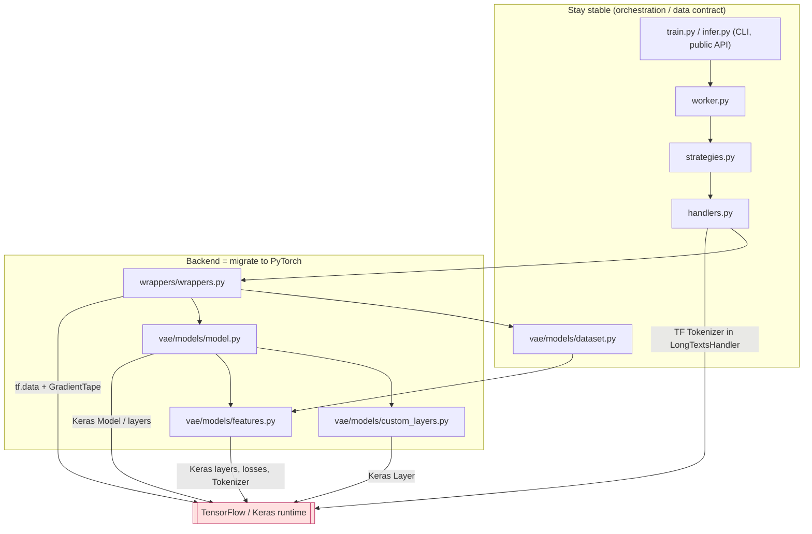

# TensorFlow → PyTorch Migration: Formal Acceptance Checklist & Anti-Collapse Test Plan

This document is the governing acceptance checklist for migrating the main
`syngen` codebase (under `src/`) from TensorFlow/Keras to PyTorch. It is
intentionally stricter than a normal implementation plan: it defines phase
boundaries, mandatory invariants, acceptance checks, evidence requirements,
rejection conditions, and final sign-off criteria **before** implementation
begins.

It is grounded in the *actual current code* (file and line references are real
as of this writing) and is explicitly shaped around the failure mode we already
hit once: a PyTorch model that trains and generates, but **collapses the output
distribution** (e.g. an age column spanning 18–90 came out 18–40). See
[§ Distribution Collapse](#distribution-collapse-the-failure-we-must-not-repeat).

> **Scope exclusion:** `demo-notebooks/` and `databricks/` are out of scope and
> are not migration targets.

---

## Purpose

Create a formal contract that can be used later to accept or reject each phase of
the migration in the main codebase under `src`, with objective, runnable evidence
rather than verbal confirmation.

## Fixed decisions

- The first migration target is **CPU-first correctness**.
- The parity target is **behavioral and statistical parity**, not exact numeric
  parity.
- Existing TensorFlow checkpoints do **not** need to remain loadable.
- Retraining models on the PyTorch path is acceptable.
- The orchestration layer (worker / strategy / handler / reporter / high-level
  dataset) stays as stable as possible.
- The migration scope excludes `demo-notebooks` and `databricks`.

## Non-negotiable invariants

- The public CLI behavior of `launch_train` and `launch_infer` remains stable
  unless an explicit change is approved.
- Metadata YAML structure and semantics remain stable.
- Worker, Strategy, Handler, Reporter, and high-level Dataset semantics remain
  stable unless a documented exception is approved.
- Generated data semantics remain valid w.r.t. row count, column order, dtype
  restoration, null restoration, zero restoration, datetime restoration, UUID
  regeneration, PK/UQ uniqueness, and FK linkage.
- The text generation path is a **first-class** migration area, not a follow-up.
- TensorFlow and Keras are removed from the runtime surface **only after** the
  PyTorch path is validated.

---

## Current-state reference (grounded in the code)

### Train control flow

```
train.py:launch_train
  └─ worker.py:Worker.launch_train
       └─ strategies.py:TrainStrategy.run
            └─ handlers.py:VaeTrainHandler.__fit_model
                 └─ wrappers.py:VAEWrapper.fit_on_df
                      ├─ Dataset.launch_detection / pipeline / transform   (dataset.py)
                      ├─ _create_batched_dataset      → tf.data, drop_remainder=True (wrappers.py:455)
                      ├─ _train / _train_step         → tf.GradientTape    (wrappers.py:360,471)
                      │     model = CVAE.model         (model.py:126)
                      │     losses = per-feature recon losses + KL*0        (model.py:127-129)
                      └─ fit_sampler → CVAE.fit_sampler
                            encoder_model.predict(mu) → BayesianGaussianMixture.fit (model.py:182-196)
  └─ save_state → vae.ckpt, vae_generator.ckpt, latent_model.pkl            (model.py:292)
  └─ LongTextsHandler → kde_params.pkl                                       (handlers.py:88)
```

### Infer control flow

```
infer.py:launch_infer
  └─ worker.py:Worker.launch_infer
       └─ strategies.py:InferStrategy.run
            └─ handlers.py:VaeInferHandler.handle           (batch split → run → concat)
                 └─ wrappers.py:VAEWrapper.predict_sampled_df
                      └─ CVAE.sample                          (model.py:203)
                           latent_model.sample(n)             → GMM draw
                           np.random.shuffle(latent_sample)
                           generator_model.predict(latent)    → decoder (shared layers)
                           dataset.inverse_transform(pred)    → per-feature scaler inverse (dataset.py:1138)
                           __make_pk_uq_unique                → PK/UQ restoration (model.py:257)
                      ├─ generate_uuid / _restore_nan_values / _restore_zero_values
                      ├─ _restore_nan_labels / _restore_date_columns          (wrappers.py:523)
                      └─ VaeInferHandler.generate_keys → FK via KDE           (handlers.py:426)
                 └─ LongTextsHandler output → generate_long_texts             (handlers.py:294)
```

### Dependency flow / shape of the change



The **shape of the migration**: keep the left/top (CLI → worker → strategy →
handler → Dataset) intact; replace the TF/Keras backend (`wrappers`, `model`,
`features`, `custom_layers`) and remove the `LongTextsHandler` Keras `Tokenizer`
dependency.

### TensorFlow / Keras touchpoint inventory (exact)

Runtime imports of `tensorflow`/`keras` exist in **exactly five** modules:

| File | What uses TF/Keras |
| --- | --- |
| `src/syngen/ml/vae/wrappers/wrappers.py` | `tf.data` batching, `tf.GradientTape` training loop, `tf.keras.optimizers.Adam`, `tf.keras.metrics.Mean`, `Model.save_weights/load_weights` |
| `src/syngen/ml/vae/models/model.py` | `tf.keras` `Model`, `Input`, `Dense`, `Dropout`, `BatchNormalization`, `Lambda`, `concatenate`; `add_loss`; `sample_z`; `save_weights`/`load_weights` |
| `src/syngen/ml/vae/models/features.py` | Keras `Input`/`Dense`/`LSTM`/`Bidirectional`/`RepeatVector`/`TimeDistributed`, `losses`, `K.*`, `Tokenizer`, `pad_sequences`, top-p/top-k via `tf.*` |
| `src/syngen/ml/vae/models/custom_layers.py` | `keras.layers.Layer`, `keras.backend` (`FeatureLossLayer`, `SampleLayer`) |
| `src/syngen/ml/handlers/handlers.py` | `keras.preprocessing.text.Tokenizer` in `LongTextsHandler` (no-ML char KDE) |

Non-runtime: `train.py` and `strategies.py` only set
`os.environ["TF_CPP_MIN_LOG_LEVEL"]`. Tests: only
`src/tests/unit/features/test_features.py` references TF/Keras directly.
Packaging: `setup.cfg` and `requirements.txt` pin `tensorflow==2.15.*` and
`keras==2.15.*`.

### Artifact inventory (current, per table)

| Artifact | Written by | Migration disposition |
| --- | --- | --- |
| `…/vae/checkpoints/vae.ckpt` | `model.py:save_state` | **Format changes** (Keras ckpt → PyTorch `state_dict`). Old need not load. |
| `…/vae/checkpoints/vae_generator.ckpt` | `model.py:save_state` | **Format changes**; generator shares decoder weights — see collapse hypothesis #2. |
| `…/vae/checkpoints/latent_model.pkl` | `model.py:save_state` | Stays (`BayesianGaussianMixture` pickle) unless replaced. |
| `…/no_ml/checkpoints/kde_params.pkl` | `handlers.py:LongTextsHandler` | Stays in spirit; must be produced **without** Keras `Tokenizer`. |
| `…/vae/checkpoints/model_dataset.pkl` | `wrappers.py:_save_dataset` | Stays (Dataset pickle). Must remain unpicklable across backend. |
| `…/vae/checkpoints/train_config.pkl`, `…/infer_config.pkl` | strategies/config | Stays; change only as needed for artifact support. |
| `…/system_store/losses/…losses.csv` | `wrappers.py:__save_losses` | Stays; column schema (`table_name,epoch,column_name,column_type,loss_name,value`) preserved for MLflow. |
| `…/vae/checkpoints/stat_keys/<fk>.pkl` | FK KDE | Stays. |
| `…/tmp_store/<table>/merged_infer_<table>.<ext>` | `handlers.py:_save_data` | Output location unchanged. |

---

## Distribution Collapse: the failure we must not repeat

**Symptom observed previously:** PyTorch path trained (loss decreased, metrics
logged, data generated) but the generated distribution was severely narrowed —
age 18–90 → 18–40 — and similar narrowing on other numeric and categorical
columns. Mechanically fine, statistically wrong.

The current TF code has several non-obvious mechanics that, if a PyTorch port
"corrects" or subtly breaks them, produce exactly this collapse. Each hypothesis
below is mapped to a guard test in
[§ Anti-collapse test harness](#anti-collapse-test-harness-runnable).

| # | Root-cause hypothesis (code-grounded) | Why it collapses the range | Guard test |
| --- | --- | --- | --- |
| 1 | **KL is disabled in TF**: `model.py:129` adds `kl_loss * 0`. The latent space is *not* regularized to N(0,1); generation instead fits a `BayesianGaussianMixture` on the encoder `mu` (`model.py:182-196`). | A port that re-enables KL with weight 1 squeezes the latent posterior toward a unit Gaussian → the BGM (or N(0,1) sampling) covers a much narrower manifold → decoded values cluster near the mean → range narrows. **Prime suspect.** | numeric range-coverage + std/quantile drift |
| 2 | **Decoder layers are shared** between training `model` and `generator_model` (`model.py:158-176`). Training updates both. | If the port makes them separate modules (or loads `vae_generator.ckpt` into the wrong module), the generator runs near-random/under-trained weights → degenerate output. | generator-vs-train weight identity check; end-to-end range coverage |
| 3 | **BatchNorm + Dropout in encoder** (`model.py:138-156`); `fit_sampler` encodes via `encoder_model.predict` (inference mode → BN running stats, dropout off). | Missing `model.eval()` (or unconverged BN running stats) during encode/generate in PyTorch → latent points distorted/under-dispersed → BGM fits a tight blob → collapse. | determinism test + range coverage; eval-mode unit assertion |
| 4 | **Feature/column ordering** is implicit: `transform`, model inputs, `feature_losses`, and `inverse_transform`'s `zip(data, self.features.items())` all rely on identical `self.features` dict order (`dataset.py:1118-1158`, `model.py:114-126`). | If the PyTorch DataLoader/collate reorders feature tensors, a decoder head's output is inverse-transformed by the **wrong feature's scaler** → wrong column, wrong range, garbage. | per-column value sanity + categorical category-coverage (mismatch shows as alien categories) |
| 5 | **Per-feature scaler restoration** (`features.py`: StandardScaler/MinMaxScaler/QuantileTransformer; `is_positive` → `np.abs`; int rounding). | If the port skips fitting/applying the scaler, applies it on the wrong axis, or drops `QuantileTransformer` for heavy-tailed columns, the inverse mapping squashes range. | numeric range coverage on the skewed/outlier fixture column |
| 6 | **Reparameterization & sampling**: `sample_z` uses `eps ~ N(0,1)` shaped `(latent_dim,)` (`model.py:56`); generation does `latent_model.sample(n)` then `np.random.shuffle` then decode (`model.py:203`). | A port with wrong eps scale/shape, or sampling from N(0,1) instead of the fitted BGM, shifts/narrows the latent draw → narrowed output. | range coverage + determinism (seeded) test |

**Design principle for the harness:** loss going down is *not* evidence of
correctness. The only acceptance evidence is **per-column statistical parity of
generated data against a frozen TF baseline**, with explicit range-coverage
assertions that fail loudly on narrowing.

---

## Baseline fixture matrix

Diverse datasets exercise every feature family and key type. They are committed
under `src/tests/integration/parity/fixtures/` (generated deterministically by
`make_fixtures.py`).

| Fixture | Columns / intent | Keys |
| --- | --- | --- |
| `numeric_wide` | `age` int 18–90 (wide range — the canonical collapse probe), `income` skewed float w/ outliers (→ QuantileTransformer), `score` ~normal float (→ StandardScaler), `near_constant`, `zero_heavy` (≫30 % zeros), `nullable_num` (null-heavy) | `id` PK (numeric) |
| `categorical` | `gender` binary, `country` low-card (~6), `city` high-card (~40), `plan` categorical w/ nulls | `id` PK (numeric) |
| `text_email` | `email` (EmailFeature), `short_code` short text, `bio` long text | `id` PK (string + regex) |
| `datetime` | `signup_date` (`%Y-%m-%d`), `event_ts` (`%Y-%m-%d %H:%M:%S`), `tz_ts` datetime-with-timezone | `id` PK (numeric) |
| `keys_parent` / `keys_child` | parent table w/ PK; child table w/ FK referencing parent; UQ column on child | parent PK, child FK + UQ |
| `mixed_complex` | one wide table mixing many dtypes/formats/distributions: `uniform_int`, **`bimodal`** (mixture — a strong shape-collapse probe), `exponential`, `signed` (negatives), `poisson_count`, `heavy_tail` (Pareto → QuantileTransformer), `zero_inflated`, `nullable_float`, `is_active` (boolean), `status` (imbalanced cat), `segment` (~50 cats), `notes` (text), `contact_email`, `external_uuid` (UUID), `created_date` (`%d/%m/%Y`, day-first), `updated_at` (ISO 8601 `T`) | `record_id` PK |
| `relations_chain` | four tables — `regions ← stores ← sales` chain plus `sales → products` (a table with **two FKs to different parents**); referential integrity in the source | per-table PK; 3 FKs across the chain |

Coverage achieved: numeric (normal / skewed / **bimodal** / uniform / exponential /
Poisson / **signed-negative** / near-constant / zero-heavy / null-heavy),
categorical (binary / boolean / low / high card / imbalanced / nullable), text,
email, long text, dates (multi-format incl. day-first + ISO-T + tz), **UUID**,
PK numeric, PK string+regex, UQ, single FK, **FK chain**, **multiple FKs per
table**. The bimodal and signed columns specifically defend against the
shape-collapse and sign-collapse variants of the failure mode.

---

## Anti-collapse test harness (runnable)

Located at `src/tests/integration/parity/`. It exercises the **real public API**
(`launch_train` → `launch_infer`) so it validates the CLI/orchestration contract
and the model behavior together.

```
src/tests/integration/parity/
├── README.md             # runbook
├── make_fixtures.py      # deterministic fixture generator → fixtures/*.csv
├── fixtures/             # committed CSVs + metadata YAMLs
├── stats.py              # profile_table() + compare_profiles()
├── capture_baseline.py   # run TF path, write baselines/<fixture>.json
├── baselines/            # committed golden statistics (captured on TF)
└── test_parity.py        # pytest: re-run, profile, diff vs baseline
```

### `stats.py` — what is profiled (collapse-sensitive)

`profile_table(df, schema)` emits a JSON-serializable per-column profile:

- **numeric**: `min`, `max`, `range`, `mean`, `std`, quantiles
  `{1,5,25,50,75,95,99}`, `null_ratio`, `zero_ratio`.
- **categorical/binary**: full `value→frequency` map, `n_categories`,
  `null_ratio`.
- **text/email**: char-length and word-count distribution summaries
  (mean/std/quantiles); for email, fraction matching `…@domain`.
- **datetime**: parse-success ratio, `min`/`max` timestamp.
- **table**: `row_count`, `column_order`, per-column `dtype`.
- **keys**: PK/UQ uniqueness ratio; FK fraction ∈ parent PK set.

`compare_profiles(baseline, candidate, tol)` returns a list of discrepancies.
Explicit **collapse checks**:

- `range_coverage = candidate_range / baseline_range` must be **≥ `tol.range_min`**
  (default 0.80) — directly fails the 18–90 → 18–40 case (coverage ≈ 0.36).
- `min`/`max` must not pull inward beyond `tol.bound_frac` of baseline span.
- `mean`/`std`/quantile relative drift ≤ `tol.num_rel` (default 0.25).
- categorical **category coverage** (present categories / baseline categories)
  ≥ `tol.cat_coverage` (default 0.90); Jensen–Shannon distance on frequencies
  ≤ `tol.cat_js` (default 0.15); no **alien** categories above `tol.alien_freq`
  (catches feature-order mixups, hypothesis #4).
- `null_ratio`/`zero_ratio` drift ≤ `tol.ratio_abs` (default 0.10).
- text length/word-count mean drift ≤ `tol.num_rel`.
- datetime parse-success ≥ `tol.parse_min` (default 0.99).

Tolerances live in a single `DEFAULT_TOLERANCES` dict, overridable per column for
known-hard cases (documented in the runbook).

### `capture_baseline.py`

For each fixture: set a fixed `random_seed`, run `launch_train` then
`launch_infer` through the public API in an isolated working directory, load the
original and the generated CSV, build both profiles with `stats.py`, and write
`baselines/<fixture>.json` (original profile + generated profile + the
tolerances used). Run once on the current TF code; the JSONs are committed as the
golden baseline.

### `test_parity.py`

Parametrized over fixtures. Each test:

1. Runs train→infer through the public API (seeded) in a temp working dir.
2. Profiles original and generated output.
3. **Contract assertions**: generated `row_count == requested size`; column order
   and dtypes preserved; reports written when `reports` requested.
4. **Anti-collapse assertions**: `compare_profiles(baseline.generated, candidate)`
   yields no discrepancies above tolerance (the table above).
5. **Determinism**: two seeded runs profile-equal within `tol.det` (default 0.02).

Markers: `@pytest.mark.parity` and `@pytest.mark.slow` (registered in
`setup.cfg`), so the default unit-test run is unaffected; the suite is opt-in via
`pytest -m parity`.

### Self-test (prove the guard works)

Before the PyTorch backend exists, `test_parity.py` includes one
`test_collapse_is_detected` that takes a generated frame, **clamps** a wide-range
numeric column (e.g. caps `age` at 40), and asserts `compare_profiles` reports a
range-coverage failure. This proves the harness catches the exact regression we
are defending against.

---

## How to use this checklist

- A phase is **Accepted** only when every mandatory item is satisfied or an
  explicit waiver is recorded.
- A phase is **Conditionally Accepted** only if remaining gaps are documented,
  bounded, and explicitly approved for later closure.
- A phase is **Rejected** if any blocking item fails or evidence is insufficient.
- No phase may begin work that depends on a prior phase until that prior phase is
  Accepted or Conditionally Accepted with explicit approval.
- Every accepted phase leaves behind objective evidence, not verbal confirmation.

**Acceptance statuses:** Not Started · In Progress · Accepted ·
Conditionally Accepted · Rejected.

**Required evidence types:** architecture/flow note for the slice · file &
interface inventory · test inventory + results · artifact inventory · explicit
deviations/waivers/deferrals · dated sign-off note.

**Global rejection rules:** reject if a phase claims completion without evidence;
changes a non-negotiable invariant without documented approval; introduces
ambiguity into artifact format / metadata semantics / orchestration boundaries;
hides incompatible behavior under silent fallback; or expands into excluded areas
without an explicit decision.

---

## Execution summary


---

## Formal acceptance checklist

### Phase A — Baseline and contract freeze
**Objective:** freeze current TF behavior and external contract before the first
change.

Entry:
- [ ] Scope limited to main codebase; excludes `demo-notebooks`, `databricks`.
- [ ] Fixed decisions and non-negotiable invariants accepted.

Acceptance:
- [ ] Train control flow documented `train.py` → `VAEWrapper` training (done above).
- [ ] Infer control flow documented `infer.py` → CVAE sampling + postprocessing.
- [ ] All TF/Keras touchpoints identified (the 5-file table above).
- [ ] `model_artifacts` contract inventoried (artifact table above).
- [ ] Baseline fixture matrix defined (numeric/categorical/text/email/date/UUID/
      PK/UQ/FK/null-heavy/zero-heavy).
- [ ] High-risk files and lowest-risk reuse targets listed.

Evidence: flow map · TF/Keras inventory · artifact inventory · fixture matrix.

Reject if: any train/infer-affecting path is ambiguous; any TF/Keras runtime
dependency unmapped; artifact tree not explicit about preserve-vs-change.

Exit: baseline detailed enough that future work can be judged against it.

### Phase B — Safety net before porting
**Objective:** replace black-box risk with executable regression coverage around
real train/infer behavior — i.e. **build and commit the parity harness on TF**.

Entry:
- [ ] Phase A Accepted / Conditionally Accepted.

Acceptance:
- [ ] Real small-dataset training scenario exercises the TF wrapper path (per
      fixture, via `launch_train`).
- [ ] Real infer round-trip scenario exercises save/load/sample/postprocess (via
      `launch_infer`).
- [ ] `fit_on_df`, `save_state`, `load_state`, `predict_sampled_df` covered.
- [ ] `CVAE.sample` and PK/UQ restoration covered.
- [ ] `CharBasedTextFeature` tokenizer/padding/top-p/top-k/`inverse_transform`
      covered.
- [ ] `LongTextsHandler` KDE checkpoint + long-text generation covered.
- [ ] `VaeInferHandler` batch split/concat covered.
- [ ] `launch_train`/`launch_infer` smoke scenarios covered.
- [ ] **TF golden baselines captured and committed** (`baselines/*.json`) for
      every fixture; `compare_profiles` tolerances agreed.
- [ ] Self-test proves the harness detects induced collapse.

Evidence: test inventory · committed baseline profiles · list of currently
mocked paths that must gain real behavioral checks.

Reject if: the real model path stays effectively untested; migration proceeds
while wrapper/sampling behavior is accepted only by mocks.

Exit: the team can later prove PyTorch did not drift silently on the most
sensitive surfaces (esp. distribution range).

### Phase C — Backend-neutral boundary
**Objective:** clean contract between orchestration and the backend VAE.

Entry: Phase B Accepted / Conditionally Accepted.

Acceptance:
- [ ] Framework-neutral wrapper interface defined for `fit_on_df`,
      `predict_sampled_df`, `save_state`, `load_state`, loss reporting (mirrors
      current `BaseWrapper`, `wrappers.py:37`).
- [ ] `TrainStrategy`/`InferStrategy` depend only on the neutral interface.
- [ ] `VaeTrainHandler`/`VaeInferHandler` depend only on the neutral interface.
- [ ] Worker stays unaware of TF-vs-PyTorch.
- [ ] Loss-reporting contract explicit enough to preserve MLflow semantics
      (`total_loss`, `kl_loss`, grouped `numeric/categorical/text` losses,
      per-feature losses; `wrappers.py:210-343`).
- [ ] Artifact version and backend identity part of the contract.

Evidence: interface contract note · ownership boundary note · list of files that
must no longer import framework code above the wrapper/model layer.

Reject if: orchestration still depends on framework semantics; loss expectations
implicit; backend switch would touch Worker logic for framework reasons.

Exit: backend can be swapped without destabilizing higher-level orchestration.

### Phase D — Preprocessing and feature contract separation
**Objective:** separate feature preprocessing/schema semantics from
framework-specific graph/loss logic.

Entry: Phase C Accepted / Conditionally Accepted.

Acceptance:
- [ ] Responsibilities mixed in `features.py` split into **preprocessing**
      (fit/transform/inverse_transform, scalers, encoders, tokenizers) vs
      **model-specific** (input/encoder/decoder/loss graph nodes).
- [ ] Dataset detection / transform / inverse_transform / key metadata semantics
      stay stable (`dataset.py`).
- [ ] Per-feature spec: input shape, output shape, feature type, loss kind,
      special postprocessing.
- [ ] Date, UUID, PK/UQ/FK, null-label, zero-restoration behavior included.
- [ ] Text and email preprocessing semantics preserved.

Evidence: feature responsibility matrix · per-feature spec format · transform /
inverse-transform invariant list.

Reject if: preprocessing still conceptually depends on TF graph objects;
transform/inverse expectations vague; date/UUID/key migration incomplete.

Exit: PyTorch model can be built against feature specs, not TF-bound objects.

### Phase E — PyTorch data path
**Objective:** define PyTorch batching/seeding that preserves behavior where it
matters.

Entry: Phase D Accepted / Conditionally Accepted.

Acceptance:
- [ ] `tf.data` batching replaced by `Dataset`/`DataLoader`
      (`wrappers.py:_create_batched_dataset`).
- [ ] **Feature order from `Dataset.transform` explicitly preserved** (hypothesis
      #4) — collate must keep the per-feature tuple order identical to
      `self.features`.
- [ ] Batch-size normalization aligned with `TrainConfig`.
- [ ] Final partial batch handling decided explicitly (TF uses
      `drop_remainder=True`, `wrappers.py:469`) and treated as a contract item.
- [ ] Seeding defined for Python / numpy / torch / torch.cuda.
- [ ] CPU-only behavior is the acceptance target for wave 1.
- [ ] Multiprocessing implications covered or explicitly deferred
      (`VaeInferHandler.run_parallel`).

Evidence: data-path design note · batch-semantics note · reproducibility note.

Reject if: batch semantics ambiguous; feature order/seed not explicitly
controlled; wave 1 depends on GPU behavior.

Exit: data path tight enough to build the training loop without hidden drift.

### Phase F — PyTorch model and training loop
**Objective:** define PyTorch CVAE + training loop precisely.

Entry: Phase E Accepted / Conditionally Accepted.

Acceptance:
- [ ] Encoder, latent heads (`mu`/`log_sigma`), reparameterization, decoder, and
      per-feature heads all accounted for (`model.py:66-176`).
- [ ] Reconstruction losses for numeric (MSE), categorical (cross-entropy), text
      (softmax CE) explicitly defined (`features.py` loss methods).
- [ ] KL loss explicitly defined **and its weight explicitly decided** — current
      TF uses **weight 0** (`model.py:129`). Any non-zero weight is a documented,
      approved deviation, validated against the range-coverage guard
      (collapse hypothesis #1).
- [ ] Loss contract includes `total_loss`, `kl_loss`, grouped losses, per-feature
      losses for MLflow (`wrappers.py:330-343`).
- [ ] Early stopping preserved (min_delta 0.005, patience 10; `wrappers.py:363`)
      or approved change recorded.
- [ ] **Decoder weight sharing** between train model and generator preserved, or
      an explicit equivalent guaranteed (collapse hypothesis #2).
- [ ] **`eval()` discipline** for BatchNorm/Dropout during `fit_sampler` encoding
      and generation guaranteed (collapse hypothesis #3).
- [ ] `BayesianGaussianMixture` retained for latent sampling unless an approved
      alternative (`model.py:193`).
- [ ] PK/UQ uniqueness restoration retained (`model.py:257`).
- [ ] Save/load expectations for wrapper and model state explicit.

Evidence: architecture note · loss contract note · early-stopping/optimizer note
· save/load note · **parity-harness run vs TF baseline** (the decisive evidence).

Reject if: any feature family lacks a decoder+loss path; MLflow loss expectations
unsatisfiable; sampling/uniqueness behavior undefined; **parity harness reports
distribution collapse**.

Exit: the model/training slice can be evaluated against objective criteria.

### Phase G — Text path migration
**Objective:** text generation/preprocessing as an explicit stream with its own
gate.

Entry: Phase F Accepted / Conditionally Accepted.

Acceptance:
- [ ] Keras-free char-level tokenizer + padding defined (replace
      `Tokenizer(lower=False, char_level=True)` and `pad_sequences`,
      `features.py:478-509`).
- [ ] `lower=False`, `char_level=True` semantics preserved or approved exception.
- [ ] `pad_sequences` replacement explicit (post-pad/truncate, value 0).
- [ ] `EmailFeature` behavior preserved (`features.py:652`).
- [ ] top-p and top-k filtering behavior covered (`features.py:511-568`).
- [ ] `inverse_transform` behavior covered.
- [ ] `LongTextsHandler` no-ML KDE preserved **without** Keras `Tokenizer`
      (`handlers.py:111`).
- [ ] Text length / word-count / plausibility checks in the validation matrix
      (already in `stats.py`).

Evidence: text-preprocessing note · text-sampling note · long-text KDE
dependency-removal note.

Reject if: text path still depends on Keras; text reconstruction undefined;
long-text generation left unverified.

Exit: highest-risk text behavior has an explicit acceptance envelope.

### Phase H — Artifact migration and compatibility rules
**Objective:** explicit, versioned, safe artifact contract.

Entry: Phase G Accepted / Conditionally Accepted.

Acceptance:
- [ ] New checkpoint format named and versioned (e.g. `vae_state.pt` +
      `backend`/`version` keys).
- [ ] Artifact contract defines what is saved for model, wrapper state, latent
      model, dataset, configs.
- [ ] Load-time compatibility checks mandatory and explicit.
- [ ] Old TF-era artifacts **fail clearly**, not silently.
- [ ] `TrainConfig`/`InferConfig` changes limited to artifact support.
- [ ] Success files, reports, output locations stay coherent
      (`handlers.py:_save_data`).
- [ ] Retained pickles versioned or validated at load.

Evidence: new-backend artifact inventory · compatibility/failure-mode note · old↔new path mapping.

Reject if: artifact identity/version implicit; incompatibility hidden behind
best-effort fallback; path/file naming unreconciled with orchestration.

Exit: loading/persistence errors cannot remain ambiguous.

### Phase I — Dependency removal and final cutover
**Objective:** define the point at which TF/Keras leave the runtime surface.

Entry: Phase H Accepted / Conditionally Accepted.

Acceptance:
- [ ] All runtime TF/Keras imports accounted for and scheduled for removal (the
      5-file table).
- [ ] `setup.cfg` + `requirements.txt` have a planned PyTorch dependency set;
      `tensorflow`/`keras` removed.
- [ ] TF-dependent tests accounted for (`tests/unit/features/test_features.py`).
- [ ] Docs / install guidance updates accounted for (`README.md`, `Dockerfile`).
- [ ] `egg-info` regeneration treated as a packaging byproduct.
- [ ] Console entry points `train`, `infer`, `syngen` remain
      (`setup.cfg [options.entry_points]`).

Evidence: dependency-removal inventory · packaging note · docs note.

Reject if: any runtime path still depends on TF/Keras without approved reason;
packaging changes incomplete/inconsistent.

Exit: clean backend cutover without hidden TF runtime coupling.

### Phase J — Final validation and sign-off
**Objective:** apply final gates and decide completeness.

Entry: Phases A–I Accepted / Conditionally Accepted.

Acceptance:
- [ ] Contract validation passed.
- [ ] Behavioral validation passed.
- [ ] Statistical validation passed (**parity harness green vs TF baseline**).
- [ ] Determinism validation passed within CPU-first scope.
- [ ] Packaging validation passed.
- [ ] Deferred items recorded as out-of-scope follow-up.
- [ ] Waivers/deviations listed.
- [ ] Final sign-off: Accepted / Conditionally Accepted / Rejected.

Evidence: final validation summary · known-risk list · deferred-scope list ·
sign-off note.

Reject if: a non-negotiable invariant broke without approval; any gate
incomplete; status rests on subjective confidence not evidence.

Exit: the migration decision is defensible with explicit evidence and scope.

---

## Global validation gates

**Contract validation**
- [ ] CLI signatures/usage preserved (`train.py`, `infer.py`).
- [ ] Metadata semantics preserved.
- [ ] Orchestration flow coherent.
- [ ] Artifact locations coherent.

**Behavioral validation**
- [ ] Representative train runs succeed.
- [ ] Representative infer runs succeed.
- [ ] Generated row counts match requests.
- [ ] Column order matches.
- [ ] Dtypes restored.
- [ ] Null / zero / datetime restoration correct.
- [ ] UUID regeneration correct.
- [ ] PK/UQ uniqueness preserved.
- [ ] FK generation valid.
- [ ] Reports generated where expected.

**Statistical validation** (enforced by `stats.py`/`compare_profiles`)
- [ ] Numeric mean/std within tolerance.
- [ ] Numeric quantiles within tolerance.
- [ ] **Numeric range coverage ≥ threshold (anti-collapse).**
- [ ] Categorical frequency distributions within tolerance + full category
      coverage.
- [ ] Null ratios within tolerance.
- [ ] Text length / word-count distributions within tolerance.
- [ ] Date formatting acceptable.
- [ ] Loss-trend shape acceptable.
- [ ] Existing project quality metrics acceptable.

**Determinism validation**
- [ ] Repeated seeded CPU runs acceptably stable.
- [ ] Reproducibility envelope documented.

**Packaging validation**
- [ ] `tensorflow` absent from runtime deps.
- [ ] `keras` absent from runtime deps.
- [ ] Project installs cleanly with the accepted dependency set.
- [ ] `train` / `infer` / `syngen` resolve as entry points.

---

## Critical files by acceptance relevance

- `src/syngen/train.py`, `src/syngen/infer.py`
- `src/syngen/ml/worker/worker.py`
- `src/syngen/ml/strategies/strategies.py`
- `src/syngen/ml/handlers/handlers.py`
- `src/syngen/ml/config/configurations.py`
- `src/syngen/ml/vae/wrappers/wrappers.py`
- `src/syngen/ml/vae/models/model.py`
- `src/syngen/ml/vae/models/features.py`
- `src/syngen/ml/vae/models/custom_layers.py`
- `src/syngen/ml/vae/models/dataset.py`
- `src/tests/unit/features/test_features.py`
- `src/tests/unit/model/test_model.py`
- `src/tests/unit/handlers/test_handlers.py`
- `src/tests/unit/test_worker/test_worker.py`
- `src/tests/unit/worker_launchers/test_launch_train.py`
- `src/tests/unit/worker_launchers/test_launch_infer.py`
- `src/tests/integration/parity/` (new — anti-collapse harness)
- `setup.cfg`, `requirements.txt`

---

## Phase sign-off record template

```
- Phase:
- Status: Not Started / In Progress / Accepted / Conditionally Accepted / Rejected
- Decision date:
- Decision owner:
- Evidence reviewed:
- Deviations approved:
- Deferred items:
- Blocking risks remaining:
- Next allowed phase:
```

## Definition of done for this checklist

This checklist is complete when it is specific enough that each migration phase
can be accepted or rejected without reopening scope, redefining invariants, or
inventing new success criteria during implementation — and the anti-collapse
harness provides the objective statistical evidence each gate requires.
